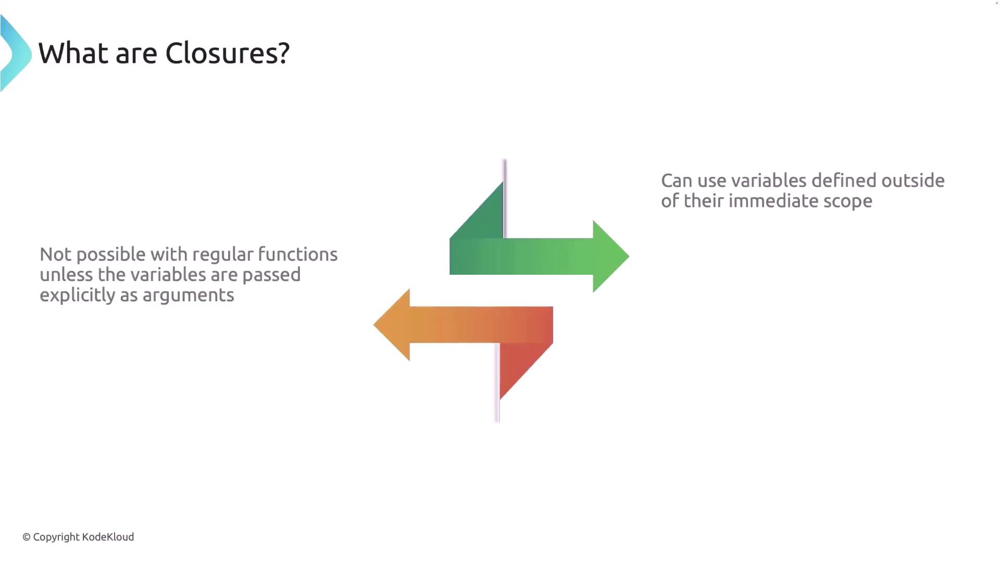
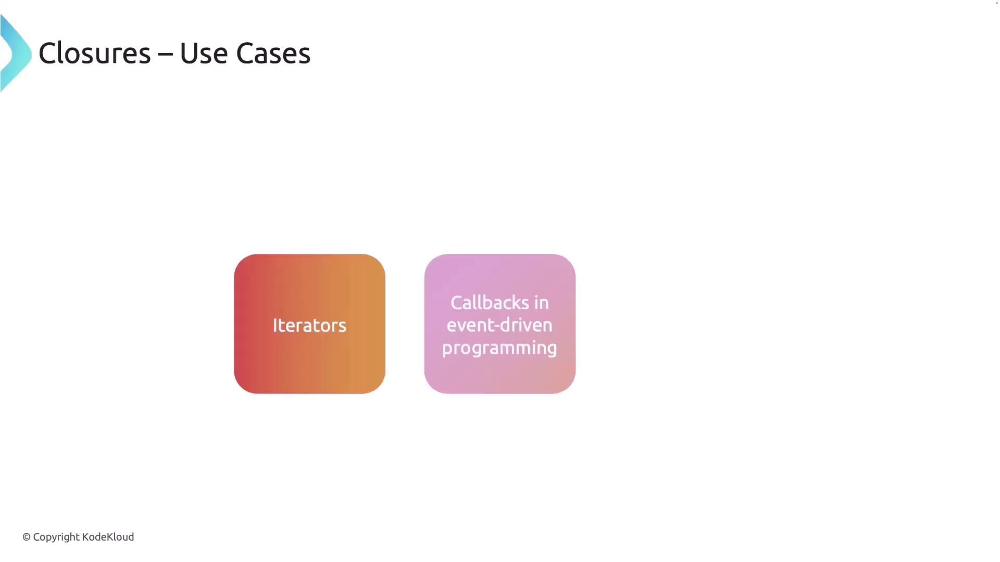
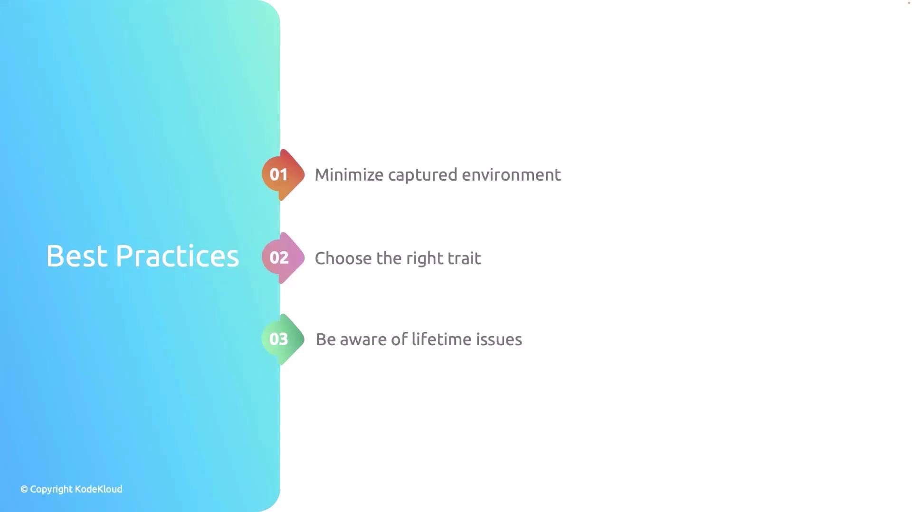

# scaffold a new binary crate and open it in your editor
cargo new mydocker
cd mydocker
code .   # optional: open in VS Code
```

After this, your project will contain the standard Rust layout (Cargo.toml, src/main.rs, etc.).

<Frame>
  
</Frame>

Add dependencies (Cargo.toml)

Open Cargo.toml and add these dependencies. Bollard provides the async Docker API client, Clap handles CLI parsing, Tokio is the async runtime, and futures-util gives helper utilities.

```toml theme={null}
[package]
name = "mydocker"
version = "0.1.0"
edition = "2021"

[dependencies]
bollard = "0.18.1"                       # Docker API integration (async)
clap = { version = "4.5.21", features = ["derive"] }  # CLI argument parsing
tokio = { version = "1.41.1", features = ["full"] }  # Async runtime
futures-util = "0.3"                     # Async utilities (streams & try_next)
```

Download dependencies once:

```bash theme={null}
cargo build
```

Dependency reference table

| Dependency   | Purpose                                         | Docs                                                                                                    |
| ------------ | ----------------------------------------------- | ------------------------------------------------------------------------------------------------------- |
| bollard      | Async Docker client for interacting with daemon | [https://docs.rs/bollard/latest/bollard/](https://docs.rs/bollard/latest/bollard/)                      |
| clap         | CLI parsing and subcommand support              | [https://clap.rs/](https://clap.rs/)                                                                    |
| tokio        | Async runtime for async/await                   | [https://tokio.rs/](https://tokio.rs/)                                                                  |
| futures-util | Stream and future utilities                     | [https://docs.rs/futures-util/latest/futures\_util/](https://docs.rs/futures-util/latest/futures_util/) |

Project structure

We will keep the code modular:

* src/cli.rs — Clap definitions (commands/subcommands)
* src/docker.rs — DockerClient wrapper around Bollard
* src/main.rs — Top-level wiring and command dispatch

CLI: define the command structure (using Clap)

Create src/cli.rs and define a clear subcommand hierarchy for list/start/stop/pull.

```rust theme={null}
use clap::{Parser, Subcommand};

/// A minimal Docker CLI in Rust
#[derive(Parser, Debug)]
#[command(name = "mydocker")]
#[command(about = "A minimal Docker CLI in Rust")]
pub struct Cli {
    /// The main command to execute
    #[command(subcommand)]
    pub command: Command,
}

/// Top-level commands
#[derive(Subcommand, Debug)]
pub enum Command {
    /// List resources
    List {
        /// Subcommands for listing resources
        #[command(subcommand)]
        list_command: ListCommands,
    },

    /// Start a container
    Start {
        /// The container name
        container_name: String,
    },

    /// Stop a container
    Stop {
        /// The container name
        container_name: String,
    },

    /// Pull an image
    Pull {
        /// The image name (e.g., "nginx:latest")
        image_name: String,
    },
}

/// Subcommands under `list`
#[derive(Subcommand, Debug)]
pub enum ListCommands {
    /// List containers
    Containers {
        /// Include stopped containers
        #[arg(short, long)]
        all: bool,
    },

    /// List images
    Images,
}
```

CLI usage hierarchy

* mydocker list containers \[--all | -a]
* mydocker list images
* mydocker start \<container\_name>
* mydocker stop \<container\_name>
* mydocker pull \<image\_name>

Quick help example:

```bash theme={null}
cargo run -- --help
# or per-subcommand:
cargo run -- list --help
```

Callout — Docker socket and Docker Desktop

<Callout icon="lightbulb">
  Ensure Docker is running ([Docker Desktop](https://www.docker.com/products/docker-desktop) or a daemon on Linux). The typical Docker socket path on Linux is /var/run/docker.sock. On Docker Desktop (macOS/Windows) the socket path may differ — use `docker context inspect` to find the "Host" value and adjust the socket path in DockerClient::new if needed.
</Callout>

Example output of docker context inspect (used to discover socket path):

```bash theme={null}
docker context inspect
[
  {
    "Name": "desktop-linux",
    "Endpoints": {
      "docker": {
        "Host": "unix:///Users/priyadav/.docker/run/docker.sock",
        "SkipTLSVerify": false
      }
    }
    ...
  }
]
```

Docker client module

Create src/docker.rs. This module wraps Bollard to provide the operations we need: listing containers/images, starting/stopping containers, and pulling images. The implementation uses async functions returning Result types mapped to Bollard errors.

```rust theme={null}
use bollard::Docker;
use bollard::errors::Error;
use bollard::models::{ContainerSummary, ImageSummary, CreateImageInfo};
use bollard::container::{ListContainersOptions, StartContainerOptions, StopContainerOptions};
use bollard::image::{ListImagesOptions, CreateImageOptions};
use futures_util::stream::TryStreamExt;
use std::default::Default;

pub struct DockerClient {
    docker: Docker,
}

impl DockerClient {
    /// Create a new DockerClient using the default Unix socket.
    pub fn new() -> Self {
        // You may tweak the socket path if your Docker context uses a different location.
        // Common defaults:
        // - Linux: "/var/run/docker.sock"
        // - Docker Desktop on macOS: "/Users/<user>/.docker/run/docker.sock" (see `docker context inspect`)
        let docker = Docker::connect_with_unix("/var/run/docker.sock", 120, bollard::API_DEFAULT_VERSION)
            .expect("Failed to connect to Docker daemon");

        Self { docker }
    }

    /// List containers.
    pub async fn list_containers(&self, all: bool) -> Result<Vec<ContainerSummary>, Error> {
        let options = Some(ListContainersOptions::<String> {
            all,
            ..Default::default()
        });

        let containers = self.docker.list_containers(options).await?;
        Ok(containers)
    }

    /// List images.
    pub async fn list_images(&self) -> Result<Vec<ImageSummary>, Error> {
        let options = Some(ListImagesOptions::<String> {
            all: true,
            ..Default::default()
        });

        let images = self.docker.list_images(options).await?;
        Ok(images)
    }

    /// Start a container by name or ID.
    pub async fn start_container(&self, container_name: &str) -> Result<(), Error> {
        self.docker
            .start_container(container_name, None::<StartContainerOptions<String>>)
            .await?;
        Ok(())
    }

    /// Stop a container by name or ID. Wait `t` seconds before killing (here t = 30).
    pub async fn stop_container(&self, container_name: &str) -> Result<(), Error> {
        let options = Some(StopContainerOptions { t: Some(30) });
        self.docker.stop_container(container_name, options).await?;
        Ok(())
    }

    /// Pull an image from a registry (e.g., "nginx:latest").
    /// This consumes the streaming progress sent by the daemon and prints statuses.
    pub async fn pull_image(&self, image_name: &str) -> Result<(), Error> {
        let options = Some(CreateImageOptions {
            from_image: image_name,
            ..Default::default()
        });

        // create_image returns a stream of CreateImageInfo messages
        let mut stream = self.docker.create_image(options, None, None);

        while let Some(msg) = stream.try_next().await? {
            if let Some(status) = msg.status {
                println!("{}", status);
            } else if let Some(progress) = msg.progress {
                println!("{}", progress);
            } else if let Some(id) = msg.id {
                println!("{}", id);
            }
        }

        Ok(())
    }
}
```

Top-level main

Create or update src/main.rs to wire the CLI and DockerClient together, then dispatch subcommands. We use Tokio for async main.

```rust theme={null}
mod cli;
mod docker;

use clap::Parser;
use cli::{Cli, Command, ListCommands};
use docker::DockerClient;

#[tokio::main]
async fn main() {
    // Parse CLI args
    let args: Cli = Cli::parse();

    // Create Docker client
    let docker_client = DockerClient::new();

    // Dispatch commands
    match args.command {
        Command::List { list_command } => match list_command {
            ListCommands::Containers { all } => {
                println!("Printing containers:");
                match docker_client.list_containers(all).await {
                    Ok(containers) => {
                        for c in containers {
                            // many fields in ContainerSummary are Option<T>, so use unwrap_or_default
                            let id = c.id.unwrap_or_default();
                            let names = c.names.unwrap_or_default().join(",");
                            let status = c.status.unwrap_or_default();
                            println!("{}\t{}\t{}", id, names, status);
                        }
                    }
                    Err(e) => eprintln!("Error listing containers: {}", e),
                }
            }
            ListCommands::Images => {
                println!("Printing images:");
                match docker_client.list_images().await {
                    Ok(images) => {
                        for img in images {
                            let id = img.id.unwrap_or_default();
                            let tags = img.repo_tags.unwrap_or_default().join(",");
                            println!("{}\t{}", id, tags);
                        }
                    }
                    Err(e) => eprintln!("Error listing images: {}", e),
                }
            }
        },

        Command::Start { container_name } => {
            println!("Starting container: {}", container_name);
            match docker_client.start_container(&container_name).await {
                Ok(_) => println!("Container started successfully"),
                Err(e) => eprintln!("Error starting container: {}", e),
            }
        }

        Command::Stop { container_name } => {
            println!("Stopping container {}", container_name);
            match docker_client.stop_container(&container_name).await {
                Ok(_) => println!("Container stopped successfully"),
                Err(e) => eprintln!("Error stopping container: {}", e),
            }
        }

        Command::Pull { image_name } => {
            println!("Pulling image {}", image_name);
            match docker_client.pull_image(&image_name).await {
                Ok(_) => println!("Image pulled successfully"),
                Err(e) => eprintln!("Error pulling image: {}", e),
            }
        }
    }
}
```

CLI commands and examples

| Command         | Description                                            | Example                             |
| --------------- | ------------------------------------------------------ | ----------------------------------- |
| list containers | List running containers (use --all to include stopped) | `cargo run -- list containers -a`   |
| list images     | List local images                                      | `cargo run -- list images`          |
| start           | Start a container by name or ID                        | `cargo run -- start my_alpine`      |
| stop            | Stop a container by name or ID                         | `cargo run -- stop my_nginx`        |
| pull            | Pull an image from a registry                          | `cargo run -- pull postgres:latest` |

Run & test examples

* Show general help:

```bash theme={null}
cargo run -- --help
```

* List running containers:

```bash theme={null}
cargo run -- list containers
# Example output:
Printing containers:
f38a4319459bb201b0875fb9c5b13f91913f3d2e160029b77217cbfe7589da23    /my_nginx    Up 36 seconds
```

* List all containers, including stopped:

```bash theme={null}
cargo run -- list containers --all
# or:
cargo run -- list containers -a
```

* List images:

```bash theme={null}
cargo run -- list images
# Example output:
sha256:0c86dddac19f2ce4fd716ac58c0fd87bf69bfd4edabfd6971fb885bafd12a00b    nginx:latest
```

* Start a container:

```bash theme={null}
cargo run -- start my_alpine
# Output:
Starting container: my_alpine
Container started successfully
```

* Stop a container:

```bash theme={null}
cargo run -- stop my_nginx
# Output:
Stopping container my_nginx
Container stopped successfully
```

* Pull an image:

```bash theme={null}
cargo run -- pull postgres:latest
# Output: streaming status lines from the daemon, then:
Image pulled successfully
```

Notes and behavior

* Docker returns many optional fields (names, status, IDs). The example code uses unwrap\_or\_default() to avoid panics and print reasonable defaults.
* Bollard's create\_image returns a stream of progress messages — the client consumes and prints these lines to provide visible progress.
* If a resource does not exist, Docker returns an error (often a 404-like response). The CLI forwards the error message returned by the Docker daemon to stderr.

Callout — Permissions and socket path

<Callout icon="warning">
  If you use a Unix socket (e.g., /var/run/docker.sock) your user needs permission to access that socket (membership in the docker group, or run the binary with appropriate privileges). On macOS/Windows with Docker Desktop, the socket path may differ — use `docker context inspect` to find the socket path and adjust DockerClient::new accordingly.
</Callout>

Extending the project

This modular structure makes it straightforward to add features:

* container inspect, remove, exec
* filtering lists by labels, status, or health
* richer output formatting (JSON, table)
* authentication support for pulling from private registries

Summary

* Built a small Rust CLI (mydocker) using Clap for argument parsing and Bollard for Docker API access.
* Organized code into src/cli.rs, src/docker.rs, and src/main.rs for clarity and maintainability.
* Implemented list (containers/images), start, stop, and pull commands with async/await using Tokio.
* The project is a solid foundation to grow into a full-featured Docker management tool in Rust.

Links and references

* Bollard (Docker client for Rust): [https://docs.rs/bollard/](https://docs.rs/bollard/)
* Clap (CLI parsing): [https://clap.rs/](https://clap.rs/)
* Tokio (async runtime): [https://tokio.rs/](https://tokio.rs/)
* Docker documentation: [https://docs.docker.com/](https://docs.docker.com/)

<CardGroup>
  <Card title="Watch Video" icon="video" href="https://learn.kodekloud.com/user/courses/rust/module/bb7ae445-2739-4b78-a1f2-e30c0b7944e3/lesson/c5c8c607-696c-4114-b7db-33feef33b563" />
</CardGroup>


# Closures

Source: https://notes.kodekloud.com/docs/Rust-Programming/Closures-and-Iterators/Closures/page

Closures in Rust are anonymous functions that capture variables from their environment, enabling flexible behavior encapsulation for code execution.

Closures in Rust are powerful, anonymous functions that can capture variables from their surrounding environment. This unique characteristic makes them highly flexible for encapsulating behavior, particularly when you need to pass a block of code for later execution, such as with iterators, callbacks, or higher-order functions.

## What Are Closures?

Closures are similar to regular functions but with the added ability to automatically capture variables from their defining scope. This means that closures can access variables defined outside their immediate scope without requiring explicit parameter passing.

<Frame>
  
</Frame>

Closures are particularly useful in scenarios like iterating over collections or handling events, where the encapsulated behavior benefits from access to external variables.

<Frame>
  
</Frame>

## Basic Syntax

In Rust, closures feature a compact and expressive syntax. Below is an example of a simple closure that adds two numbers. Although Rust often infers parameter and return types, explicit annotations can help clarify the developer's intent (as highlighted by the Rust Analyzer extension).

```rust theme={null}
fn main() {
    let add: impl Fn(i32, i32) -> i32 = |x: i32, y: i32| x + y;
    let result: i32 = add(2, 3);
    println!("2 + 3 = {}", result);
}
```

In the example above:

* The closure is defined using vertical pipes (`| |`) to enclose its parameters.
* The arrow (`-> i32`) indicates that the closure returns an integer.
* The closure invocation with values 2 and 3 then prints the result, 5.

Rust’s type inference allows you to omit parameter types in many cases, streamlining your code while still ensuring type safety.

## Capturing the Environment

One of the key features of closures in Rust is their ability to capture variables from the surrounding environment. This enables the closure to maintain context without explicitly passing all dependencies.

<Callout icon="lightbulb">
  Closures can capture variables by value, by reference, or by mutable reference. Rust automatically determines the most appropriate capture semantics based on how the closure is used.
</Callout>

Consider the following example where the closure captures the variable `num` from its scope:

```rust theme={null}
fn main() {
    let num: i32 = 5;
    let add_num = |x: i32| x + num;
    let result: i32 = add_num(10);
    println!("10 + 5 = {}", result);
}
```

In this case, the variable `num` is captured automatically. Depending on how the closure interacts with the variable, the capture method may be by value, by reference, or by mutable reference.

### Surrounding Environment

The "surrounding environment" of a closure comprises any variables that are in scope when the closure is defined. For instance, a global static variable can be accessed directly by a closure without requiring capture:

```rust theme={null}
static GLOBAL_NUM: i32 = 42;

fn main() {
    let closure: impl Fn(i32) -> i32 = |x: i32| x + GLOBAL_NUM;
    println!("Result: {}", closure(8)); // Directly accesses GLOBAL_NUM
}
```

Since `GLOBAL_NUM` has a static lifetime, it remains accessible throughout the program’s execution.

### Capturing by Mutable Reference

Closures can also capture variables by mutable reference, which allows them to modify the captured variables. The example below demonstrates this capability:

```rust theme={null}
fn main() {
    let mut num: i32 = 3;
    let mut closure: impl FnMut(i32) = |x: i32| num += x; // Captures `num` by mutable reference
    closure(2); // Modifies `num` within the closure
    println!("{}", num); // Prints: 5
}
```

This example emphasizes Rust’s strict ownership and borrowing rules, which also apply to closures.

## Closure Traits

Closures automatically implement one of three traits based on their interaction with captured variables:

* **Fn**: For closures that capture variables immutably (read-only).
* **FnMut**: For closures that capture variables mutably (can modify).
* **FnOnce**: For closures that capture variables by taking ownership (the variables can be used only once).

### Using the Fn Trait

The following example demonstrates how to create a function that accepts a closure implementing the `Fn` trait:

```rust theme={null}
fn apply<F>(g: F)
where
    F: Fn(),
{
    g();
}

fn main() {
    let greeting = || println!("Hello, world!");
    apply(greeting); // The closure only reads from its environment.
}
```

### Using the FnMut Trait

When a closure needs to modify an external variable, it implements the `FnMut` trait. Consider this example:

```rust theme={null}
fn apply_mut<F>(mut g: F)
where
    F: FnMut(),
{
    g();
}

fn main() {
    let mut counter: i32 = 0;
    let mut increment: impl FnMut() = || counter += 1;
    apply_mut(increment); // The closure modifies `counter`.
    println!("Counter: {}", counter); // Output: Counter: 1
}
```

### Using the FnOnce Trait

Closures that take ownership of captured variables using the `move` keyword implement the `FnOnce` trait. Once a variable is moved into the closure, it is no longer accessible outside of it:

```rust theme={null}
fn apply_once<F>(g: F)
where
    F: FnOnce(),
{
    g();
}

fn main() {
    let name: String = String::from("Rust");
    let consume_name = move || println!("Goodbye, {}", name);
    apply_once(consume_name);
    // Uncommenting the next line will cause an error because `name` has been moved:
    // println!("Hello, {}", name);
}
```

## Returning Closures from Functions

Returning closures from functions in Rust requires using either trait objects or generics because closures do not have a fixed type. A common solution is to return a boxed closure:

```rust theme={null}
fn create_closure() -> Box<dyn Fn(i32) -> i32> {
    Box::new(|x: i32| x + 10)
}

fn main() {
    let closure: Box<dyn Fn(i32) -> i32> = create_closure();
    let result: i32 = closure(5);
    println!("Result: {}", result); // Output: Result: 15
}
```

In this example, the closure is boxed into a `Box<dyn Fn(i32) -> i32>`, allowing dynamic dispatch at runtime.

## Best Practices with Closures

When using closures in Rust, consider the following best practices:

1. **Minimize the Captured Environment**: Capture only what is necessary to reduce overhead.
2. **Choose the Right Trait**: Select between `Fn`, `FnMut`, or `FnOnce` based on whether the closure reads, modifies, or takes ownership of its captured variables.
3. **Be Aware of Lifetime Issues**: Understand how closures interact with Rust’s lifetime system to avoid borrowing conflicts and ownership errors.

<Frame>
  
</Frame>

Understanding and effectively leveraging closures is essential for writing efficient and expressive Rust code. Their ability to capture their environment in various ways—by immutable reference, mutable reference, or by taking ownership—empowers developers to write clean, concise, and powerful functions while maintaining Rust’s strong safety guarantees.

<Callout icon="lightbulb">
  Learn more about Rust and closures by exploring the [Rust Programming Language](https://doc.rust-lang.org/book/) and [Rust by Example](https://doc.rust-lang.org/rust-by-example/).
</Callout>

<CardGroup>
  <Card title="Watch Video" icon="video" href="https://learn.kodekloud.com/user/courses/rust/module/ec5f51b7-2bd4-4b24-bff0-94947cac5257/lesson/21fbcda1-2e3c-40ab-b0a8-8e3a9763d22a" />
</CardGroup>
