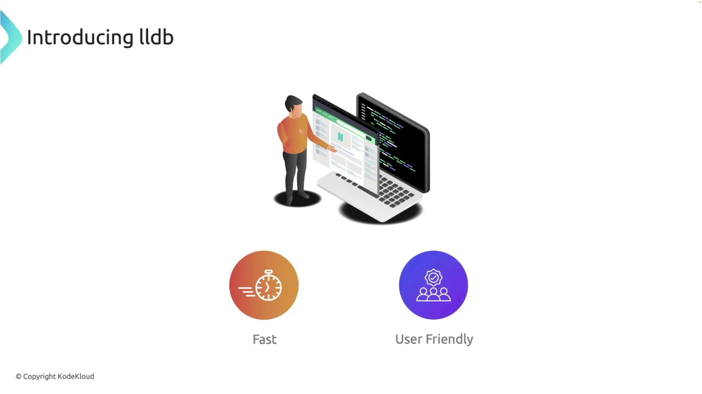
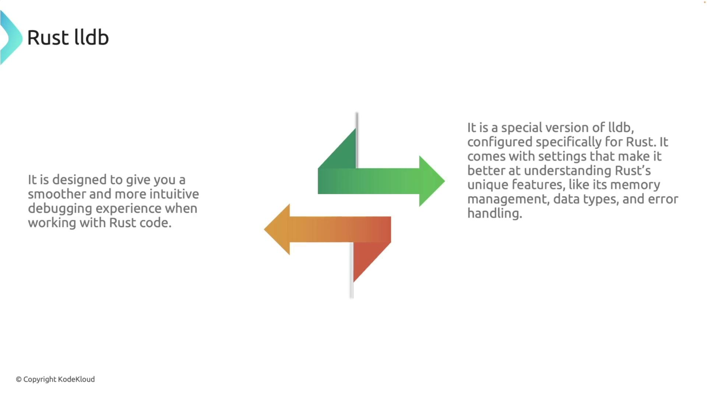
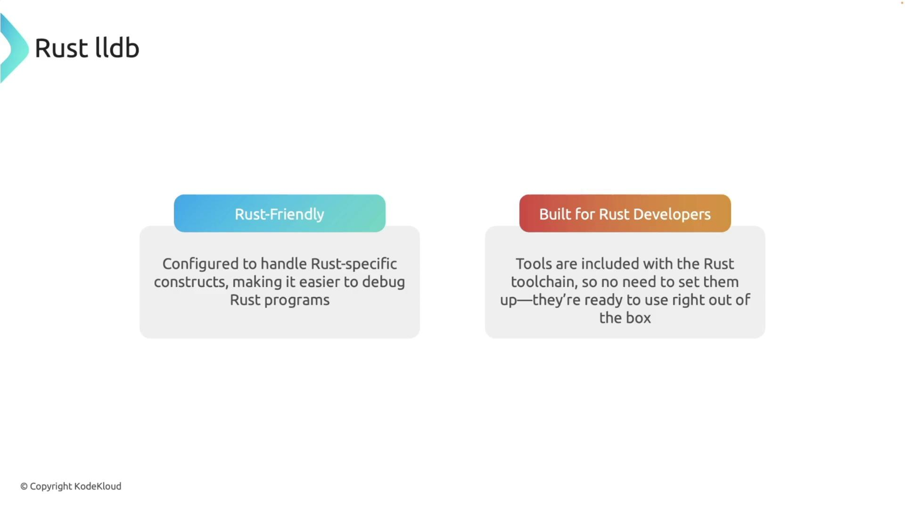

# Rust specific tools rust gdb rust lldb

Source: https://notes.kodekloud.com/docs/Rust-Programming/Debugging-in-Rust/Rust-specific-tools-rust-gdb-rust-lldb/page

This article explores using Rust LLDB, a debugging tool tailored for Rust development, guiding through essential concepts and procedures.

In this lesson, we explore a powerful debugging tool tailored for Rust development: Rust LLDB. Although debugging might seem challenging at first, this guide will walk you through the essential concepts and procedures step by step.

## What is LLDB?

LLDB (Low-Level Debugger) is an efficient and user-friendly debugger that is part of the LLVM project. As the default debugger on macOS, it enables you to pause program execution, inspect variables, and step through code interactively.

<Frame>
  
</Frame>

## Introducing Rust LLDB

Rust LLDB is a customized version of LLDB designed specifically for Rust. It is configured to understand Rust’s unique memory management, data types, and error handling. This Rust-friendly debugger is integrated seamlessly into the Rust toolchain. If you installed Rust via Rustup, Rust LLDB is already available. Confirm your installation with:

```bash theme={null}
rust-lldb --version
```

If version information is displayed, Rust LLDB is installed and ready to use.

<Frame>
  
</Frame>

Rust LLDB is ready to use out of the box as it comes bundled with the Rust toolchain.

<Frame>
  
</Frame>

## Launching Rust LLDB

To start debugging, launch Rust LLDB by executing the following command with the compiled executable from your project's debug directory:

```bash theme={null}
rust-lldb target/debug/your_project_name
```

For demonstration, consider a simple Rust program that calculates the factorial of a number.

## Writing and Compiling a Factorial Program

Before debugging, compile your Rust program with debug information. Below is a basic example of a factorial function:

```rust theme={null}
fn factorial(n: u32) -> u32 {
    if n <= 1 {
        1
    } else {
        n * factorial(n - 1)
    }
}

fn main() {
    let number: u32 = 5;
    let result: u32 = factorial(number);
    println!("The factorial of {} is {}", number, result);
}
```

Compile the program using Cargo:

```bash theme={null}
cargo build --quiet
```

After a successful build, the executable will be located in your project's debug folder.

## Introducing a Bug for Debugging

To demonstrate the debugging process, let's intentionally introduce a subtle bug. Instead of subtracting 1 in the recursive call, we accidentally add 1:

```rust theme={null}
fn factorial(n: u32) -> u32 {
    if n <= 1 {
        1
    } else {
        n * factorial(n + 1)  // Bug: should be n - 1
    }
}

fn main() {
    let number: u32 = 5;
    let result: u32 = factorial(number);
    println!("The factorial of {} is {}", number, result);
}
```

Rebuild the project with:

```bash theme={null}
cargo build --quiet
```

This error causes the recursion never to satisfy the base case, leading to a stack overflow.

Next, navigate to your project directory (for example, "debug-rust") and launch Rust LLDB with:

```bash theme={null}
rust-lldb target/debug/debug_rust
```

Once launched, you'll see the LLDB prompt. Type `help` for a list of available commands.

## Setting Breakpoints and Starting a Debug Session

You can set breakpoints to inspect your code execution. To set a breakpoint at the beginning of the `factorial` function, enter:

```bash theme={null}
(lldb) breakpoint set --name factorial
```

Alternatively, set a breakpoint at a specific line (e.g., line 5):

```bash theme={null}
(lldb) breakpoint set --line 5
```

A sample output might look like:

```text theme={null}
(lldb) breakpoint set --name factorial
Breakpoint 1: where = debug_rust`debug_rust::factorial::hc2078a81714cb92f + 20 at main.rs:2:8, address = 0x00000001000148c

(lldb) breakpoint set --line 5
Breakpoint 2: where = debug_rust`debug_rust::factorial::hc2078a81714cb92f + 36 at main.rs:5:23, address = 0x00000001000149c
```

Now, start the debugging session by running:

```bash theme={null}
(lldb) run
```

When the first breakpoint is hit, you will see output similar to:

```Rust theme={null}
Process 70628 launched: '/Users/priyadav/projects/debug_rust/target/debug/debug_rust' (arm64)
Process 70628 stopped
* thread #1, name = 'main', queue = 'com.apple.main-thread', stop reason = breakpoint 1.1
frame #0: 0x00000001000148c debug_rust`factorial::hc2078a81714cb92f(n=5) at main.rs:2:8
    1    fn factorial(n: u32) -> u32 {
 -> 2        if n <= 1 {
    3            1
    4        } else {
    5            n * factorial(n + 1)
    6        }
    7    }
Target 2: (debug_rust) stopped.
```

At this point, inspect variables like `n`:

```bash theme={null}
(lldb) print n
(unsigned int) 5
```

Stepping through the code reveals that the value of `n` increases rather than decreasing. For example, after stepping into the recursive call, you might see:

```text theme={null}
(lldb) step
Process 70628 stopped
* thread #1, name = 'main', queue = 'com.apple.main-thread', stop reason = breakpoint 2.1
frame #0: 0x00000001000149c debug_rust`debug_rust::factorial::hc2078a81714cb92f(n=6) at main.rs:5:23
```

This confirms that `n` becomes 6 and continues increasing, which prevents the recursion from reaching its base case and ultimately leads to a stack overflow.

<Callout icon="triangle-alert">
  Using an incorrect recursive call (i.e., adding instead of subtracting) will cause an infinite loop, leading to a stack overflow error. Always verify the logic of recursive functions.
</Callout>

## Fixing the Bug

Exit the debugger and correct the error by replacing `n + 1` with `n - 1` in the recursive call. The fixed code is:

```rust theme={null}
fn factorial(n: u32) -> u32 {
    if n <= 1 {
        1
    } else {
        n * factorial(n - 1)
    }
}

fn main() {
    let number: u32 = 5;
    let result: u32 = factorial(number);
    println!("The factorial of {} is {}", number, result);
}
```

Compile and run your project:

```bash theme={null}
cargo run --quiet
```

The output should now correctly display:

```text theme={null}
The factorial of 5 is 120
```

For comparison, running the buggy version would result in a stack overflow error:

```rust theme={null}
fn factorial(n: u32) -> u32 {
    if n <= 1 {
        1
    } else {
        n * factorial(n + 1)
    }
}

fn main() {
    let number: u32 = 5;
    let result: u32 = factorial(number);
    println!("The factorial of {} is {}", number, result);
}
```

```bash theme={null}
cargo run --quiet
thread 'main' has overflowed its stack
fatal runtime error: stack overflow
zsh: abort      cargo run --quiet
```

<Callout icon="lightbulb">
  By using Rust LLDB to step through your code and inspect variable values, you can efficiently pinpoint and resolve subtle bugs in your Rust applications.
</Callout>

Happy debugging!

<CardGroup>
  <Card title="Watch Video" icon="video" href="https://learn.kodekloud.com/user/courses/rust/module/fdebf97c-bade-4db7-bfcf-9881f9ec96fc/lesson/5db13f94-0b56-4bca-8c94-1999c4118a1f" />

  <Card title="Practice Lab" icon="installation" href="https://learn.kodekloud.com/user/courses/rust/module/fdebf97c-bade-4db7-bfcf-9881f9ec96fc/lesson/0de0f591-4119-47f9-a1ac-27449ee43040" />
</CardGroup>
