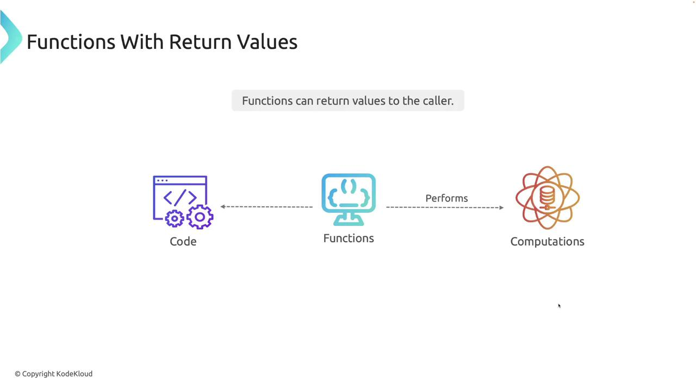
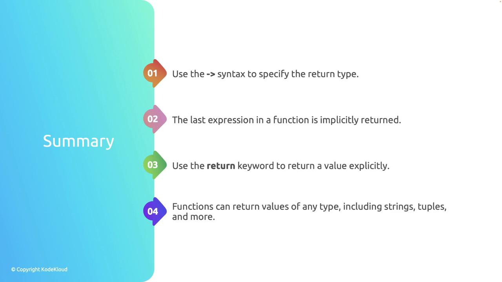

# Return Values

Source: https://notes.kodekloud.com/docs/Rust-Programming/Functions/Return-Values/page

This article explains how functions in Rust can return values, detailing syntax and examples for implicit and explicit returns.

In Rust, functions can return values to the caller, enabling efficient computations and the smooth delivery of results. This capability is fundamental to writing robust Rust programs.

<Frame>
  
</Frame>

To define a function that returns a value, specify the return type after an arrow (`->`) in the function signature. The returned value can be the last expression in the function body or explicitly returned using the `return` keyword.

Below is the standard syntax for a function with a return value:

```rust theme={null}
fn function_name(parameters) -> ReturnType {
    // function body
    return value; // Optional: the last expression can be returned implicitly
}
```

## Example: Adding Two Integers

The following example demonstrates a function called `add` that accepts two integers and returns their sum. The `main` function is the entry point of the program, calling `add` with the arguments 5 and 3:

```rust theme={null}
fn main() {
    let result = add(5, 3);
    println!("The sum is: {}", result);
}

fn add(a: i32, b: i32) -> i32 {
    a + b
}
```

In the `add` function, the expression `a + b` is the last statement and is implicitly returned. When this program is executed, it prints: "The sum is: 8" to the console.

## Example: Subtracting Two Integers with an Explicit Return

Rust also allows using the `return` keyword for explicitly returning a value. Consider the `subtract` function in the example below, which explicitly returns the result of subtracting `b` from `a`:

```rust theme={null}
fn main() {
    let result = subtract(10, 4);
    println!("The difference is {}", result);
}

fn subtract(a: i32, b: i32) -> i32 {
    return a - b;
}
```

Running this program outputs: "The difference is 6".

<Callout icon="lightbulb">
  Rust functions can return values of any type, including complex types like strings, tuples, and even other functions.
</Callout>

## Example: Returning a Greeting String

In the following example, a function returns a greeting string by formatting a message with the provided name:

```rust theme={null}
fn main() {
    let message = get_greeting("Alice");
    println!("{}", message);
}

fn get_greeting(name: &str) -> String {
    format!("Hello, {}!", name)
}
```

When you run this program, it prints:

```text theme={null}
Hello, Alice!
```

## Summary of Key Concepts

* Use the arrow syntax (`->`) to specify a function's return type.
* The last expression in a function is returned implicitly.
* Use the `return` keyword to explicitly return a value.
* Functions in Rust can output various data types including integers, strings, and tuples.

<Frame>
  
</Frame>

<CardGroup>
  <Card title="Watch Video" icon="video" href="https://learn.kodekloud.com/user/courses/rust/module/7ec396a4-7aea-4d77-abd2-48f4cee7fd94/lesson/3481e3ff-e618-4715-9f4b-abb37d17d730" />
</CardGroup>
