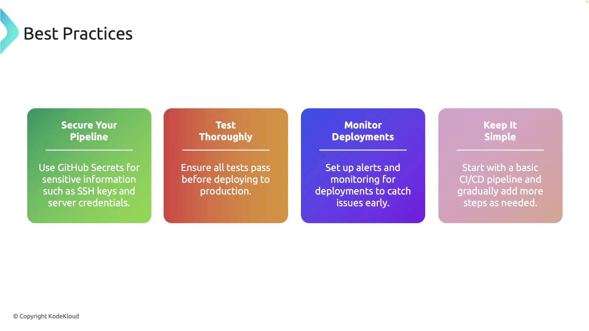

# (Output: Reinitialized existing Git repository in /path/to/repository/.git/)
git remote add origin https://github.com/Priyanka488/rust_mock.git
```

### 2. Create the Workflows Directory

Set up the directory structure required for GitHub Actions:

```bash theme={null}
mkdir -p .github/workflows
```

### 3. Define the Workflow File

Within the `.github/workflows` folder, create a file named `ci.yaml` and add the following configuration:

```yaml theme={null}
name: Rust CI
on: [push, pull_request]

jobs:
  build:
    runs-on: ubuntu-latest
    steps:
      - name: Checkout code
        uses: actions/checkout@v2

      - name: Set up Rust
        uses: actions-rs/toolchain@v1
        with:
          toolchain: stable
          override: true

      - name: Build
        run: cargo build --verbose

      - name: Run tests
        run: cargo test --verbose
```

In this workflow:

* The pipeline is triggered on every push or pull request.
* Jobs run on the latest Ubuntu environment.
* Steps include checking out the code, setting up Rust, building the project, and running tests.

### 4. Commit and Push Your Workflow

After setting up your workflow, stage your changes, commit, and push to your main branch:

```bash theme={null}
git add .
git commit -m "Initial commit: add CI workflow"
git push origin master
```

Visit your repository’s GitHub Actions tab to monitor the workflow run. You should see that each step—checkout, build, and test—executes successfully.

***

## Enhancing the Workflow with Linting and Formatting

For improved code quality, extend your CI workflow to include linting and formatting checks using Clippy and Rustfmt. Update your `ci.yaml` file as shown below:

```yaml theme={null}
name: Rust CI
on: [push, pull_request]

jobs:
  build:
    runs-on: ubuntu-latest
    steps:
      - name: Checkout code
        uses: actions/checkout@v2

      - name: Set up Rust
        uses: actions-rs/toolchain@v1
        with:
          toolchain: stable
          override: true

      - name: Install Clippy
        run: rustup component add clippy

      - name: Run Clippy
        run: cargo clippy

      - name: Build
        run: cargo build --verbose

      - name: Run tests
        run: cargo test --verbose

      - name: Run Rustfmt
        run: cargo fmt -- --check
```

After configuring these additional steps:

* Clippy is installed to identify common issues.
* The project is built and tested.
* Rustfmt checks ensure that your code adheres to standard formatting guidelines.

Stage, commit, and push your changes:

```bash theme={null}
git add .
git commit -m "Add linting and formatting checks"
git push origin master
```

Then, observe the updated workflow in the GitHub Actions tab to verify that linting and formatting checks execute correctly.

***

## Best Practices for CI/CD Pipelines

Adopt the following best practices to maintain a robust CI/CD pipeline:

* **Secure Your Pipeline:** Use [GitHub Secrets](https://docs.github.com/en/actions/security-guides/encrypted-secrets) to manage sensitive information, such as SSH keys and credentials.
* **Ensure Test Coverage:** Always ensure that your tests pass before deploying to production.
* **Monitor Deployments:** Keep a close watch on deployments to quickly identify and resolve potential issues.
* **Start Simple:** Begin with a basic pipeline and incrementally add steps as your project evolves.

<Frame>
  
</Frame>

<Callout icon="lightbulb">
  Following these best practices not only improves the reliability of your deployments but also enhances overall code quality and team collaboration.
</Callout>

<CardGroup>
  <Card title="Watch Video" icon="video" href="https://learn.kodekloud.com/user/courses/rust/module/e9736aa9-07fd-49d2-b348-ab9c4534b367/lesson/b265f5cb-324c-43e0-939a-1467ff54153d" />

  <Card title="Practice Lab" icon="installation" href="https://learn.kodekloud.com/user/courses/rust/module/e9736aa9-07fd-49d2-b348-ab9c4534b367/lesson/ca2b8f97-c505-405f-87c5-3b31543f989e" />
</CardGroup>


# Introduction to Testing in Rust

Source: https://notes.kodekloud.com/docs/Rust-Programming/Testing-Continuous-Integration/Introduction-to-Testing-in-Rust/page

Guide to writing and running Rust unit tests with Cargo, using assertion macros, handling panics and Result tests, interpreting output, and following best practices for reliable tests

Welcome to this lesson on testing in Rust.

Testing is an essential practice that verifies code correctness, prevents regressions, and helps maintain a reliable codebase as your project grows. Rust's testing tools—integrated with Cargo—make it straightforward to write unit tests, verify panics, and use concise error handling in tests.

<Frame>
  
</Frame>

This lesson covers:

* Creating a library and the built-in test template
* Writing and running unit tests with Cargo
* Using assertion macros and interpreting test output
* Handling panics and returning Result in tests
* Best practices for reliable unit tests

<Frame>
  
</Frame>

## Creating a library and the built-in test template

When you create a new Rust library crate, Cargo often includes a small example test module in `lib.rs`. This template demonstrates the typical structure: a public function and a test module guarded by `#[cfg(test)]`.

Example `lib.rs`:

```rust theme={null}
pub fn add(left: u64, right: u64) -> u64 {
    left + right
}

#[cfg(test)]
mod tests {
    use super::*;

    #[test]
    fn it_works() {
        let result: u64 = add(2, 2);
        assert_eq!(result, 4);
    }
}
```

<Callout icon="lightbulb">
  Key points:

  * `#[cfg(test)]` makes the test module compile only when running `cargo test`.
  * `mod tests` is a conventional place to group unit tests.
  * `use super::*;` imports parent-module items to make them available to the tests.
  * `#[test]` marks functions that Cargo will execute as tests.
</Callout>

## Running tests with Cargo

Run all tests with:

* `cargo test` — compiles the crate in test mode and runs all `#[test]` functions.
* `cargo test --lib` — run only library tests.
* `cargo test <test-name>` — run tests matching a substring.

Typical passing output:

```text theme={null}
running 1 test
test tests::it_works ... ok

test result: ok. 1 passed; 0 failed; 0 ignored; 0 measured; 0 filtered out
```

## A simple example: multiply

A small function with a unit test demonstrates the workflow:

```rust theme={null}
pub fn multiply(a: i32, b: i32) -> i32 {
    a * b
}

#[cfg(test)]
mod tests {
    use super::*;

    #[test]
    fn test_multiply() {
        let result: i32 = multiply(3, 4);
        assert_eq!(result, 12);
    }
}
```

Running `cargo test` will compile in test mode and execute `test_multiply`. The test harness prints a per-test pass/fail line and a summary.

<Frame>
  
</Frame>

## Demonstrating a failing test

When an assertion fails, Cargo reports a failure with useful context: the test name, a panic message, and the expected vs actual values when available.

Intentional failing example:

```rust theme={null}
#[cfg(test)]
mod tests {
    use super::*;

    #[test]
    fn test_multiply_failure() {
        let result: i32 = multiply(3, 4);
        assert_eq!(result, 15); // wrong expected value
    }
}
```

Example failing output:

```Rust theme={null}
running 1 test
test tests::test_multiply_failure ... FAILED

failures:

---- tests::test_multiply_failure stdout ----
thread 'tests::test_multiply_failure' panicked at 'assertion `left == right` failed: left: 12, right: 15', src/lib.rs:12:9
note: run with `RUST_BACKTRACE=1` environment variable to display a backtrace

failures:
    tests::test_multiply_failure

test result: FAILED. 0 passed; 1 failed; 0 ignored; 0 measured; 0 filtered out
error: test failed, to rerun pass `--lib`
```

The output shows both the actual and expected values, making it easier to detect and fix logic errors.

## Common assertion macros

Use these assertion macros inside tests to express expectations clearly.

| Macro                     | Description                                                  | Example                                 |
| ------------------------- | ------------------------------------------------------------ | --------------------------------------- |
| `assert!(cond)`           | Asserts a boolean condition is true                          | `assert!(2 + 2 == 4);`                  |
| `assert_eq!(left, right)` | Asserts two expressions are equal (prints values on failure) | `assert_eq!(multiply(2, 3), 6);`        |
| `assert_ne!(left, right)` | Asserts two expressions are not equal                        | `assert_ne!(multiply(2, 3), 7);`        |
| `assert!(cond, "msg")`    | Asserts with a custom failure message                        | `assert!(x > 0, "x must be positive");` |

Example test demonstrating these assertions:

```rust theme={null}
#[cfg(test)]
mod tests {
    use super::*;

    #[test]
    fn test_assertions() {
        // Assert that a condition is true
        assert!(2 + 2 == 4);

        // Assert that two values are equal
        assert_eq!(multiply(2, 3), 6);

        // Assert that two values are not equal
        assert_ne!(multiply(2, 3), 7);

        // Assert with a custom message
        assert!(multiply(2, 2) == 4, "Multiplication failed!");
    }
}
```

If a custom message assertion fails, the message is printed in the panic output to highlight the intent.

## Testing for panics with #\[should\_panic]

To test that code panics in error conditions, use `#[should_panic]`. Optionally provide `expected = "text"` to match the panic message.

Example: a divide function that panics on division by zero

```rust theme={null}
pub fn divide(a: i32, b: i32) -> i32 {
    if b == 0 {
        panic!("Division by zero!");
    }
    a / b
}

#[cfg(test)]
mod tests {
    use super::*;

    #[test]
    #[should_panic(expected = "Division by zero!")]
    fn test_divide_by_zero() {
        divide(10, 0);
    }
}
```

This test passes because the function panics with the expected message.

<Callout icon="warning">
  Use `#[should_panic(expected = "...")]` carefully: matching an expected substring can make tests fragile if panic messages change. Prefer asserting error types or Result-based APIs when possible.
</Callout>

## Writing tests that return Result\<T, E>

Instead of using panics, test functions may return `Result<(), E>`. This lets you use the `?` operator for concise error handling—tests that return `Ok(())` pass; returning `Err(_)` fails.

<Frame>
  !\[A presentation slide titled "Writing Tests With Result\<T, E]" with a colored banner that reads "Using Result\<T, E> in tests enables concise error handling with the ? operator." The slide has a © Copyright KodeKloud notice in the bottom-left.]\(/images/Rust-Programming/Testing-Continuous-Integration/Introduction-to-Testing-in-Rust/writing-tests-result-t-e-slide.jpg)
</Frame>

Example: check if a file exists

```rust theme={null}
use std::fs;

#[test]
fn test_file_exists() -> Result<(), String> {
    let file_path = "Cargo.toml";
    if fs::metadata(file_path).is_ok() {
        Ok(())
    } else {
        Err(format!("File {} does not exist.", file_path))
    }
}
```

If `Cargo.toml` exists in the test working directory, this test will pass. Returning `Result` is especially useful when tests perform I/O or use other fallible APIs.

## Interpreting test output

When running tests, Cargo prints:

* a per-test line showing name and status (ok/FAILED/ignored)
* detailed failure reports including backtraces (if `RUST_BACKTRACE=1`)
* a final summary with counts of passed/failed/ignored tests

This output helps you quickly locate failing cases and the code locations that triggered the failures.

## Best practices

<Frame>
  
</Frame>

* Keep tests independent: avoid shared mutable state and order-dependent behavior.
* Use descriptive names: a clear test name documents intent and simplifies debugging.
* Test edge cases: include boundary conditions, error paths, and invalid inputs.
* Prefer explicit checks over fragile string matching for panics—use `Result`-based APIs or error types when possible.
* Refactor tests alongside code: remove duplication and keep tests readable and maintainable.

Following these practices results in more reliable tests and a healthier codebase.

## Quick reference

| Topic                 | Command / Pattern                                        |
| --------------------- | -------------------------------------------------------- |
| Run all tests         | `cargo test`                                             |
| Run specific test     | `cargo test <name>`                                      |
| Test module guard     | `#[cfg(test)]`                                           |
| Mark test             | `#[test]`                                                |
| Expect panic          | `#[should_panic]` or `#[should_panic(expected = "...")]` |
| Result-returning test | `fn test() -> Result<(), E>`                             |

## Links and further reading

* [The Rust Book — Testing](https://doc.rust-lang.org/book/ch11-00-testing.html)
* [Rust Reference — Testing](https://doc.rust-lang.org/reference/attributes/testing.html)
* [Cargo — Running Tests](https://doc.rust-lang.org/cargo/commands/cargo-test.html)

Mocking and integration testing are more advanced topics you can explore next; start there once you're comfortable with unit testing basics and the patterns shown above.

<CardGroup>
  <Card title="Watch Video" icon="video" href="https://learn.kodekloud.com/user/courses/rust/module/e9736aa9-07fd-49d2-b348-ab9c4534b367/lesson/5e629a8e-da68-410c-8071-405d1a7e86b5" />
</CardGroup>
