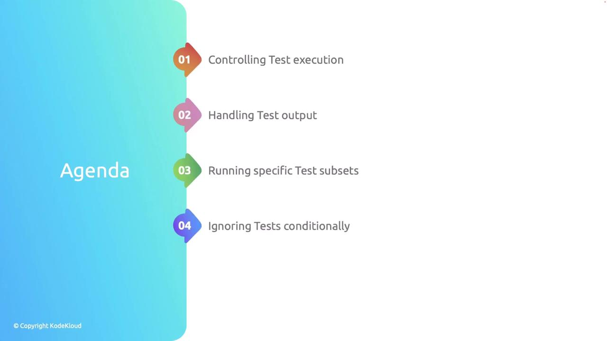
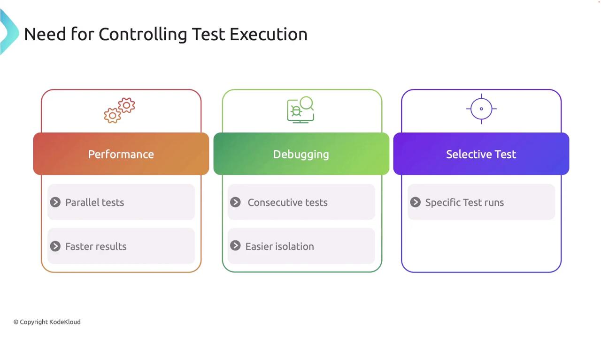
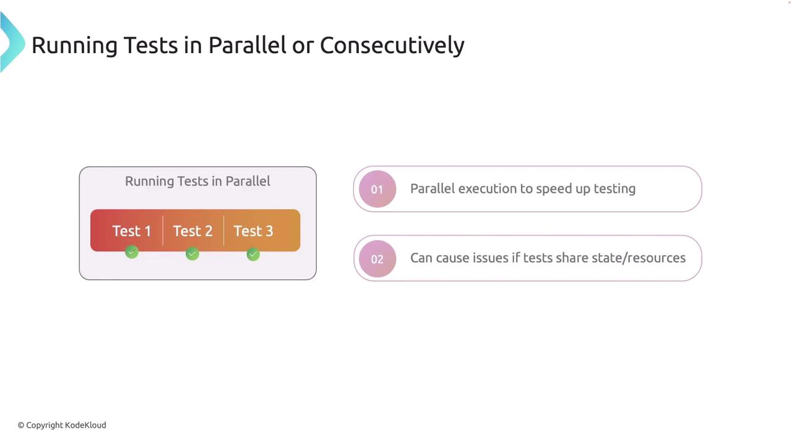
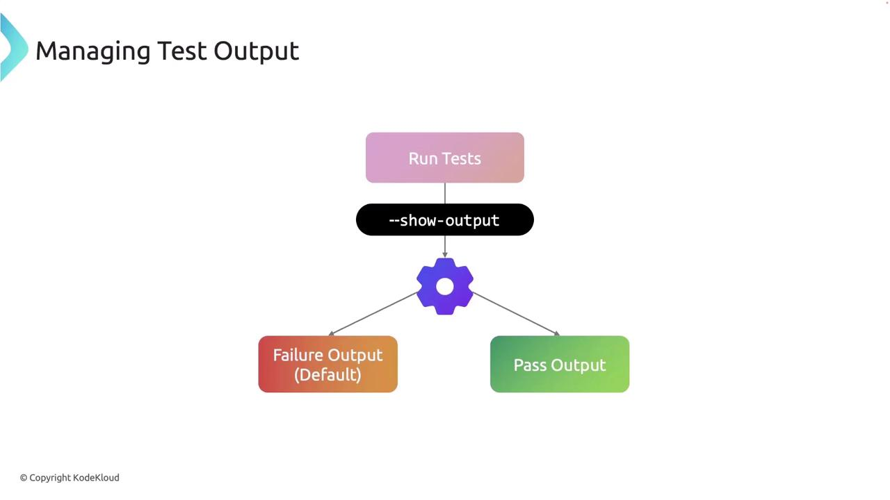
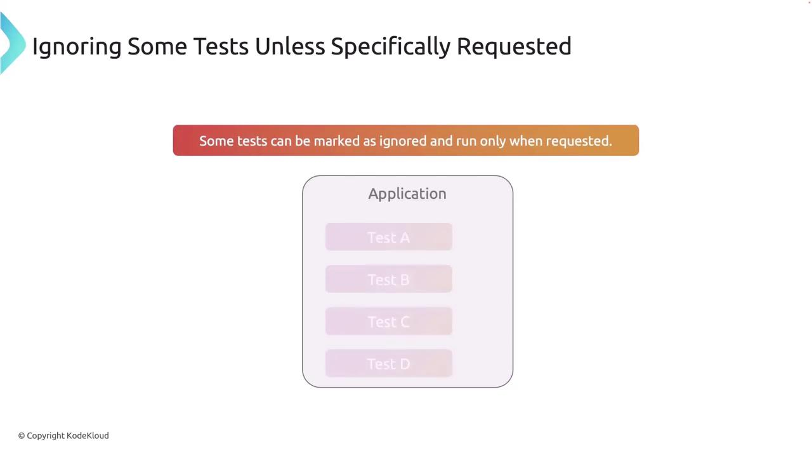
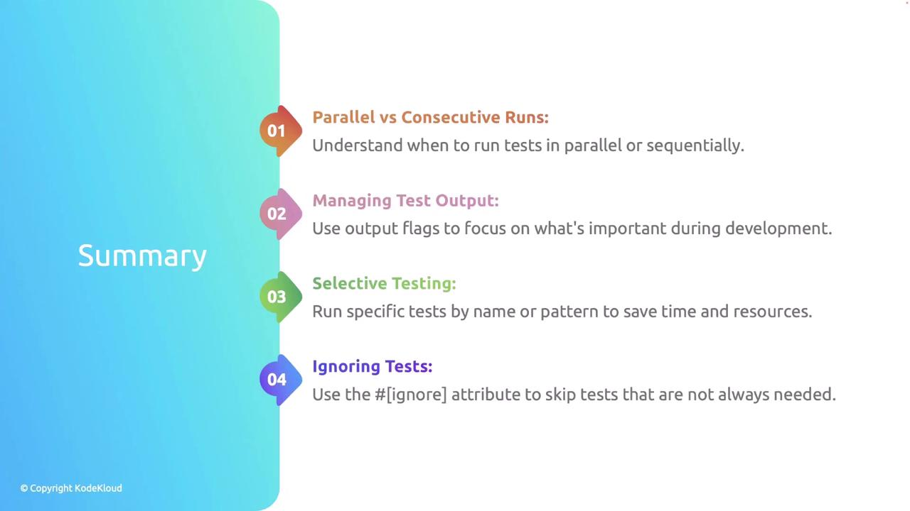

# Managing and Running Tests in Rust

Source: https://notes.kodekloud.com/docs/Rust-Programming/Testing-Continuous-Integration/Managing-and-Running-Tests-in-Rust/page

This article explores advanced techniques for managing and running tests in Rust, focusing on optimizing testing workflows in larger projects.

In this lesson, we explore advanced techniques for managing and running tests in Rust. We cover strategies such as controlling test execution, handling test output, filtering tests, and conditionally ignoring tests. These techniques can greatly optimize your testing workflow, especially in larger projects.

<Frame>
  
</Frame>

## Why Control Test Execution?

Controlling test execution can be essential for several reasons:

1. **Performance**\
   Running tests in parallel can significantly reduce overall test runtime.

2. **Debugging**\
   Executing tests sequentially may help isolate issues more effectively.

3. **Selective Testing**\
   Filtering tests allows you to focus on specific areas under active development, saving valuable time.

<Frame>
  
</Frame>

By default, Rust runs tests in parallel using Cargo. While this improves speed, it may occasionally cause issues if tests share state or resources.

<Frame>
  
</Frame>

### Running Tests Sequentially

When you need to run tests consecutively—for instance, when debugging tests that are not thread-safe—use the `--test-threads=1` flag with Cargo. This flag disables parallel execution.

<Callout icon="lightbulb">
  Running tests sequentially can help pinpoint failures by isolating test interactions.
</Callout>

For example, execute the following command:

```bash theme={null}
$ cargo test -- --test-threads=1
```

## Managing Test Output

Rust captures standard output during tests by default to maintain a clean test summary. However, you can use the `--nocapture` flag to display output from passing and failing tests, which is particularly useful for debugging `println!` outputs.

<Frame>
  
</Frame>

Consider the following example to understand how output is managed during testing:

```rust theme={null}
// Filename: src/lib.rs

pub fn greet(name: &str) -> String {
    format!("Hello, {}!", name)
}

#[cfg(test)]
mod tests {
    use super::*;

    #[test]
    fn test_greet() {
        let greeting = greet("Alice");
        println!("Greeting: {}", greeting);
        assert!(greeting.contains("Hello"));
    }
}
```

Run the tests with:

```bash theme={null}
$ cargo test
```

Remember, only outputs from failing tests are shown by default unless the `--nocapture` flag is used.

## Running Specific Subsets of Tests

Sometimes you may want to execute only specific tests rather than running the entire suite. Rust allows you to filter tests by name. For example, to run just the `test_greet` function, use:

```bash theme={null}
$ cargo test test_greet
```

Alternatively, you can run all tests that share a common substring in their names:

```bash theme={null}
$ cargo test test_
```

This flexibility is particularly useful when you are developing a specific feature or debugging a subset of functionality.

## Ignoring Tests Unless Explicitly Requested

Certain tests, such as those that are time-consuming or depend on external resources, may not need to run every time. Rust provides the `#[ignore]` attribute to mark these tests so that they are skipped by default.

<Frame>
  
</Frame>

Below is an example demonstrating how to mark a slow test with `#[ignore]`:

```rust theme={null}
// Filename: src/lib.rs
#[cfg(test)]
mod tests {
    use super::*;
    
    #[test]
    fn quick_test() {
        assert_eq!(2 + 2, 4);
    }

    #[test]
    #[ignore]
    fn slow_test() {
        // This test simulates a time-consuming scenario.
        assert_eq!(2 + 2, 4);
    }
}
```

To run only tests marked with `#[ignore]`, use:

```bash theme={null}
$ cargo test -- --ignored
```

Alternatively, you can include ignored tests in a full run with the appropriate Cargo flag.

## Practical Usage Scenarios

Below are practical scenarios to enhance your testing workflow:

1. **Debugging with Sequential Runs**\
   When tests intermittently fail due to shared state, it's helpful to run them sequentially:

   ```bash theme={null}
   $ cargo test -- --test-threads=1
   ```

2. **Focusing on Critical Features**\
   For critical feature development, filter tests by a substring to run only the relevant tests:

   ```bash theme={null}
   $ cargo test feature_name
   ```

3. **Managing Test Output During Development**\
   When debugging, the `--nocapture` flag allows you to view all output, which may assist in identifying issues:

   ```bash theme={null}
   $ cargo test --nocapture
   ```

## Summary

Effective test management in Rust involves knowing when and how to run tests both in parallel and sequentially. Using flags to manage test output and filtering helps streamline debugging and development. Moreover, marking tests as ignored optimizes your test suite by focusing on essential tests during each run.

<Frame>
  
</Frame>

## Best Practices

* **Isolate Tests**\
  Ensure tests do not rely on shared state or external resources to prevent flaky results.

* **Run Tests Frequently**\
  Utilize selective testing to run the most critical tests frequently during development.

* **Keep Test Output Clean**\
  Limit the display of output to necessary debugging information for enhanced readability.

<Callout icon="lightbulb">
  Following these best practices will improve your development workflow and contribute to a more robust and maintainable codebase.
</Callout>

With these strategies and best practices, you can efficiently manage and run tests in Rust, thereby optimizing your development process and ensuring that your tests provide reliable insights into your code’s performance.

<CardGroup>
  <Card title="Watch Video" icon="video" href="https://learn.kodekloud.com/user/courses/rust/module/e9736aa9-07fd-49d2-b348-ab9c4534b367/lesson/e6394d18-6fee-4687-a00c-2958cc637cbc" />
</CardGroup>
