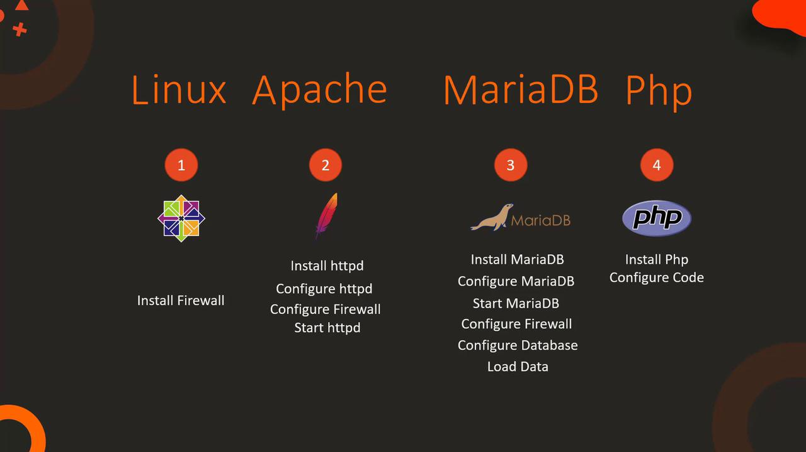

# Disabling symbolic-links is recommended to prevent assorted security risks
symbolic-links=0

[mysqld_safe]
log-error=/var/log/mariadb/mariadb.log
pid-file=/var/run/mariadb/mariadb.pid
```

<Callout icon="lightbulb">
  Leave these settings as default unless you require any custom changes, such as modifying the port.
</Callout>

***

## 2. Configuring the Database

### a. Creating the Database and User

Start by entering the MariaDB prompt:

```bash theme={null}
mysql
```

At the MariaDB monitor, execute the following SQL commands to create the database, user, and grant necessary privileges. In this example, the database is "ecomdb", the user is "ecomuser", and the password is "ecompassword":

```sql theme={null}
CREATE DATABASE ecomdb;
SHOW DATABASES;

CREATE USER 'ecomuser'@'localhost' IDENTIFIED BY 'ecompassword';
GRANT ALL PRIVILEGES ON *.* TO 'ecomuser'@'localhost';
FLUSH PRIVILEGES;
```

Successful execution of these commands should display no errors, and `SHOW DATABASES;` will list "ecomdb".

### b. Loading Inventory Data

The repository provides a SQL script (usually in the assets directory named `db-load-script.sql`) that creates a "products" table and inserts sample data.

1. Create the SQL script file:

   ```bash theme={null}
   cat > db-load-script.sql
   ```

2. Open the file in your favorite text editor and insert the following:

   ```sql theme={null}
   USE ecomdb;

   CREATE TABLE products (
     id mediumint(8) unsigned NOT NULL auto_increment,
     Name varchar(255) DEFAULT NULL,
     Price varchar(255) DEFAULT NULL,
     ImageUrl varchar(255) DEFAULT NULL,
     PRIMARY KEY (id)
   ) AUTO_INCREMENT=1;

   INSERT INTO products (Name, Price, ImageUrl) VALUES 
     ("Laptop", "100", "c-1.png"),
     ("Drone", "20", "c-2.png"),
     ("VR", "300", "c-3.png"),
     ("Tablet", "50", "c-5.png"),
     ("Watch", "90", "c-6.png"),
     ("Phone Covers", "20", "c-7.png"),
     ("Phone", "80", "c-8.png"),
     ("Laptop", "150", "c-4.png");
   ```

3. Save the file and load it into MySQL:

   ```bash theme={null}
   mysql < db-load-script.sql
   ```

4. Finally, verify the data load by logging back into MariaDB and executing:

   ```sql theme={null}
   USE ecomdb;
   SELECT * FROM products;
   ```

You should see a list of products with their details.

***

## 3. Deploying and Configuring the Web Server

### a. Installing Apache, PHP, and PHP-MySQL

Install the necessary packages to run a web server with PHP support:

```bash theme={null}
sudo yum install -y httpd php php-mysql
```

Allow HTTP traffic by adding a firewall rule for port 80:

```bash theme={null}
sudo firewall-cmd --permanent --zone=public --add-port=80/tcp
sudo firewall-cmd --reload
```

Edit Apache’s configuration file if required. For example, ensure the DirectoryIndex directive prioritizes `index.php`:

```apache theme={null}
# DirectoryIndex: sets the file that Apache will serve if a directory is requested.
DirectoryIndex index.php
```

Start and enable the Apache HTTP server:

```bash theme={null}
sudo service httpd start
sudo systemctl enable httpd
```

### b. Downloading the Application Code

Ensure Git is installed:

```bash theme={null}
sudo yum install -y git
```

Then, clone the e-commerce application repository:

```bash theme={null}
git clone https://github.com/kodekloudhub/learning-app-ecommerce.git
```

This repository includes all the required web files, including `index.php`.

### c. Verifying the Application

Before making adjustments, verify that the application is accessible by using a web browser or curl:

```bash theme={null}
curl http://localhost
```

At this stage, you might see a default page that does not display the configured e-commerce application. This may be due to an old database connection configuration.

### d. Updating the Database Connection in index.php

Open the `index.php` file from the cloned repository and update the database connection details. Replace any external IP address (e.g., 172.20.1.101) with `localhost` and ensure the username, password, and database name match your configuration:

```php theme={null}
<?php
$link = mysqli_connect('localhost', 'ecomuser', 'ecompassword', 'ecomdb');
if ($link) {
    $res = mysqli_query($link, "SELECT * FROM products");
    while ($row = mysqli_fetch_assoc($res)) { 
        // Display product information
        ?>
        <div class="col-md-3 col-sm-6 business_content">
            <?php echo ''; ?>
            <div class="media">
                <div class="media-left"></div>
                <div class="media-body">
                    <a href="#"><?php echo $row['Name']; ?></a>
                    <span>Purchase <?php echo $row['Price']; ?>$</span>
                </div>
            </div>
        </div>
    <?php 
    }
}
?>
```

Save the changes and refresh your web page (or run curl again):

```bash theme={null}
curl http://localhost
```

You should now see the updated list of products from your database.

***

## 4. Optional: Handling index.html vs. index.php

If an `index.html` file exists in the document root of your web server, Apache might serve that file by default over `index.php`. To ensure that Apache serves the e-commerce application:

* Either remove/rename the `index.html` file, or
* Update the `DirectoryIndex` directive in `/etc/httpd/conf/httpd.conf` as shown below:

  ```apache theme={null}
  DirectoryIndex index.php
  ```

Restart Apache to apply the changes:

```bash theme={null}
sudo service httpd restart
```

Then, confirm by visiting:

```bash theme={null}
curl http://localhost
```

Your e-commerce application should now display the products loaded from the database.

***

Thank you for following this guide on deploying the KodeKloud ECommerce Application. With both the web server and the application correctly configured along with its database, your e-commerce site should now be fully operational.

For further reading on web server deployment and database configuration concepts, consider checking out these resources:

* [Apache HTTP Server Documentation](https://httpd.apache.org/docs/)
* [MariaDB Knowledge Base](https://mariadb.com/kb/en/)
* [PHP Manual](https://www.php.net/manual/en/)

<Callout icon="lightbulb">
  Regularly back up your configuration files and database to prevent data loss and ease recovery in case of system failures.
</Callout>

<CardGroup>
  <Card title="Watch Video" icon="video" href="https://learn.kodekloud.com/user/courses/shell-scripts-for-beginners/module/0e75480e-85f7-470c-9aa4-fac3fef0ede7/lesson/1da45f7e-0de3-4563-9e0f-a0221f54a376" />

  <Card title="Practice Lab" icon="installation" href="https://learn.kodekloud.com/user/courses/shell-scripts-for-beginners/module/0e75480e-85f7-470c-9aa4-fac3fef0ede7/lesson/2f9d4198-72ca-4408-b1b8-5fac4ec299f5" />
</CardGroup>


# Project KodeKloud e commerce application

Source: https://notes.kodekloud.com/docs/Shell-Scripts-for-Beginners/Project-E-Commerce-Application/Project-KodeKloud-e-commerce-application/page

This guide covers the deployment and configuration of the KodeKloud eCommerce Application using a LAMP stack on a CentOS machine.

In this guide, we will walk through the deployment and configuration of the KodeKloud eCommerce Application—a fictional online store specializing in electronic devices. The application leverages a LAMP stack (Linux, Apache, MariaDB, PHP) on a CentOS machine. While the application is built around MySQL, our labs use MariaDB, a community fork of MySQL. You can substitute MySQL in your own environment if preferred.

## Deployment Overview

The deployment process is divided into several key steps:

1. Identify the system for deployment (using a CentOS machine).
2. Install and configure the Apache HTTP server.
3. Install and configure the MariaDB database (using MariaDB instead of MySQL).
4. Install and configure PHP to integrate smoothly with Apache.
5. Set up additional system requirements, such as firewall rules.
6. Download and configure the application code from Git.

<Frame>
  
</Frame>

## Step 1: Firewall and Database Setup

Before installing application components, ensure all system prerequisites are met. Begin by setting up the firewall and configuring the MariaDB database:

1. Install and start the `firewalld` service.
2. Install and configure MariaDB by editing the `/etc/my.cnf` file for the correct port settings.
3. Start and enable the MariaDB service.
4. Add firewall rules to allow SQL access on port 3306.
5. Configure the database by creating the necessary user and database, then import inventory data.
6. Install Apache, PHP packages, and optionally Git to download the application code.

Below is the complete sequence of commands:

```bash theme={null}
$ sudo yum install firewalld
$ sudo service firewalld start
$ sudo systemctl enable firewalld

$ sudo yum install mariadb-server
$ sudo vi /etc/my.cnf  # Configure the file with the correct port settings
$ sudo service mariadb start
$ sudo systemctl enable mariadb

$ sudo firewall-cmd --permanent --zone=public --add-port=3306/tcp
$ sudo firewall-cmd --reload
