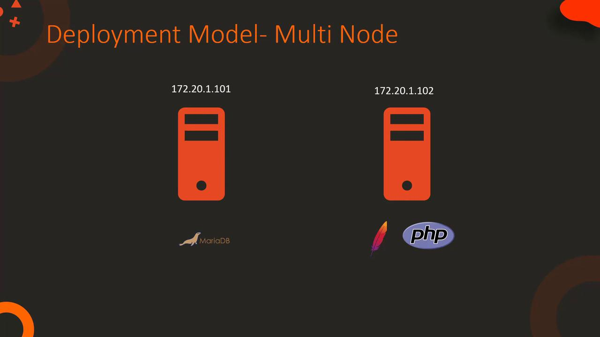

# Configure the database
$ mysql
MariaDB > CREATE DATABASE ecomdb;
MariaDB > CREATE USER 'ecomuser'@'localhost' IDENTIFIED BY 'ecompassword';
MariaDB > GRANT ALL PRIVILEGES ON *.* TO 'ecomuser'@'localhost';
MariaDB > FLUSH PRIVILEGES;

# Load inventory data
$ mysql < db-load-script.sql
```

<Callout icon="lightbulb">
  Ensure that the `/etc/my.cnf` file is correctly updated with the appropriate port settings before starting MariaDB.
</Callout>

## Step 2: Apache and PHP Configuration

Next, configure Apache and PHP. This step involves the installation of necessary packages, updating Apache’s configuration to prioritize `index.php`, adjusting firewall rules for HTTP traffic, and cloning the application code from Git.

```bash theme={null}
$ sudo yum install -y httpd php php-mysql
$ sudo firewall-cmd --permanent --zone=public --add-port=80/tcp
$ sudo firewall-cmd --reload

$ sudo vi /etc/httpd/conf/httpd.conf
$ sudo service httpd start
$ sudo systemctl enable httpd

$ sudo yum install -y git
$ git clone https://github.com/<application>.git /var/www/html/
$ curl http://localhost
```

This completes the deployment of the LAMP stack application on a single-node system.

## Multi-Node Deployment

In a multi-node deployment scenario, the database and web server are hosted on separate nodes. The fundamental configuration steps remain the same, with an emphasis on connectivity settings. For example, when configuring the database, specify the web server's IP address for user access. Similarly, update the `index.php` file on the web server with the database server’s IP address.

<Frame>
  
</Frame>

### Configuring the Database for Multi-Node Setup

Execute the following commands to set up the database for a multi-node environment:

```sql theme={null}
$ mysql
MariaDB > CREATE DATABASE ecomdb;
MariaDB > CREATE USER 'ecomuser'@'172.20.1.102' IDENTIFIED BY 'ecompassword';
MariaDB > GRANT ALL PRIVILEGES ON *.* TO 'ecomuser'@'172.20.1.102';
MariaDB > FLUSH PRIVILEGES;
```

### Example PHP Code for Remote Database Connection

Below is a sample PHP code snippet that demonstrates how to connect to the remote database server:

```php theme={null}
$link = mysqli_connect('172.20.1.101', 'ecomuser', 'ecompassword');

if ($link) {
    $res = mysqli_query($link, "SELECT * FROM products;");
    while ($row = mysqli_fetch_assoc($res)) { 
        // Process each row as needed
    }
}
```

## Detailed Example: index.php File

A crucial component of the application is the `index.php` file, which is responsible for establishing the database connection and rendering product information. In the following example, the connection to the MariaDB database is set up using the IP address, database name, user ID, and password:

```php theme={null}
$link = mysqli_connect('172.20.1.101', 'ecomuser', 'ecompassword', 'ecomdb');
if ($link) {
  $res = mysqli_query($link, "SELECT * FROM products;");
  while ($row = mysqli_fetch_assoc($res)) { 
    // Your code to display product information  
  }
}
```

For a live demonstration of product details rendering on the webpage, consider the expanded PHP snippet below:

```php theme={null}
$link = mysqli_connect('172.20.1.101', 'ecomuser', 'ecompassword', 'ecomdb');
if ($link) {
    $res = mysqli_query($link, "SELECT * FROM products;");
    while ($row = mysqli_fetch_assoc($res)) { ?>
        <div class="col-md-3 col-sm-6 business_content">
            <?php echo ''; ?>
            <div class="media">
                <div class="media-left">
                    <!-- Placeholder for media icon if needed -->
                </div>
                <div class="media-body">
                    <a href="#"><?php echo $row['Name']; ?></a>
                    <p>Purchase <?php echo $row['Name']; ?> at the lowest price <span>$<?php echo $row["Price"]; ?></span></p>
                </div>
            </div>
        </div>
<?php 
    } 
}
```

<Callout icon="triangle-alert">
  Double-check the database credentials and IP addresses during configuration. Incorrect settings may lead to connection failures.
</Callout>

## Conclusion

After reviewing this setup and demonstration, proceed to your project labs to apply these configurations. Begin by setting up your project environment and ensure that each component operates correctly. This detailed guide has covered both single-node and multi-node deployment scenarios to match a range of real-world architectures.

For further reading, consider exploring the following resources:

* [Kubernetes Basics](https://kubernetes.io/docs/concepts/overview/what-is-kubernetes/)
* [Kubernetes Documentation](https://kubernetes.io/docs/)
* [Docker Hub](https://hub.docker.com/)
* [Terraform Registry](https://registry.terraform.io/)

<CardGroup>
  <Card title="Watch Video" icon="video" href="https://learn.kodekloud.com/user/courses/shell-scripts-for-beginners/module/0e75480e-85f7-470c-9aa4-fac3fef0ede7/lesson/14e1f54f-6652-41e6-8cab-96c4c823e784" />
</CardGroup>


# Solution Project ECommerce Application

Source: https://notes.kodekloud.com/docs/Shell-Scripts-for-Beginners/Project-E-Commerce-Application/Solution-Project-ECommerce-Application/page

This article demonstrates developing a shell script to deploy an ECommerce Application on a CentOS system.

In this lesson, we demonstrate how to develop a shell script to deploy the ECommerce Application on a CentOS system. The deployment process includes installing and configuring Firewalld, MariaDB, Apache (httpd), PHP, and Git; setting up the database with inventory data; and verifying that the web server serves the application correctly.

Below is an enhanced walkthrough that maintains the original command order and details while improving readability, flow, and technical accuracy.

***

## 1. Initial Command Overview

The following commands install and start Firewalld and MariaDB, update the firewall to allow traffic on port 3306, and launch the MySQL client:

```bash theme={null}
sudo yum install -y firewalld
sudo service firewalld start
sudo systemctl enable firewalld

sudo yum install -y mariadb-server
sudo vi /etc/my.cnf
sudo service mariadb start
sudo systemctl enable mariadb

sudo firewall-cmd --permanent --zone=public --add-port=3306/tcp
sudo firewall-cmd --reload
mysql
```

<Callout icon="lightbulb">
  Although the instructions include manual editing of `/etc/my.cnf` using `vi`, you can automate configuration changes with tools like `sed` for a fully automated deployment.
</Callout>

***

## 2. Developing the Deployment Script

Create the deployment script locally using your favorite IDE (e.g., PyCharm) and test it in your lab environment. Name the script file, for example, `deploy_ECommerce_Application.sh`. Start by copying the essential commands from your Git repository before gradually improving and testing the script.

An initial version might look like this:

```bash theme={null}
sudo yum install -y firewalld
sudo service firewalld start
sudo systemctl enable firewalld

sudo yum install -y mariadb-server
sudo vi /etc/my.cnf
sudo service mariadb start
sudo systemctl enable mariadb

sudo firewall-cmd --permanent --zone=public --add-port=3306/tcp
sudo firewall-cmd --reload

mysql
```

Testing command blocks individually ensures that each part runs non-interactively (thanks to the `-y` option) and highlights any permission or manual input issues.

***

## 3. Database Configuration

### 3.1. Configuring the Database

Create a SQL script to setup the database by creating a database, user, and assigning privileges:

```bash theme={null}
cat > configure-db.sql <<EOF
CREATE DATABASE ecomdb;
CREATE USER 'ecomuser'@'localhost' IDENTIFIED BY 'ecompassword';
GRANT ALL PRIVILEGES ON *.* TO 'ecomuser'@'localhost';
FLUSH PRIVILEGES;
EOF

sudo mysql < configure-db.sql
```

<Callout icon="lightbulb">
  For automated configuration, consider replacing manual edits with command-line utilities such as `sed` to modify files like `/etc/my.cnf` programmatically.
</Callout>

### 3.2. Loading Inventory Data

Load sample inventory data by creating a SQL script that creates a table and populates it with product details:

```bash theme={null}
cat > db-load-script.sql <<EOF
USE ecomdb;
CREATE TABLE products (
  id mediumint(8) unsigned NOT NULL AUTO_INCREMENT,
  Name varchar(255) DEFAULT NULL,
  Price decimal(10,2) DEFAULT NULL,
  ImageUrl varchar(255) DEFAULT NULL,
  PRIMARY KEY (id)
);
INSERT INTO products (Name,Price,ImageUrl) VALUES 
  ("Laptop", "100", "c-1.png"),
  ("Drone", "200", "c-2.png"),
  ("VR", "300", "c-3.png"),
  ("Tablet", "5", "c-5.png"),
  ("Watch", "90", "c-6.png"),
  ("Phone", "80", "c-8.png"),
  ("Laptop", "150", "c-4.png");
EOF

sudo mysql < db-load-script.sql
```

If you face access issues (e.g., "Access denied for user ... to database 'ecomdb'"), try running the command with `sudo`.

***

## 4. Web Server Configuration

Install and configure Apache, PHP, and Git. Modify the server configuration to use `index.php` instead of `index.html` and clone the application repository.

```bash theme={null}
sudo yum install -y httpd php php-mysql
sudo firewall-cmd --permanent --zone=public --add-port=80/tcp
sudo firewall-cmd --reload
sudo sed -i 's/index.html/index.php/g' /etc/httpd/conf/httpd.conf

sudo service httpd start
sudo systemctl enable httpd
```

Clone the repository and update the configuration to replace the database IP with localhost:

```bash theme={null}
sudo yum install -y git
sudo git clone https://github.com/kodekloudhub/learning-app-ecommerce.git /var/www/html/
sudo sed -i 's/172.20.1.101/localhost/g' /var/www/html/index.php
```

You can test the web application with:

```bash theme={null}
curl http://localhost
```

***

## 5. Enhancing the Script with Checks and User-Friendly Messages

For a production-grade script, it is ideal to include functions that provide colored status messages, verify service activity, and confirm that firewall rules and web content are as expected. Below is an example of an enhanced deployment script:

```bash theme={null}
#!/bin/bash
