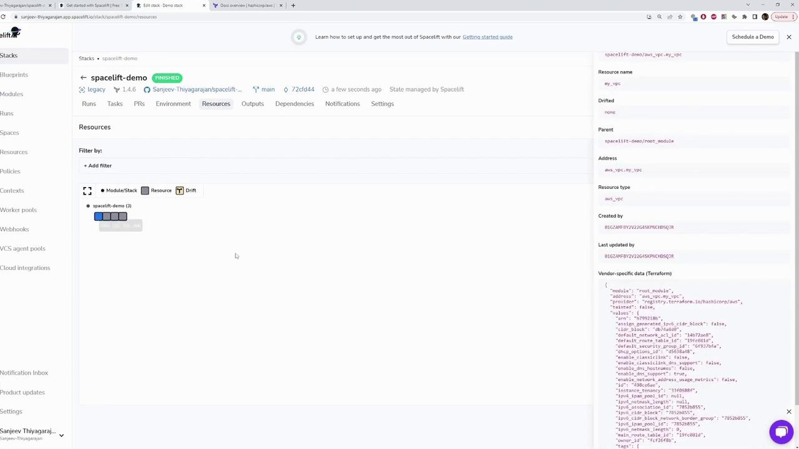
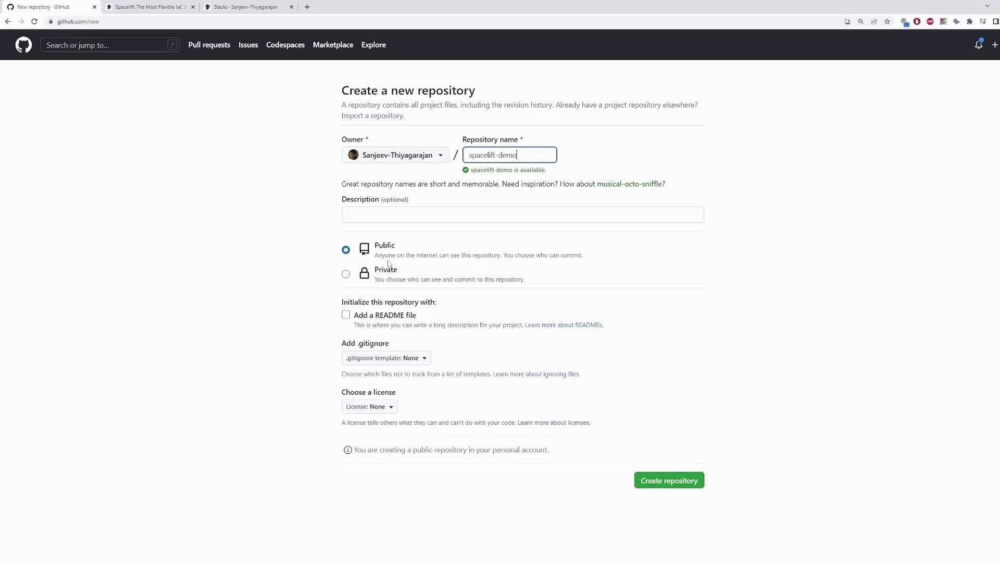
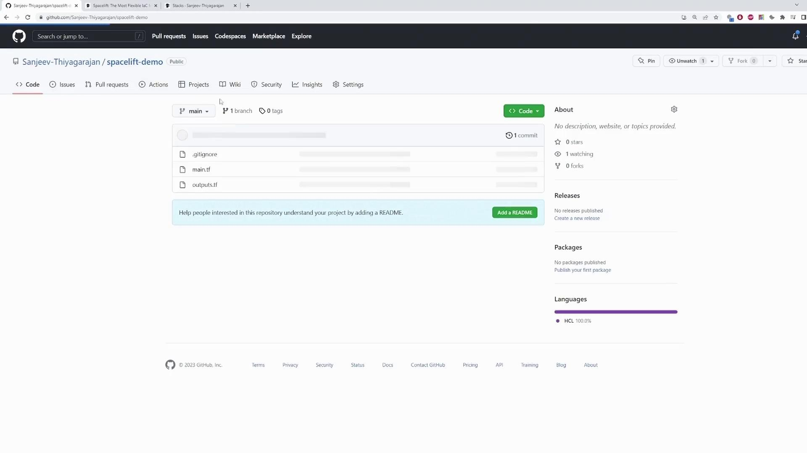
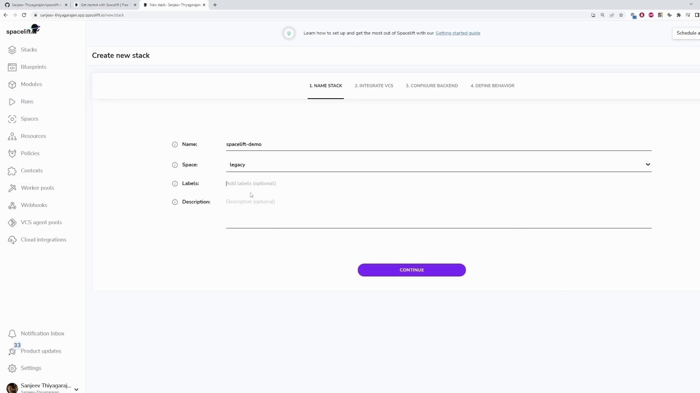
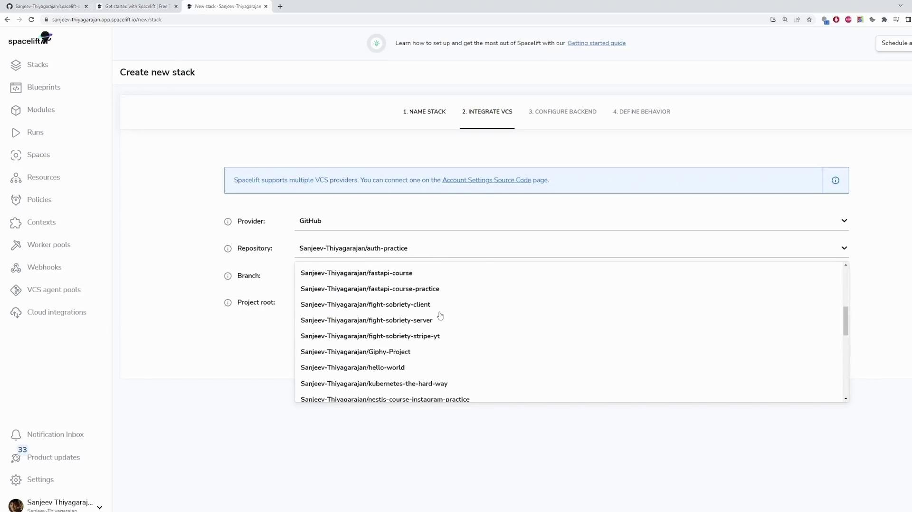
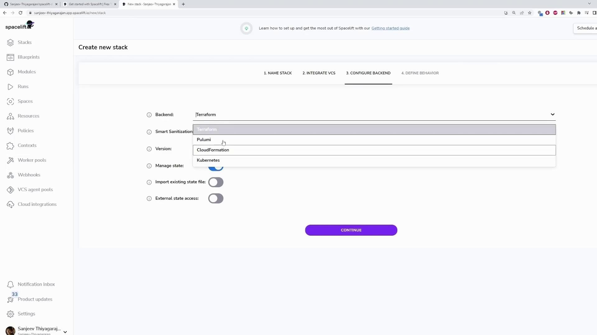
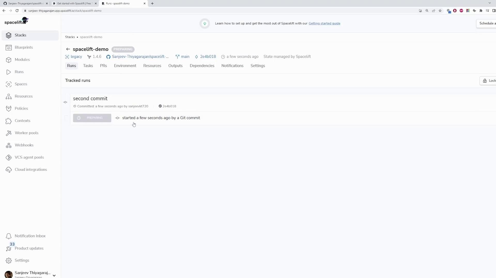

# aws_vpc.my_vpc will be created
resource "aws_vpc" "my_vpc" {
  cidr_block                = "10.0.0.0/16"
  default_network_acl_id    = (known after apply)
  default_route_table_id    = (known after apply)
  enable_dns_support        = (known after apply)
  enable_classiclink        = (known after apply)
  enable_classiclink_dns_support = (known after apply)
  enable_dhpc_options       = true
  id                       = (known after apply)
}
```

<Callout icon="lightbulb">
  At this point, the plan is in an unconfirmed state. Instead of confirming or discarding the plan immediately, another engineer might make a change to the VPC configuration.
</Callout>

## Handling Concurrent Changes

Assume another engineer updates the VPC configuration by changing the CIDR block to 10.2.0.0/16. Their updated configuration is as follows:

```hcl theme={null}
provider "aws" {
  region = "us-east-1"
}

resource "aws_vpc" "my_vpc" {
  cidr_block = "10.2.0.0/16"

  tags = {
    Name = "tf-example"
  }
}
```

After committing these changes, you will see similar Git output:

```bash theme={null}
1 file changed, 8 insertions(+)
$ git push
Enumerating objects: 5, done.
Counting objects: 100% (5/5), done.
Delta compression using up to 12 threads
Compressing objects: 100% (3/3), done.
Writing objects: 100% (3/3), 415 bytes | 415.00 KiB/s, done.
Total 3 (delta 1), reused 0 (delta 0), pack-reused 0
remote: Resolving deltas: 100% (1/1), completed with 1 local object.
To https://github.com/Sanjeev-Thiyagarajan/spacelift-demo.git
   2e4d018..1587182  main -> main
```

Since the previous run is still awaiting confirmation, this new commit causes the new run to be queued. Spacelift blocks the new plan because a prior commit is pending confirmation. The following log output illustrates the plan execution for the queued run:

```plaintext theme={null}
Plan: 1 to add, 0 to change, 0 to destroy.
  [16G2A21ZKRPPCFHCXHCKDX] changes are GO
  Uploading the list of managed resources...
  Please be aware that Run changes calculation includes Terraform output changes.
  Resource list upload is GO
  Generating JSON representation of the plan...
  JSON representation is GO
  Loading custom plan policy inputs...
  No custom plan policy inputs found
  Encrypting workspace...
  Uploading workspace...
  [16G2A21ZKRPPCFHCXHCKDX] workspace upload is GO
```

<Callout icon="triangle-alert">
  If the run remains in a queued state due to an unconfirmed prior commit, you may need to discard the queued run to allow the previously pending changes to proceed.
</Callout>

## Finalizing the Run

Once the queued run is discarded, the remaining unconfirmed run continues through the following initialization steps:

* Downloading the source code.
* Setting up mounted files.
* Configuring file permissions.
* Pulling the required Docker image.
* Downloading Terraform.
* Creating and starting the Docker container.
* Verifying prerequisites.

Example initialization output:

```plaintext theme={null}
[019A21Z1ZKRPCPWHCHDX]
Downloading source code...
Source code is GO
Setting up mounted files...
Mounted files are GO
Configuring file permissions...
Permissions are GO
Evaluating run initialization policy...
No initialization policies attached
Pulling Docker image public.ecr.aws/spacelift/runner-terraform:latest...
Docker image is GO
Downloading Terraform 1.4.6...
Terraform 1.4.6 download is GO (/bin/terraform)
Creating Docker container...
Starting Docker container...
Docker container is GO
Verifying container image prerequisites...
Successfully verified container image prerequisites
```

After reviewing the plan, you can confirm the run. The confirmed plan incorporates a minor adjustment in the resource tags, as seen below:

```hcl theme={null}
tags = {
  "Name" = "tf-example"
}
tags_all = {
  "Name" = "tf-example"
}

Plan: 1 to add, 0 to change, 0 to destroy.
[016A21Z1KCPW93HDBYHCKD] Changes are GO
[016A21Z1KCPW93HDBYHCKD] Uploading the list of managed resources...
Please be aware that run changes calculation includes Terraform output changes.
[016A21Z1KCPW93HDBYHCKD] Generating JSON representation of the plan...
json representation is GO
[016A21Z1KCPW93HDBYHCKD] Loading custom plan policy inputs...
[016A21Z1KCPW93HDBYHCKD] No custom plan policy inputs found
```

Confirming the run initiates Terraform to apply the changes. During the apply phase, the new VPC is created successfully:

```plaintext theme={null}
Configuring Terraform CLI...
Terraform CLI config is GO
Running 0 custom hooks.
Applying changes...
aws_vpc.my_vpc: Creating...
aws_vpc.my_vpc: Creation complete after 2s [id=vpc-04ba775bef2142e4]
Apply complete! Resources: 1 added, 0 changed, 0 destroyed.

Outputs:
instance_id = "i-0aad255fcf794a89b"
instance_public_ip = "34.229.176.97"
```

The run then transitions to a finished state, and you can verify the successful creation of the VPC in your AWS environment.

The image below shows an example of the Spacelift dashboard displaying the "spacelift-demo" stack details, including resources and configuration information:

<Frame>
  
</Frame>

## Summary

This article demonstrated how Spacelift handles concurrent runs and queued states when multiple engineers update Infrastructure as Code. By understanding and managing these states effectively, you can avoid conflicts and ensure a smooth deployment process.

For more detailed information on managing Terraform configurations and Spacelift operations, check out the [Terraform Documentation](https://www.terraform.io/docs) and [Spacelift Guides](https://spacelift.io/docs).

<CardGroup>
  <Card title="Watch Video" icon="video" href="https://learn.kodekloud.com/user/courses/spacelift-elevate-your-infrastructure-deployment/module/74dbb4df-716f-4fa2-92e9-a223a3a697ca/lesson/5a323522-4400-4236-b24f-af9bf58b0d14" />
</CardGroup>


# Creating your first stack

Source: https://notes.kodekloud.com/docs/Spacelift-Elevate-Your-Infrastructure-Deployment/Spacelift-Basics/Creating-your-first-stack/page

This guide teaches how to use Spacelift with Terraform to launch an AWS EC2 instance and manage it through a GitHub repository.

In this guide, you'll learn how to use Spacelift with a straightforward Terraform configuration. This configuration launches an AWS EC2 instance of type t2.micro tagged as "app-server" and outputs both the instance ID and its public IP. The AMI used is the default Linux AMI for the us-east-1 region, so if you're operating in another region, update the AMI accordingly.

## Terraform Configuration

Below is the Terraform configuration that creates the EC2 instance:

```hcl theme={null}
terraform {
  required_providers {
    aws = {
      source  = "hashicorp/aws"
      version = "~> 4.16"
    }
  }
  required_version = ">= 1.2.0"
}

provider "aws" {
  region = "us-east-1"
}

resource "aws_instance" "app_server" {
  ami           = "ami-02396cdd13e9a1257"
  instance_type = "t2.micro"

  tags = {
    Name = "app-server"
  }
}
```

This configuration deploys a simple EC2 instance. To retrieve essential details about this instance, such as its ID and public IP address, include the following outputs:

```hcl theme={null}
output "instance_id" {
  description = "ID of the EC2 instance"
  value       = aws_instance.app_server.id
}

output "instance_public_ip" {
  description = "Public IP address of the EC2 instance"
  value       = aws_instance.app_server.public_ip
}
```

## Repository Setup

To begin, create a GitHub repository for your project. In this example, we use "spacelift-demo" as the repository name, keeping it public with default settings.

<Frame>
  
</Frame>

After you name the repository, click **Create repository**. Then, run the following commands to initialize your repository locally, add your files, commit your changes, and push your repository to GitHub:

```bash theme={null}
echo "# spacelift-demo" >> README.md
git init
git add README.md
git commit -m "first commit"
git branch -M main
git remote add origin https://github.com/Sanjeev-Thiyagarajan/spacelift-demo.git
git push -u origin main
```

Once the push is complete, you will see your repository populated with the corresponding files.

<Frame>
  
</Frame>

A default `.gitignore` is automatically included to prevent committing unnecessary files.

## Configuring Spacelift

With your repository ready, head over to the [Spacelift website](https://spacelift.io/) and click the **Get Started** button on the homepage.

<Frame>
  
</Frame>

You can sign up using GitHub, GitLab, or Google. Using GitHub simplifies the process, as Spacelift automatically detects your repositories.

After logging in, you'll see a dashboard featuring a **Stacks** section. In Spacelift, stacks are the core building blocks, with each repository linked to its corresponding stack. Follow these steps to create a stack for your demo:

1. Click on **Create new stack**.
2. Name the stack "Spacelift-demo" and optionally add labels and a description for better management.

<Frame>
  
</Frame>

3. Click **Continue** and search for your GitHub repository by typing "spacelift-demo." Select the main branch.
4. If your Terraform code is inside a subdirectory, specify the project root; otherwise, leave the field with its default value.
5. Choose **Terraform** as the backend and keep the advanced configurations unchanged.

<Frame>
  
</Frame>

<Frame>
  
</Frame>

6. Leave additional settings (such as auto deploy or auto retry) at their defaults and click **Save Stack**.

<Frame>
  
</Frame>

Your "Spacelift-demo" stack is now created and visible on your dashboard. Any changes pushed to your GitHub repository will automatically trigger a run in Spacelift.

## Triggering a New Run

To see Spacelift in action, make a slight modification to your Terraform configuration (such as adding a comment), then commit and push the change:

```bash theme={null}
git add .
git commit -m "second commit"
git push
```

Once pushed, Spacelift detects the update and initiates a new run. The run status on the dashboard will change from "queued" to "preparing" as Spacelift initializes a containerized runner.

<Frame>
  
</Frame>

During the run, you may see output logs indicating that Spacelift is initializing the Terraform backend and provider plugins. For example, the planning phase might display an error like this:

```plaintext theme={null}
Error: configuring Terraform AWS Provider: no valid credential sources for Terraform AWS Provider found.

Please see https://registry.terraform.io/providers/hashicorp/aws for more information about providing credentials.

AWS Error: failed to refresh cached credentials, no EC2 IMDS role found, operation error ec2imds: GetMetadata, request canceled, context deadline exceeded

with provider["registry.terraform.io/hashicorp/aws"],
on main.tf line 11, in provider "aws":
11: provider "aws" {
[...]
```

<Callout icon="lightbulb">
  This error occurs because AWS credentials have not been provided. Ensure your AWS credentials are configured correctly before re-running the plan. Despite this error, the primary objective of the demonstration is to showcase the Spacelift workflow.
</Callout>

## Conclusion

This walkthrough has demonstrated how to create your first stack with Spacelift using a simple Terraform configuration. You now understand how to set up your repository, connect it with Spacelift, and trigger runs through Git operations. Happy deploying!

<CardGroup>
  <Card title="Watch Video" icon="video" href="https://learn.kodekloud.com/user/courses/spacelift-elevate-your-infrastructure-deployment/module/74dbb4df-716f-4fa2-92e9-a223a3a697ca/lesson/ffa70455-8277-4a65-8706-3f39c7cc71e4" />
</CardGroup>
