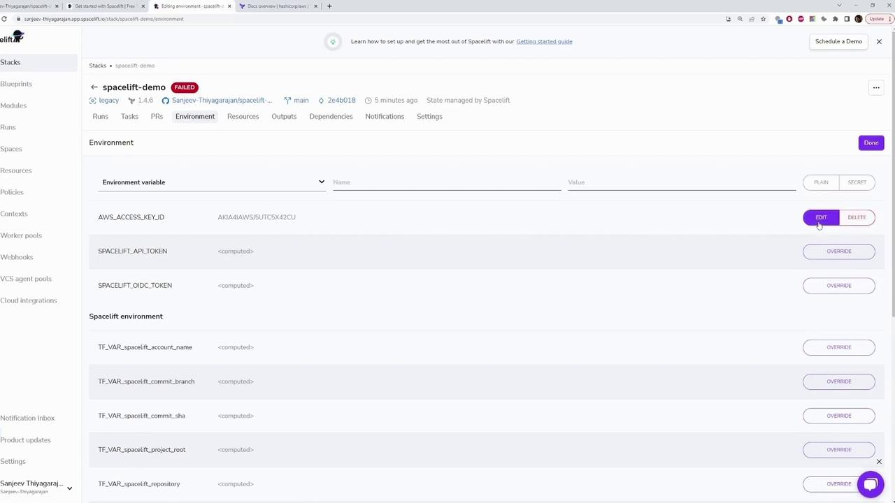

# Configure the AWS Provider
provider "aws" {
  version = "~> 4.0"
  region  = "us-east-1"
}

# Create a VPC
resource "aws_vpc" "example" {
  cidr_block = "10.0.0.0/16"
}
```

## Passing Environment Variables to the Spacelift Runner

Before running Terraform, export your AWS credentials and region in your terminal:

```bash theme={null}
export AWS_ACCESS_KEY_ID="anaccesskey"
export AWS_SECRET_ACCESS_KEY="asecretkey"
export AWS_REGION="us-west-2"
terraform plan
```

After performing these steps, navigate to your stack's environment settings in Spacelift and select "Edit" to add or update the necessary variables. To confirm your current AWS credential configuration, run:

```bash theme={null}
cat ~/.aws/credentials
```

The credentials file may also include Terraform output blocks that display resource attributes after provisioning. For instance:

```hcl theme={null}
output "instance_id" {
  description = "ID of the EC2 instance"
  value       = aws_instance.app_server.id
}

output "instance_public_ip" {
  description = "Public IP address of the EC2 instance"
  value       = aws_instance.app_server.public_ip
}
```

After you verify and commit your changes, push them to your repository with:

```bash theme={null}
git push
```

The terminal output should resemble the following, indicating a successful commit:

```plain theme={null}
1 file changed, 2 insertions(+)
C:\Users\sanje\Documents\scratch\spacelift-demo
>git push
Enumerating objects: 5, done.
Counting objects: 100% (5/5), done.
Delta compression using up to 12 threads
Compressing objects: 100% (3/3), done.
Writing objects: 100% (3/3), 304 bytes | 304.00 KiB/s, done.
Total 3 (delta 2), reused 0 (delta 0), pack-reused 0
remote: Resolving deltas: 100% (2/2), completed with 2 local objects.
To https://github.com/Sanjeev-Thiyagarajan/spacelift-demo.git
   8997C93..2e4b018  main -> main
```

## Managing AWS Credentials in Spacelift

When configuring your environment variables in Spacelift, you have two options for storing AWS credentials:

| Storage Option | Visibility                       | Recommendation                                                                |
| -------------- | -------------------------------- | ----------------------------------------------------------------------------- |
| Plain Text     | Visible and editable             | Suitable for non-sensitive variables (e.g., AWS region)                       |
| Secret         | Hidden and not directly viewable | Essential for sensitive data like AWS Access Key ID and AWS Secret Access Key |

<Callout icon="triangle-alert">
  Always store sensitive credentials as secrets in Spacelift. This ensures that your AWS credentials remain hidden and secure, protecting them from unauthorized access.
</Callout>

When stored as plain text, the values are visible and can be edited by anyone with access to Spacelift. Therefore, for security reasons, always mark your AWS credentials as secrets.

<Frame>
  
</Frame>

By following these guidelines, you can efficiently manage your AWS credentials in Spacelift while ensuring your Terraform projects are configured securely and correctly.

<CardGroup>
  <Card title="Watch Video" icon="video" href="https://learn.kodekloud.com/user/courses/spacelift-elevate-your-infrastructure-deployment/module/74dbb4df-716f-4fa2-92e9-a223a3a697ca/lesson/b01f8c43-13ef-47ca-bc4a-e783aeebcdbd" />
</CardGroup>


# Mounted Files

Source: https://notes.kodekloud.com/docs/Spacelift-Elevate-Your-Infrastructure-Deployment/Spacelift-Basics/Mounted-Files/page

This article explores best practices for using variables in Terraform configurations while managing AWS resources with Spacelift's mounted files feature.

In this article, we explore best practices for using variables in Terraform configurations while managing AWS resources with [Spacelift: Elevate Your Infrastructure Deployment](https://learn.kodekloud.com/user/courses/spacelift-elevate-your-infrastructure-deployment). You will learn how to update an AWS instance configuration, define and use Terraform variables, and leverage Spacelift's mounted files feature to supply variable values consistently.

***

## Updating the AWS Instance Configuration

Below is an example Terraform configuration for an AWS EC2 instance. Modify the configuration as needed, for instance by updating the instance type or other resource parameters.

```hcl theme={null}
resource "aws_instance" "app_server" {
  ami           = "ami-02396cdd13e9a1257"
  instance_type = "t2.micro"

  tags = {
    Name = "app-server"
  }
}
```

After updating the resource, commit the changes using Git:

```bash theme={null}
git commit -m "changing to t2.micro"
[main e890439] changing to t2.micro
 1 file changed, 1 insertion(+), 1 deletion(-)
```

And then push the commit:

```bash theme={null}
git push
Enumerating objects: 5, done.
Counting objects: 100% (5/5), done.
Delta compression using up to 12 threads
Compressing objects: 100% (3/3), done.
Writing objects: 100% (3/3), 362 bytes | 362.00 KiB/s, done.
Total 3 (delta 1), reused 0 (delta 0), pack-reused 0
remote: Resolving deltas: 100% (1/1), completed with 1 local object.
To https://github.com/Sanjeev-Thiyagarajan/spacelift-demo.git
 dbf10f3..e890439  main -> main
```

***

## Defining and Introducing Variables in Terraform

Instead of hard-coding resource values, it is best practice to use variables. First, create a `variables.tf` file with definitions for your instance name and VPC name:

```hcl theme={null}
variable "instance_name" {
  description = "Value of the Name tag for the EC2 instance"
  type        = string
  default     = "myInstance"
}

variable "vpc_name" {
  description = "Name of the VPC"
  type        = string
}
```

If you need the values to be provided at runtime, simply remove the default from the variable declaration:

```hcl theme={null}
variable "instance_name" {
  description = "Value of the Name tag for the EC2 instance"
  type        = string
}

variable "vpc_name" {
  description = "Name of the VPC"
  type        = string
}
```

Reference these variables in your main Terraform configuration (`main.tf`) as shown below:

```hcl theme={null}
required_version = ">= 1.2.0"

provider "aws" {
  region = "us-east-1"
}

resource "aws_vpc" "my_vpc" {
  cidr_block = "10.2.0.0/16"
  tags = {
    Name = var.vpc_name
  }
}

resource "aws_instance" "app_server" {
  ami           = "ami-02396cdd13e9a1257"
  instance_type = "t2.micro"

  tags = {
    env = var.instance_name
  }
}
```

Once changes are made, commit the updates:

```bash theme={null}
git commit -m "added variables for instance and VPC names"
```

And push them:

```bash theme={null}
git push
```

***

## Handling Missing Variable Values

If you trigger a Terraform run without setting required variable values, you will encounter errors during the planning stage. For example:

```plaintext theme={null}
Error: No value for required variable 
  on variables.tf line 1:
1: variable "instance_name" {
The root module input variable "instance_name" is not set, and has no default value. Use a var or -var-file command line argument to provide a value for this variable.

Error: No value for required variable
  on variables.tf line 7:
7: variable "vpc_name" {
```

<Callout icon="lightbulb">
  These errors indicate that the values for `instance_name` and `vpc_name` have not been provided. To resolve this, supply the values using a `terraform.tfvars` file.
</Callout>

Create a `terraform.tfvars` file with:

```plaintext theme={null}
instance_name = "testing-instance"
vpc_name = "test-vpc"
```

Then, commit and push your changes if needed:

```bash theme={null}
git push
```

On rerunning Terraform, the provided variable values should be correctly applied.

***

## Leveraging Mounted Files in Spacelift

Managing numerous variables via environment variables can be cumbersome for large projects. Fortunately, [Spacelift: Elevate Your Infrastructure Deployment](https://learn.kodekloud.com/user/courses/spacelift-elevate-your-infrastructure-deployment) offers a mounted file feature that allows you to supply all your variable definitions through the `terraform.tfvars` file.

In Spacelift, workloads execute in a dedicated directory structure:

* All operations occur in `/mnt/workspace`.
* Your Git repository is cloned into `/mnt/workspace/source`.

<Callout icon="lightbulb">
  Ensure your `terraform.tfvars` file is mounted inside `/mnt/workspace/source`.
</Callout>

### Setting Up the Mounted File

1. Navigate to the Environment Variables section in Spacelift and click **Edit**.

2. Instead of setting individual variables, select the **Mounted File** option.

3. Provide the file path:

   ```text theme={null}
   /mnt/workspace/source/terraform.tfvars
   ```

4. Upload an existing `terraform.tfvars` file or create a new one with the following content:

   ```plaintext theme={null}
   instance_name = "testing-instance"
   vpc_name = "test-vpc"
   ```

After mounting the file, trigger another run. The output should reflect that the variable values have been successfully injected. For example, you might see:

```plaintext theme={null}
Plan: 0 to add, 2 to change, 0 to destroy.
Changes are GO
Uploading the list of managed resources...
Please be aware that Run Changes calculation includes Terraform output changes.
Resource list upload is GO
Generating JSON representation of the plan...
loading custom plan policy inputs...
Evaluated 1 plan policy
preflight checks are GO
Exporting workspace...
Uploading workspace...
workspace upload is GO
```

Within the detailed plan, the changes might appear similar to:

```plaintext theme={null}
Terraform will perform the following actions:
  # aws_instance.app_server will be updated in-place
  resource "aws_instance" "app_server" {
    id                    = "i-aadd255fc794a8b9"
    tags = {
      "Name" = "app-server"
      "env"  = "testing-instance"
    }
  }
  tags_all = {
    "Name" = "app-server"
    "env"  = "testing-instance"
  }
  # (30 unchanged attributes hidden)
  # (7 unchanged blocks hidden)
```

This confirms that the `terraform.tfvars` file data was correctly used during the Terraform run.

***

## Cleaning Up Resources

To delete all the resources created by Terraform, you can use the `terraform destroy` command. Since Spacelift cannot handle interactive prompts, include the `--auto-approve` flag:

```bash theme={null}
terraform destroy --auto-approve
```

If you experience issues—such as the command being blocked by a recent commit—consider discarding those changes and trying again. You can view the current state of resources with:

```bash theme={null}
terraform state list
```

Once the process starts, Terraform will refresh the configuration, display a list of resources to be destroyed, and proceed with cleanup. After a short wait, you should receive confirmation of successful deletion.

***

That concludes this comprehensive guide on managing Terraform variables and utilizing Spacelift's mounted file feature. For additional resources, refer to the following links:

* [Terraform Documentation](https://www.terraform.io/docs)
* [Spacelift Documentation](https://spacelift.io/docs)

Happy Infrastructure Deployments!

<CardGroup>
  <Card title="Watch Video" icon="video" href="https://learn.kodekloud.com/user/courses/spacelift-elevate-your-infrastructure-deployment/module/74dbb4df-716f-4fa2-92e9-a223a3a697ca/lesson/d2aafa10-a554-4288-bd27-52a321f9b30b" />
</CardGroup>
