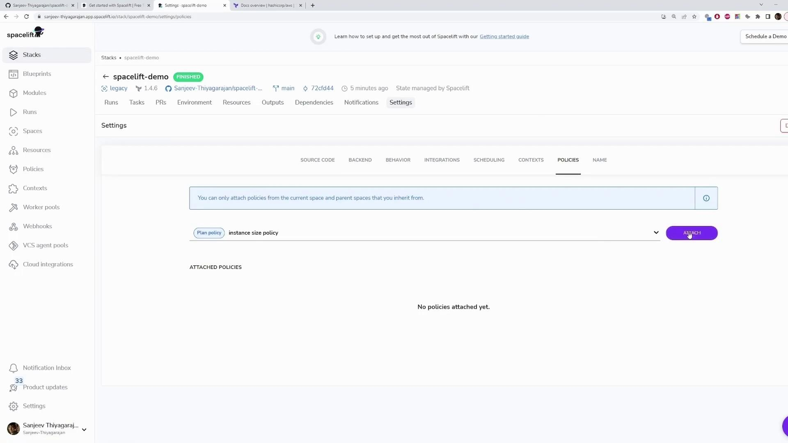

# Feel free to remove commented code once your policy is ready.
#
# ⚠️ Plan policies only take effect once attached to a Stack or Module ⚠️
#
# A plan policy can be used to fail a run during the planning phase or warn human
# reviewers about any suspicious changes. As input, it receives data from both Spacelift
# and Terraform in the following form:
#
# "spacelift": {
#   "commit": "string",
#   "author": "string",
#   "branch": "string",
#   "created_at": "number (timestamp in nanoseconds)",
#   "message": "string",
# },
# "request": {
#   "timestamp_ms": "number - current Unix timestamp in milliseconds"
# },
# "run": {
#   "creator_session": {
#     "admin": "boolean",
#     "creator_ip": "string",
#   },
#   "name": "string",
#   "id": "string",
#   "machine": "boolean - whether the run was initiated by a human or a machine"
# }
```

You might also encounter an updated version that more explicitly defines the input:

```go theme={null}
package spacelift

# Feel free to remove commented code once your policy is ready.
# ⚠️ Plan policies only take effect once attached to a Stack or Module ⚠️
# A plan policy can be used to fail a run during the planning phase or warn human 
# reviewers about any suspicious changes. As input, it receives both Spacelift 
# and Terraform data in the following form:
# {
#   "spacelift": {
#     "commit": "string",
#     "author": "string",
#     "branch": "string",
#     "created_at": "number (timestamp in nanoseconds)",
#     "message": "string"
#   },
#   "request": {
#     "timestamp_ns": "number - current Unix timestamp in nanoseconds"
#   },
#   "run": {
#     "creator_session": {
#       "admin": "boolean",
#       "creator_ip": "string",
#       "name": "string"
#     },
#     "name": "string",
#     "machine": "boolean - whether the run was initiated by a human or a machine"
#   }
# }
```

This policy serves as a template to enforce rules—such as preventing deployment of non-approved instance sizes.

────────────────────────────

## Defining the Deny Rule

A plan policy in Spacelift supports only denials since all actions are allowed by default. A typical deny rule example starts as follows:

```go theme={null}
package spacelift

deny["Policy was denied"] {
    // Define your conditions here.
}
```

For demonstration purposes, consider the following policy that always denies the plan by using a condition that always evaluates to true:

```go theme={null}
package spacelift

deny["Policy was denied"] {
    true
}
```

This simple example is often referred to as the "world's dumbest policy" and is designed solely to illustrate how a denial works.

────────────────────────────

## Attaching the Policy

After defining your policy, you need to attach it to your stack:

1. Go to your stack’s Settings.
2. Navigate to the Policies section.
3. Attach the "instance size policy" to your stack.

<Callout icon="lightbulb">
  The dashboard interface provides the necessary options to attach policies. If you do not see the visual guide, simply locate the Policies section under your stack settings.
</Callout>

<Frame>
  
</Frame>

Now, run your plan. Since the policy condition always evaluates to true, the policy will deny the plan during the planning phase. The console output may include logs resembling the following:

```text theme={null}
Downloading source code...
Source code is GO
Setting up mounted files...
Mounted files are GO
Configuring file permissions...
permissions are GO
Evaluating run initialization policy...
No initialization policies attached
Pulling Docker image public.ecr.aws/spacelift/runner-terraform:latest...
Docker image is GO
Downloading Terraform 1.4.6...
Terraform 1.4.6 download is GO (/bin/terraform)
Starting Docker container...
Docker container is GO
Verifying container image prerequisites...
successfully verified container image prerequisites
```

Followed by logs indicating the plan was denied:

```text theme={null}
aws_vpc.my_vpc: Refreshing state... [id=vpc-aba7757b5bef21424e4]
No changes. Your infrastructure matches the configuration.

Terraform has compared your real infrastructure against your configuration
and found no differences, so no changes are needed.
Changes are GO
[0G1A2Z1KPCF9VCRHMCKX] Uploading the list of managed resources...
[0G1A2Z1KPCF9VCRHMCKX] Please be aware that Run Changes calculation includes Terraform output changes.
[0G1A2Z1KPCF9VCRHMCKX] Resource list upload is GO
[0G1A2Z1KPCF9VCRHMCKX] Generating JSON representation of the plan...
[0G1A2Z1KPCF9VCRHMCKX] JSON representation is GO
[0G1A2Z1KPCF9VCRHMCKX] Loading custom plan inputs...
[0G1A2Z1KPCF9VCRHMCKX] 0 custom plan policy inputs found
[0G1A2Z1KPCF9VCRHMCKX] Evaluated 1 plan policy
[0G1A2Z1KPCF9VCRHMCKX] Denied by policy: Policy was denied
[0G1A2Z1KPCF9VCRHMCKX] Failing the run as per plan policy
```

This log clearly indicates that the run fails because the denial condition is met.

────────────────────────────

## Troubleshooting with Sample Policy Input

To assist with troubleshooting your policy, include a sample block that outputs the data Spacelift passes to the policy. This sample helps you understand the input structure, which includes details such as the git commit, Terraform configuration, and planned changes.

```plaintext theme={null}
package spacelift

deny["Policy was denied"] {
    input
    # Cannot edit in read-only editor
}

sample { true }
```

By examining this sample output, you can adjust your policy conditions as needed.

────────────────────────────

## Enforcing Specific Instance Types

Consider creating a policy that only allows users to deploy [EC2](https://learn.kodekloud.com/user/courses/amazon-elastic-compute-cloud-ec2) instances of size t2.micro. Start by reviewing the following Terraform configuration:

```hcl theme={null}
resource "aws_instance" "app_server" {
  ami           = "ami-02396cdd13e9a1257"
  instance_type = "t2.micro"
  tags = {
    Name = "app-server"
  }
}
```

Your policy should iterate through all resource changes and verify that each [EC2](https://learn.kodekloud.com/user/courses/amazon-elastic-compute-cloud-ec2) instance's type is exactly "t2.micro." Define your policy as follows:

```rego theme={null}
package spacelift

deny["Policy was denied"] {
    instance := input.terraform.resource_changes[_].change.after.instance_type
    instance != "t2.micro"
}

sample { true }
```

If a resource change includes an instance type other than t2.micro, the condition will evaluate to true, and the plan is denied.

To test this policy, update your instance configuration to use a different type, such as t2.large:

```hcl theme={null}
resource "aws_instance" "app_server" {
  ami           = "ami-02396cdd13e9a1257"
  instance_type = "t2.large"
  tags = {
    Name = "app-server"
  }
}
```

You might also update your policy accordingly if needed:

```rego theme={null}
package spacelift

deny["Policy was denied"] {
    instance := input.terraform.resource_changes[_].change.after.instance_type
    instance != sanitized("t2.large")
}

sample { true }
```

<Callout icon="triangle-alert">
  If you encounter an error stating that the "sanitized" function is undefined, verify that you are using the correct function name or adjust your approach according to your environment's specifications.
</Callout>

After pushing your changes via git, Spacelift will run the plan. The policy will deny the plan if the instance type does not match the approved value. For instance, the Terraform plan logs may display:

```text theme={null}
aws_vpc.my_vpc: Refreshing state... [id=vpc-ab4a7575bef21424e4]
No changes. Your infrastructure matches the configuration.
Terraform has compared your real infrastructure against your configuration and found no differences.
Changes are GO
Uploading the list of managed resources...
Resource list upload is GO
Generating JSON representation of the plan...
JSON representation is GO
Loading custom plan policy inputs...
Evaluated 1 plan policy
Denied by policy: Policy was denied
Failing the run as per plan policy
```

When you change the configuration back to t2.micro:

```hcl theme={null}
resource "aws_instance" "app_server" {
  ami           = "ami-02396cdd13e9a1257"
  instance_type = "t2.micro"
  tags = {
    Name = "app-server"
  }
}
```

Commit and push your changes:

```bash theme={null}
git commit -m "changing to t2.micro"
git push
```

Now, the plan should proceed because the instance type complies with the enforced policy.

────────────────────────────

## Policy Management Dashboard

Once your policy is active, use the Spacelift dashboard to verify its status and view detailed logs. The dashboard lists all policies attached to your stack along with information about their creation and update times.

<Callout icon="lightbulb">
  The image below provides an illustrative example of the dashboard interface for managing policies. All necessary functionality is accessible through the dashboard, regardless of the visual layout.
</Callout>

<Frame>
  
</Frame>

────────────────────────────

## Conclusion

This article demonstrated how to create, test, and update a Spacelift plan policy. By enforcing restrictions on instance types through a deny rule, you ensure that only approved configurations (like t2.micro) are deployed. Utilize the sample input feature to troubleshoot and refine your policies for robust infrastructure management. For more information, check out the [Spacelift documentation](https://spacelift.io/docs).

Happy policy building!

<CardGroup>
  <Card title="Watch Video" icon="video" href="https://learn.kodekloud.com/user/courses/spacelift-elevate-your-infrastructure-deployment/module/74dbb4df-716f-4fa2-92e9-a223a3a697ca/lesson/90718dac-dc08-4897-aeff-bcccc7781bb0" />
</CardGroup>


# Tasks

Source: https://notes.kodekloud.com/docs/Spacelift-Elevate-Your-Infrastructure-Deployment/Spacelift-Basics/Tasks/page

This article explains how to execute one-off Terraform commands within Spacelift for troubleshooting and gathering infrastructure details.

When working with Spacelift, there may be occasions when you need to run one-off Terraform commands—such as "terraform state list"—to troubleshoot issues or quickly gather important infrastructure details. This article explains how to execute these commands within Spacelift in a streamlined manner.

<Callout icon="lightbulb">
  One-off commands can be especially useful when you need immediate feedback on the state of your infrastructure without altering your main configuration processes.
</Callout>

## Running One-Off Terraform Commands

To execute a single Terraform command:

1. **Navigate to the Tasks Section:**\
   In the Spacelift dashboard, locate and click on the Tasks section. This is where you can input and run one-off commands.

2. **Execute Your Command:**\
   Once you enter your desired Terraform command (for example, `terraform state list`) and click "Perform," Spacelift will automatically spin up a container to handle the command execution. The resulting output is then displayed directly in the interface for your review.

3. **Review the Command Output:**\
   The output provides real-time information about the current state of your infrastructure. For instance, running `terraform state list` might show entries for both an AWS instance and an AWS VPC, enabling you to quickly diagnose or verify the state of your deployments.

Below is a sample output demonstrating a successful one-off command execution:

```bash theme={null}
[0m[32m[0161AZ1ZKRCFPHW9RCHMBOX] calculating state checksum...
[0m[32m[0161AZ1ZKRCFPHW9RCHMBOX] Running custom task with 0 custom hooks...
[0m[32m[0161AZ1ZKRCFPHW9RCHMBOX] Custom task performed successfully
[0m[32m[0161AZ1ZKRCFPHW9RCHMBOX] calculating state checksum...
```

<Callout icon="lightbulb">
  This facility not only helps in troubleshooting but also assists in gathering real-time state information without impacting your ongoing infrastructure operations.
</Callout>

Using one-off Terraform commands in Spacelift provides a quick and efficient method to inspect and diagnose your infrastructure, ensuring that you can address issues as they arise. For additional information on integrating Spacelift with Terraform workflows, refer to the [Spacelift Documentation](https://spacelift.io/docs) and [Terraform Documentation](https://www.terraform.io/docs).

<CardGroup>
  <Card title="Watch Video" icon="video" href="https://learn.kodekloud.com/user/courses/spacelift-elevate-your-infrastructure-deployment/module/74dbb4df-716f-4fa2-92e9-a223a3a697ca/lesson/36939112-f096-4fad-bf68-d50f6ef8217c" />
</CardGroup>
