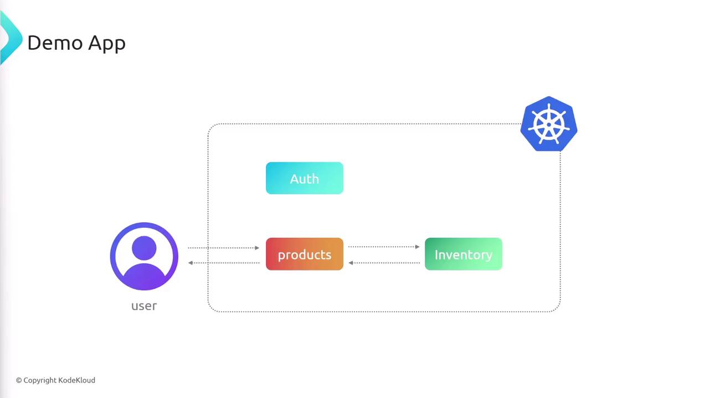
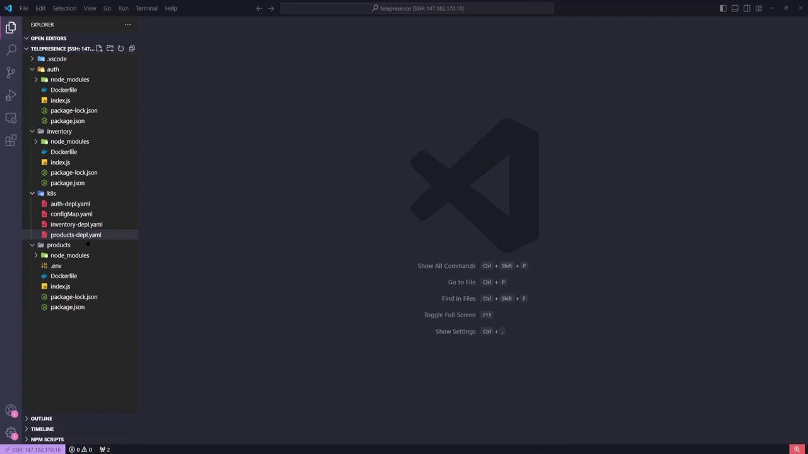

# Demo Telepresence Basics

Source: https://notes.kodekloud.com/docs/Telepresence-For-Kubernetes/Telepresence-For-Kubernetes/Demo-Telepresence-Basics/page

Learn to use Telepresence for local development with Kubernetes through a simple three-service demo application.

In this guide, you’ll learn how to use Telepresence for seamless local development against a Kubernetes cluster by walking through a simple three-service demo application.

## Application Architecture

Our sample app comprises three microservices:

| Service       | Description                               | Port |
| ------------- | ----------------------------------------- | ---- |
| **auth**      | Handles user authentication               | 3000 |
| **products**  | Returns product details; user entry point | 3000 |
| **inventory** | Tracks stock levels per product           | 3000 |

When a client requests product data, **products** calls **inventory** to fetch stock counts and then merges the results. **auth** runs independently.

<Frame>
  
</Frame>

## What We’ll Cover

1. Inspect application code and Kubernetes manifests
2. Install the Telepresence client locally
3. Deploy the Telepresence traffic manager in the cluster
4. Establish a connection and verify setup
5. Test DNS, service endpoints, and pod IPs from your laptop
6. Cleanly disconnect when finished

<Frame>
  
</Frame>

***

## 1. Inspecting the Code

Open the project in [VS Code](https://code.visualstudio.com/) or your preferred IDE. You’ll see three top-level folders—`auth`, `inventory`, and `products`—each containing:

* `index.js`: Node.js entrypoint
* `package.json`
* `Dockerfile`

Under the `k8s/` directory are the Kubernetes YAML manifests for each service.

<Frame>
  
</Frame>

***

## 2. Kubernetes Manifests

### Auth Deployment & Service

```yaml theme={null}
apiVersion: apps/v1
kind: Deployment
metadata:
  name: auth-depl
spec:
  selector:
    matchLabels:
      app: auth
  template:
    metadata:
      labels:
        app: auth
    spec:
      containers:
      - name: auth
        image: sanjeevkt720/telepresence-auth
        ports:
        - containerPort: 3000
          name: web
---
apiVersion: v1
kind: Service
metadata:
  name: auth-service
spec:
  selector:
    app: auth
  ports:
    - port: 3000
      targetPort: web
  type: ClusterIP
```

### Inventory Deployment & Service

```yaml theme={null}
apiVersion: apps/v1
kind: Deployment
metadata:
  name: inventory-depl
spec:
  selector:
    matchLabels:
      app: inventory
  template:
    metadata:
      labels:
        app: inventory
    spec:
      containers:
      - name: inventory
        image: sanjeevkt720/telepresence-inventory
        ports:
        - containerPort: 3000
          name: web
---
apiVersion: v1
kind: Service
metadata:
  name: inventory-service
spec:
  selector:
    app: inventory
  ports:
    - port: 3000
      targetPort: web
  type: ClusterIP
```

### Products Deployment & Service

The **products** service is exposed via a LoadBalancer:

```yaml theme={null}
apiVersion: apps/v1
kind: Deployment
metadata:
  name: products-depl
spec:
  selector:
    matchLabels:
      app: products
  template:
    metadata:
      labels:
        app: products
    spec:
      containers:
      - name: products
        image: sanjeevkt720/telepresence-products
        ports:
        - containerPort: 3000
          name: web
        env:
        - name: API_URL
          value: http://inventory-service:3000/
---
apiVersion: v1
kind: Service
metadata:
  name: products-service
spec:
  type: LoadBalancer
  selector:
    app: products
  ports:
    - port: 3000
      targetPort: web
```

***

## 3. Verifying the Kubernetes Cluster

Before proceeding, ensure your cluster is running and your `kubectl` context is set correctly.

```bash theme={null}
kubectl get nodes
```

You should see multiple nodes in the `Ready` state.

<Callout icon="lightbulb">
  Make sure your kubeconfig points to the correct context. On managed services like [AWS EKS](https://aws.amazon.com/eks/), verify your cluster endpoint and authentication.
</Callout>

***

## 4. Installing the Telepresence Client

On Windows, open PowerShell as an Administrator:

```powershell theme={null}
