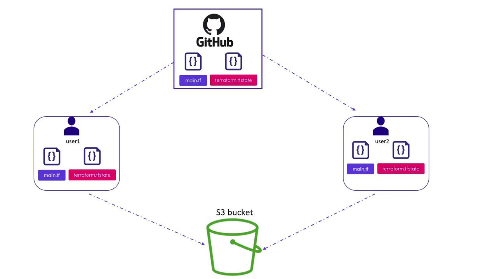
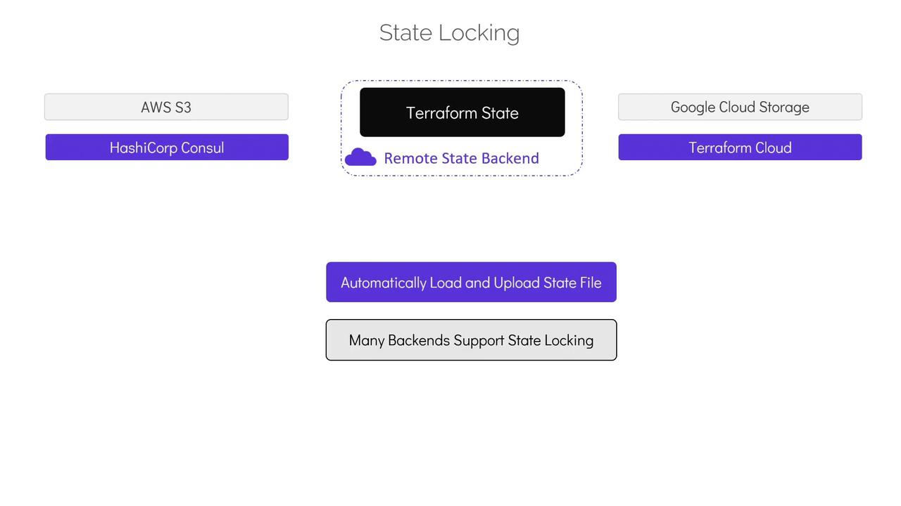
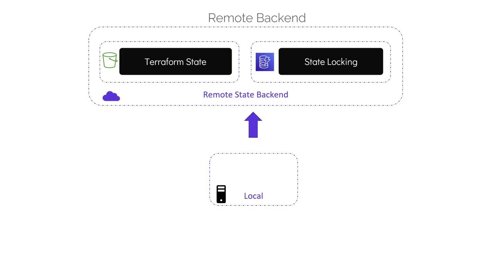

# Remote State

Source: https://notes.kodekloud.com/docs/Terraform-Associate-Certification-HashiCorp-Certified/Terraform-State/Remote-State/page

This article explores remote state in Terraform, highlighting its benefits for team collaboration and infrastructure security.

In this article, we explore the concept of remote state in Terraform, explaining its benefits for team collaboration and enhanced infrastructure security.

Previously, we discussed Terraform state files with a focus on local state stored alongside your configuration files. Local state files map your Terraform configuration to real-world infrastructure and track metadata, such as dependencies, which ensures that resources are created and deleted in the correct order. Although local state files can improve performance by disabling state refreshes in large organizations with multiple cloud providers, they pose risks when collaborating in teams.

Consider the following directory listing that shows a typical configuration with a local state file:

```bash theme={null}
$ ls
main.tf  variables.tf  terraform.tfstate
```

<Callout icon="lightbulb">
  Local state files are stored on the client machine and should not be used when working in a team environment. Additionally, avoid storing them in version control systems like GitHub as they may contain sensitive infrastructure details.
</Callout>

For example, if two users modify the same S3 bucket resource by pulling, modifying, and committing changes simultaneously, it can lead to conflicts and potential data loss. Furthermore, issues with state locking can occur; when Terraform applies changes, it locks the state file to prevent concurrent modifications. Running parallel Terraform operations without proper state locking can result in corrupted or conflicted state.

<Frame>
  
</Frame>

To mitigate these concerns, it's best to store the Terraform state securely in shared storage using remote backends. With remote backends, the state file is stored outside the configuration directory and version control system, in secure storage solutions such as AWS S3 buckets, HashiCorp Consul, Google Cloud Storage, or Terraform Cloud. When configured, Terraform downloads the state file from the shared storage at the beginning of each operation and uploads the updated state after applying changes. Many remote backends support state locking, ensuring state integrity, and provide encryption both at rest and in transit.

<Frame>
  
</Frame>

## Configuring Remote State with AWS S3

Let's review how to configure remote state using AWS S3 as a backend. To achieve this, you will need an existing S3 bucket for storing the Terraform state and, optionally, a DynamoDB table for state locking. (Creating these resources is outside the scope of this article. For further details, check out the [Terraform Basics Training Course](https://learn.kodekloud.com/user/courses/terraform-basics-training-course), which includes practical labs.)

The S3 backend configuration requires:

* a bucket name (an existing S3 bucket),
* a key (the S3 object path to store the state file),
* the region where the bucket is located,
* and optionally, a DynamoDB table for state locking.

Below is an example that configures an S3 backend along with a local file resource:

```hcl theme={null}
resource "local_file" "pet" {
  filename = "/root/pets.txt"
  content  = "We love pets!"
}
```

```hcl theme={null}
terraform {
  backend "s3" {
    bucket         = "kodekloud-terraform-state-bucket01"
    key            = "finance/terraform.tfstate"
    region         = "us-west-1"
    dynamodb_table = "state-locking"
  }
}
```

In this configuration, the backend block instructs Terraform to use AWS S3 for storing the state file. The "bucket" points to an existing S3 bucket, while the "key" specifies the path where the state will be stored (here, under the "finance" directory). The "region" identifies the bucket's location, and including the "dynamodb\_table" enables state locking via a DynamoDB table named "state-locking".

After updating your configuration to use the remote backend, running `terraform apply` without initializing the new backend will result in an error. This is because Terraform must be initialized with the new backend configuration.

To initialize the remote backend, run the following command:

```bash theme={null}
$ terraform init
```

During initialization, Terraform will detect the existing local state file and prompt you with a message like:

> Pre-existing state was found while migrating the previous "local" backend to the newly configured "s3" backend. No existing state was found in the newly configured "s3" backend. Do you want to copy this state to the new "s3" backend? Enter "yes" to copy and "no" to start with an empty state.

Type "yes" to copy the existing state file to the S3 bucket. Once initialization is complete, you can safely remove the local state file from your directory. Subsequent runs of `terraform plan` or `terraform apply` will automatically manage state locking, download the state from the S3 bucket, and upload the updated state after operations conclude. For example:

```bash theme={null}
$ terraform apply
Acquiring state lock. This may take a few moments...
local_file.pet: Refreshing state... [id=a676sd56655d]

Apply complete! Resources: 0 added, 0 changed, 0 destroyed.
Releasing state lock. This may take a few moments.
```

With the remote backend successfully configured, your state file is managed securely and efficiently, independent of your local configuration.

<Frame>
  
</Frame>

That concludes the article on remote state in Terraform. Please proceed to the multiple choice quiz for this section to test your understanding.

<CardGroup>
  <Card title="Watch Video" icon="video" href="https://learn.kodekloud.com/user/courses/terraform-associate-certification-hashicorp-certified/module/4b6ab52b-4fbb-4a33-9dbc-0fb1c6900c7e/lesson/466f38ac-67f8-4bc8-8253-a7ab27bb7894" />
</CardGroup>
