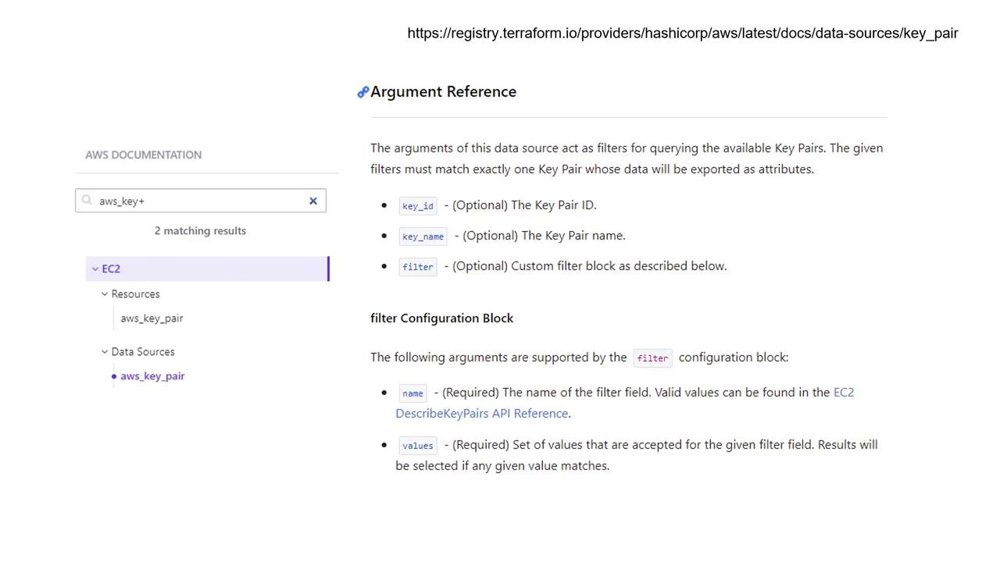

# main.tf
resource "aws_instance" "webserver" {
  ami           = var.ami
  instance_type = var.instance_type
  tags = {
    Environment = "Development"
  }
}

# variable.tf
variable "ami" {
  default = "ami-24e140119877avm"
}

variable "instance_type" {
  default = "t2.micro"
}

variable "region" {
  default = "ca-central-1"
}
```

In this configuration, the AMI and instance type are tailored for a development web server. To create similar resources for a production environment using the same configuration files, Terraform workspaces become essential.

<Callout icon="lightbulb">
  Terraform workspaces allow you to reuse the same configuration directory for multiple environments by isolating state files.
</Callout>

## Listing and Creating Workspaces

Every Terraform configuration automatically creates a workspace named "default." You can list all workspaces with:

```bash theme={null}
$ terraform workspace list
  * default
```

To create new workspaces, such as one for production and another for development, use the `terraform workspace new` command:

```bash theme={null}
$ terraform workspace new production
Created and switched to workspace "production"!
You're now on a new, empty workspace. Workspaces isolate their state, so if you run "terraform plan" Terraform will not see any existing state for this configuration.

$ terraform workspace new development
Created and switched to workspace "development"!
You're now on a new, empty workspace. Workspaces isolate their state, so if you run "terraform plan" Terraform will not see any existing state for this configuration.
```

The asterisk (\*) in the output from `terraform workspace list` indicates the current active workspace:

```bash theme={null}
$ terraform workspace list
  default
  production
  * development
```

## Configuring Different Environments

Assume that both production and development environments will deploy EC2 instances in the "ca-central-1" region with the same AMI. However, production demands a more powerful machine (using `m5.large`), while development will use `t2.micro`. To accommodate this difference, update your configuration to determine the instance type based on the active workspace. Convert the `instance_type` variable into a map and apply the `lookup` function.

### Updated Configuration

Make the following modifications to your resource block and variables:

```hcl theme={null}
# main.tf
resource "aws_instance" "webserver" {
  ami           = var.ami
  instance_type = lookup(var.instance_type, terraform.workspace)
  tags = {
    Environment = terraform.workspace
  }
}

# variable.tf
variable "ami" {
  default = "ami-24e140119877avm"
}

variable "region" {
  default = "ca-central-1"
}

variable "instance_type" {
  type = map
  default = {
    development = "t2.micro"
    production  = "m5.large"
  }
}
```

Here, the expression `terraform.workspace` returns the name of the current workspace. When used with the `lookup` function, it selects the appropriate instance type from the map. For instance, in the development workspace it returns "t2.micro," and in the production workspace it returns "m5.large."

You can verify this behavior using the Terraform console:

```bash theme={null}
$ terraform console
> terraform.workspace
development
> lookup(var.instance_type, terraform.workspace)
t2.micro
```

Switch to the production workspace to confirm:

```bash theme={null}
$ terraform workspace select production

$ terraform console
> terraform.workspace
production
> lookup(var.instance_type, terraform.workspace)
m5.large
```

When you run `terraform apply` in a particular workspace, Terraform selects the corresponding instance type and updates resource tags accordingly. For example, in the development workspace, the plan will show:

```plaintext theme={null}
$ terraform apply
Terraform will perform the following actions:

# aws_instance.webserver will be created
+ resource "aws_instance" "webserver" {
    + ami           = "ami-24e140119877avm"
    + instance_type = "t2.micro"
    + tags = {
        + "Environment" = "development"
    }
}
...
```

In contrast, in the production workspace:

```bash theme={null}
$ terraform workspace select production
Switched to workspace "production".

$ terraform apply
```

```plaintext theme={null}
Terraform will perform the following actions:

# aws_instance.webserver will be created
+ resource "aws_instance" "webserver" {
    + ami           = "ami-24e140119877avm"
    + instance_type = "m5.large"
    + tags = {
        + "Environment" = "production"
    }
}
...
```

## Workspace State Files

When using workspaces with local state, Terraform no longer uses a single `terraform.tfstate` file in the configuration directory. Instead, it stores each workspace’s state in a dedicated subdirectory within `terraform.tfstate.d`. For example, the directory structure might look like this:

```bash theme={null}
$ ls
main.tf  provider.tf  terraform.tfstate  variables.tf

$ tree terraform.tfstate.d/
terraform.tfstate.d/
|-- development
|   `-- terraform.tfstate
`-- production
    `-- terraform.tfstate

2 directories, 2 files
```

Each workspace directory contains its own `terraform.tfstate` file, ensuring that the state for one environment doesn't interfere with another.

<Callout icon="lightbulb">
  That concludes our guide on Terraform workspaces. Harness this feature to efficiently manage multiple infrastructure environments with a single configuration.
</Callout>

Proceed to the multiple-choice quiz to test your understanding of Terraform workspaces.

<CardGroup>
  <Card title="Watch Video" icon="video" href="https://learn.kodekloud.com/user/courses/terraform-associate-certification-hashicorp-certified/module/ed4291fc-57a9-43d3-abff-eb82bba4a679/lesson/473debba-eac1-42ad-a6d1-f90e337fb1b7" />
</CardGroup>


# Data Sources

Source: https://notes.kodekloud.com/docs/Terraform-Associate-Certification-HashiCorp-Certified/Variables-Resource-Attributes-and-Dependencies/Data-Sources/page

This article explores leveraging data sources in Terraform to integrate existing resources into configurations, enabling seamless connections between managed and unmanaged infrastructure.

In this lesson, we explore how to leverage data sources in Terraform to integrate existing resources into your configuration. Data sources enable you to reference items that were created outside the current Terraform environment, ensuring a seamless connection between managed and unmanaged infrastructure.

By this point, you are likely familiar with provisioning new resources using Terraform as well as using reference expressions to pass attributes between resources. For example, the configuration below creates an AWS key pair and an EC2 instance:

```hcl theme={null}
resource "aws_key_pair" "alpha" {
  key_name   = "alpha"
  public_key = "ssh-rsa…"
}

resource "aws_instance" "cerberus" {
  ami           = var.ami
  instance_type = var.instance_type
  key_name      = aws_key_pair.alpha.key_name
}
```

In this example, the key pair is generated and its attribute (key\_name) is directly referenced in the EC2 instance configuration. This works well when both resources are defined within the same Terraform configuration.

However, there are scenarios where a resource already exists or is managed by another tool (such as CloudFormation, Ansible, or even another Terraform configuration). In these cases, while you cannot manage the lifecycle of the resource directly with Terraform, you can still reference its attributes using data sources.

<Callout icon="lightbulb">
  If the resource you need already exists—for example, a key pair named "alpha"—you can reference it in your Terraform configuration using a data block.
</Callout>

Assuming the key pair "alpha" is already present in your AWS account, you can reference it by defining the following data block:

```hcl theme={null}
data "aws_key_pair" "cerberus-key" {
  key_name = "alpha"
}
```

This block utilizes the keyword `data` to specify the data source type (`aws_key_pair`), assigns it a logical name (`cerberus-key`), and uses a unique argument (`key_name = "alpha"`) to locate the existing resource.

Once the data source is defined, you can incorporate it into your resource definitions. For instance, the EC2 instance configuration can be modified to use the existing key pair:

```hcl theme={null}
resource "aws_instance" "cerberus" {
  ami           = var.ami
  instance_type = var.instance_type
  key_name      = data.aws_key_pair.cerberus-key.key_name
}
```

This revised configuration creates a new EC2 instance that utilizes the pre-existing AWS key pair, which is fetched using the data source.

Terraform’s documentation offers detailed explanations on accepted arguments and the exported attributes for each data source. While this example relies on the key name "alpha" to identify the key pair, alternative identifiers such as key ID or specific filters can also be used. For example, if the key pair includes a tag with the key "project" and the value "Cerberus", you can apply filters to locate the correct resource.

<Frame>
  
</Frame>

## Key Differences Between Resources and Data Sources

The main distinction between resources and data sources in Terraform is:

* **Resources**
  * Created using the `resource` block.
  * Managed by Terraform to create, update, and destroy infrastructure.

* **Data Sources**
  * Defined with the `data` block.
  * Used to fetch and reference information about existing resources that Terraform does not directly manage.

This separation allows you to blend Terraform-managed infrastructure with resources maintained externally.

That’s it for this lesson on using data sources. For further details on configuring specific data sources, please refer to the official [Terraform documentation](https://www.terraform.io/docs).

<CardGroup>
  <Card title="Watch Video" icon="video" href="https://learn.kodekloud.com/user/courses/terraform-associate-certification-hashicorp-certified/module/cca81ade-f05a-42b2-af56-1926cade6582/lesson/c6f5553f-3a31-4922-8f6b-b5c9bc60f838" />
</CardGroup>
