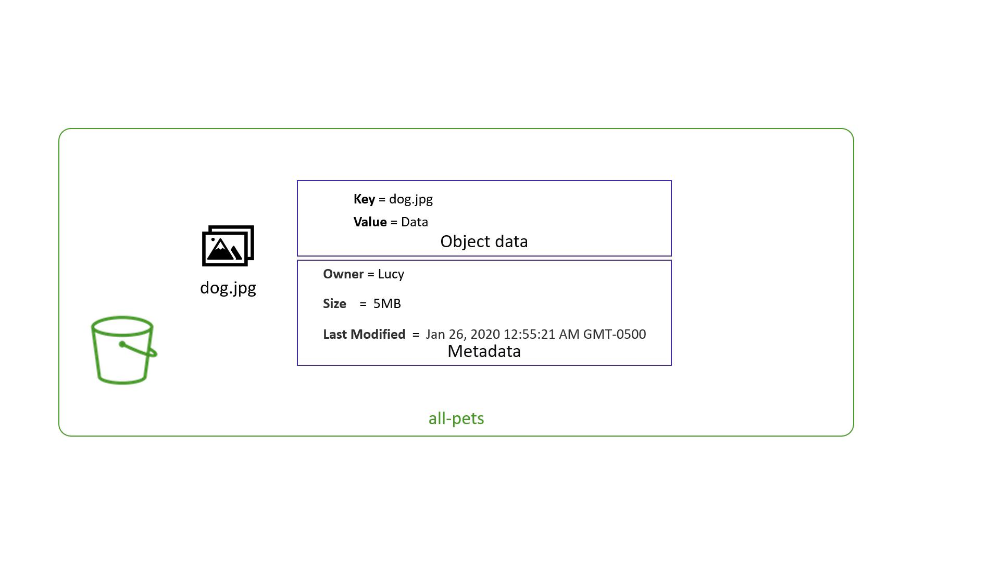

# aws_iam_policy.adminUser will be created
+ resource "aws_iam_policy" "adminUser" {
    + arn    = (known after apply)
    + id     = (known after apply)
    + name   = "AdminUsers"
    + path   = "/"
    + policy = jsonencode(
        {
          + Statement = [
              + {
                  + Action   = "*"
                  + Effect   = "Allow"
                  + Resource = "*"
                },
            ]
          + Version = "2012-10-17"
        }
      )
}

:[Output Truncated]
aws_iam_user.lucy: Creating...
aws_iam_policy.adminUser: Creating...
aws_iam_user.lucy: Creation complete after 0s [id=lucy]
aws_iam_policy.adminUser: Creation complete after 0s
aws_iam_user_policy_attachment.lucy-admin-access: Creating...
aws_iam_user_policy_attachment.lucy-admin-access: Creation complete after 0s [id=lucy-2020919034158686100000001]

Apply complete! Resources: 3 added, 0 changed, 0 destroyed.
```

<Callout icon="lightbulb">
  Double-check your IAM policies and user attachments to ensure you are not inadvertently granting excessive permissions.
</Callout>

## Alternative Approach: Using an External JSON File

An alternative method to define the IAM policy document is to store it in an external file. This can enhance readability and maintainability.

### Steps to Use an External File:

1. Create a file named `admin-policy.json` in the same directory as your `main.tf`.
2. Move the JSON policy document into `admin-policy.json`.

Update the IAM policy resource to read the policy document using the `file` function:

```hcl theme={null}
resource "aws_iam_policy" "adminUser" {
  name   = "AdminUsers"
  policy = file("admin-policy.json")
}
```

The remainder of the configuration remains unchanged.

## Summary

In this lesson, you learned how to create an IAM policy with Terraform and attach it to an IAM user. These techniques are essential for managing AWS permissions securely and efficiently. Continue practicing these methods with practical exercises to master AWS infrastructure provisioning with Terraform.

For more information on IAM policies and Terraform, refer to:

* [Terraform AWS Provider - IAM Policy](https://registry.terraform.[SECRET_REDACTED]iam_policy)
* [AWS IAM Documentation](https://docs.aws.amazon.com/iam/)

<CardGroup>
  <Card title="Watch Video" icon="video" href="https://learn.kodekloud.com/user/courses/terraform-basics-training-course/module/e1d12378-f838-46c9-9b2e-28d86daa1e1e/lesson/35a22034-f257-4b05-9a60-75c6a7d3cf68" />

  <Card title="Practice Lab" icon="installation" href="https://learn.kodekloud.com/user/courses/terraform-basics-training-course/module/e1d12378-f838-46c9-9b2e-28d86daa1e1e/lesson/cdc489ff-7591-4875-8d6a-9cddc5f4256a" />
</CardGroup>


# Introduction to AWS S3

Source: https://notes.kodekloud.com/docs/Terraform-Basics-Training-Course/Terraform-with-AWS/Introduction-to-AWS-S3/page

This article provides an introduction to AWS S3, covering its storage capabilities, data organization, and access control mechanisms.

In this article, we explore AWS S3—a highly scalable and reliable storage service designed for the AWS cloud. AWS S3 (Simple Storage Service) provides an infinitely scalable solution for storing files such as documents, images, and videos. As an object-based storage system, S3 is optimized for storing flat files unlike block storage solutions that are more suitable for operating systems or databases.

## Key Concepts

Data in S3 is organized into containers called *buckets*. Each bucket can hold an unlimited number of objects, and every file stored is treated as a separate object—even when they appear to be organized within folders such as "pictures/cat.jpg" or "videos/dog.mp4".

### Bucket Fundamentals

When creating an S3 bucket, consider the following guidelines:

* **Unique Bucket Name:** The bucket name must be unique worldwide, as AWS assigns it a global DNS name.
* **DNS-Compliant Naming:** Bucket names cannot contain uppercase letters, underscores, or end with a dash. They must be between 3 to 63 characters.
* **File Upload Limit:** Each individual file uploaded to S3 can be a maximum of 5 TB in size.

For a comprehensive list of bucket naming restrictions, please refer to the [official AWS documentation](https://docs.aws.amazon.[SECRET_REDACTED].html).

Once created, the bucket is accessible via a unique DNS endpoint. For example, a bucket named "allpets" in the US West (N. California) region would be accessible at:

[https://allpets.us-west-1.amazonaws.com](https://allpets.us-west-1.amazonaws.com)

Objects inside the bucket are accessed using the bucket name along with individual object keys.

<Frame>
  
</Frame>

### Object Structure in S3

An object in S3 consists of:

* **Data:** The file content.
* **Key:** The unique identifier or name of the file.
* **Metadata:** Additional information such as creation time, owner, and file size.

<Frame>
  
</Frame>

### Access Control

By default, AWS restricts access to a bucket and its objects so that only the bucket owner has access. AWS manages access through:

* **Bucket Policies:** These policies apply permissions at the bucket level.
* **Access Control Lists (ACLs):** ACLs provide granular control over individual object permissions.

<Frame>
  
</Frame>

<Callout icon="lightbulb">
  For enhanced security, consider applying both bucket policies and ACLs to fine-tune access permissions in your AWS S3 environment.
</Callout>

## Bucket Policies in Practice

Bucket policies are JSON documents that control access to your S3 buckets. They can grant or restrict permissions for IAM users, groups, or even external accounts.

Below is an example policy that allows an IAM user named Lucy to retrieve all objects from a bucket called "all-pets":

```json theme={null}
{
    "Version": "2012-10-17",
    "Statement": [
        {
            "Action": [
                "s3:GetObject"
            ],
            "Effect": "Allow",
            "Resource": "arn:aws:s3:::all-pets/*",
            "Principal": {
                "AWS": [
                    "arn:aws:iam::123456123457:user/Lucy"
                ]
            }
        }
    ]
}
```

Bucket policies function similarly to IAM policies and can be used to provide cross-account access or public permissions when necessary.

<Callout icon="triangle-alert">
  Avoid exposing your buckets publicly unless absolutely required. Improper bucket policy configurations can lead to unauthorized data access.
</Callout>

## Summary

This article has provided an introduction to AWS S3 covering:

* The organization of data into buckets and objects.
* Guidelines for naming and creating buckets.
* Access control mechanisms including bucket policies and ACLs.

With this foundational knowledge of AWS S3, you're ready to explore more practical implementations, including Terraform integration and hands-on labs focused on managing S3 storage effectively.

For more detailed information, consider exploring additional resources:

* [AWS S3 Documentation](https://docs.aws.amazon.com/AmazonS3/latest/userguide/Welcome.html)
* [Kubernetes Basics](https://kubernetes.io/docs/concepts/overview/what-is-kubernetes/)

<CardGroup>
  <Card title="Watch Video" icon="video" href="https://learn.kodekloud.com/user/courses/terraform-basics-training-course/module/e1d12378-f838-46c9-9b2e-28d86daa1e1e/lesson/06e93745-c92e-4381-973c-79231772f01e" />
</CardGroup>
