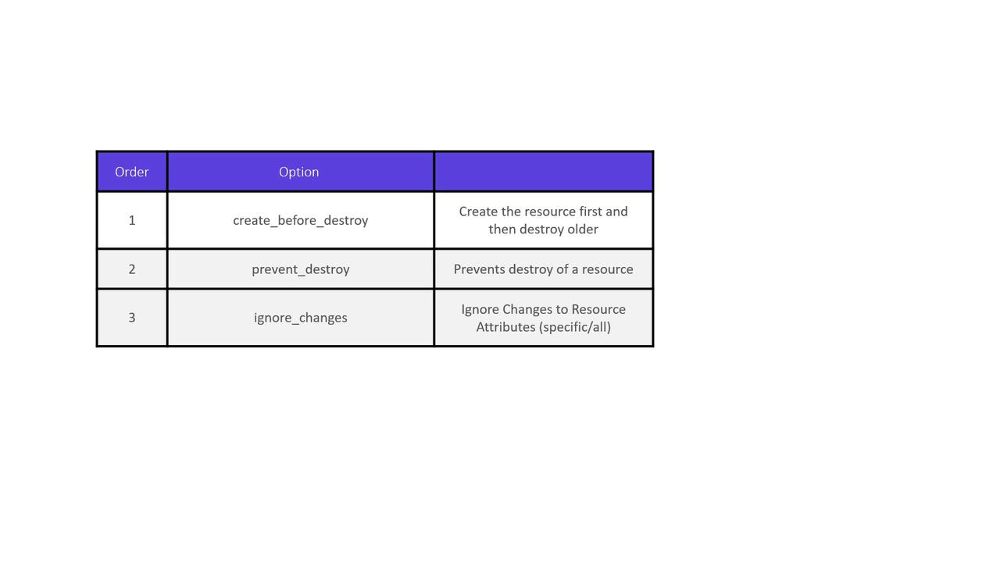

# local_file.pet must be replaced
-/+ resource "local_file" "pet" {
    content              = "We love pets!"
    directory_permission = "0777"
  ~ file_permission       = "0777" -> "0700" # forces replacement
    filename             = "/root/pet.txt"
  ~ id                   = "[AWS_SECRET_ACCESS_KEY]" -> (known after apply)
}
Plan: 1 to add, 0 to change, 1 to destroy.

local_file.pet: Destroying...
[id=[AWS_SECRET_ACCESS_KEY]]
local_file.pet: Destruction complete after 0s
local_file.pet: Creating...
[id=[AWS_SECRET_ACCESS_KEY]]

Apply complete! Resources: 1 added, 0 changed, 1 destroyed.
```

## Lifecycle Rules

Terraform offers several lifecycle rules to modify this default behavior. These rules can be configured within the resource block to either create the new resource before destroying the old one, prevent resource deletion, or ignore specific attribute changes.

### The create\_before\_destroy Rule

The `create_before_destroy` lifecycle rule instructs Terraform to create a new resource before deleting the old one. This is particularly useful when maintaining service availability is critical.

```hcl theme={null}
resource "local_file" "pet" {
  filename        = "/root/pets.txt"
  content         = "We love pets!"
  file_permission = "0700"

  lifecycle {
    create_before_destroy = true
  }
}
```

When you update a resource using this rule, Terraform will generate a plan that creates the new resource first and then removes the old one:

```bash theme={null}
$ terraform apply
# local_file.pet must be replaced
-/+ resource "local_file" "pet" {
    content              = "We love pets!"
    directory_permission = "0777"
  ~ file_permission       = "0777" -> "0755" # forces replacement
    filename             = "/root/pet.txt"
  ~ id                   = "5f8fb950ac60f723ef968097cda0a1fd3c11bdf" -> (known after apply)
}

Plan: 1 to add, 0 to change, 1 to destroy.
...
local_file.pet: Creating...
local_file.pet: Creation complete after 0s [id[AWS_SECRET_ACCESS_KEY]]
local_file.pet: Destroying...
local_file.pet: Destruction complete after 0s [id[AWS_SECRET_ACCESS_KEY]]
Apply complete! Resources: 1 added, 0 changed, 1 destroyed.
```

### The prevent\_destroy Rule

In some cases, you might want to ensure a resource is never accidentally deleted—even if a configuration change would normally force a replacement. Terraform allows you to achieve this using the `prevent_destroy` rule.

```hcl theme={null}
resource "local_file" "pet" {
  filename        = "/root/pets.txt"
  content         = "We love pets!"
  file_permission = "0700"

  lifecycle {
    prevent_destroy = true
  }
}
```

If you run `terraform apply` and the plan includes destroying the resource, Terraform will generate an error similar to the following:

```bash theme={null}
$ terraform apply
local_file.my-pet: Refreshing state...
[[SECRET_REDACTED]]
Error: Instance cannot be destroyed

on main.tf line 1:
  1: resource "local_file" "my-pet" {

Resource local_file.my-pet has lifecycle.prevent_destroy set, but the plan calls for this resource to be destroyed. To avoid this error and continue with the plan, either disable lifecycle.prevent_destroy or reduce the scope of the plan using the -target flag.
```

<Callout icon="triangle-alert">
  Even with `prevent_destroy` enabled, running `terraform destroy` explicitly will still remove the resource. This rule only prevents destruction triggered by configuration changes.
</Callout>

### The ignore\_changes Rule

The `ignore_changes` rule is beneficial when you want Terraform to disregard modifications made to specific attributes. For example, if an external process updates the tags on an AWS EC2 instance, Terraform can be configured to ignore these changes during subsequent runs.

Consider the following AWS EC2 instance configuration:

```hcl theme={null}
resource "aws_instance" "webserver" {
  ami           = "ami-0edab43b6fa892279"
  instance_type = "t2.micro"
  tags = {
    Name = "ProjectA-Webserver"
  }
}
```

By default, if the tags are updated externally (e.g., changing the tag from "ProjectA-Webserver" to "ProjectB-Webserver"), Terraform will detect the drift and attempt to revert the change:

```bash theme={null}
$ terraform apply
aws_instance.webserver: Refreshing state... [id=i-05cd83b221911acd5]

An execution plan has been generated and is shown below.
Resource actions are indicated with the following symbols:
  ~ update in-place

Terraform will perform the following actions:

  # aws_instance.webserver will be updated in-place
  ~ resource "aws_instance" "webserver" {
      ...
      tags = {
          ~ "Name" = "ProjectB-WebServer" -> "ProjectA-WebServer"
      }
      ...
  }

Apply complete! Resources: 0 added, 1 changed, 0 destroyed.
```

To prevent Terraform from reverting such external changes, add the `ignore_changes` rule to the lifecycle block:

```hcl theme={null}
resource "aws_instance" "webserver" {
  ami           = "ami-0edab43b6fa892279"
  instance_type = "t2.micro"
  tags = {
    Name = "ProjectA-Webserver"
  }
  lifecycle {
    ignore_changes = [
      tags
    ]
  }
}
```

Alternatively, to ignore changes across all attributes, you can use the special keyword `all`:

```hcl theme={null}
resource "aws_instance" "webserver" {
  ami           = "ami-0edab43b6fa892279"
  instance_type = "t2.micro"
  tags = {
    Name = "ProjectA-Webserver"
  }
  lifecycle {
    ignore_changes = all
  }
}
```

After applying these settings, Terraform will refresh the state without making any changes:

```bash theme={null}
$ terraform apply
aws_instance.webserver: Refreshing state... [id=i-05cd83b221911acd5]
Apply complete! Resources: 0 added, 0 changed, 0 destroyed.
```

## Lifecycle Rules at a Glance

| Lifecycle Rule          | Description                                                | Use Case                                                          |
| ----------------------- | ---------------------------------------------------------- | ----------------------------------------------------------------- |
| create\_before\_destroy | Creates the new resource before deleting the old one       | Ensures continuous availability during updates                    |
| prevent\_destroy        | Prevents resource destruction during configuration changes | Protects critical resources from accidental deletion              |
| ignore\_changes         | Ignores changes to specified attributes or all attributes  | Allows external modifications without triggering unwanted changes |

## Summary

In this article, we reviewed three key lifecycle rules in Terraform:

* The **create\_before\_destroy** rule ensures uninterrupted resource availability by creating the new resource first.
* The **prevent\_destroy** rule safeguards critical resources from unintentional deletion.
* The **ignore\_changes** rule allows you to specify attributes that Terraform should ignore during state comparisons, accommodating external changes.

Now, put these lifecycle rules into practice in your Terraform configurations for better resource management and more predictable infrastructure deployments.

<Frame>
  
</Frame>

<CardGroup>
  <Card title="Watch Video" icon="video" href="https://learn.kodekloud.com/user/courses/terraform-basics-training-course/module/98de9b33-985e-4ec4-9903-b39856d309e8/lesson/cb4518bb-3a35-4aa1-9232-a70ead9587a7" />

  <Card title="Practice Lab" icon="installation" href="https://learn.kodekloud.com/user/courses/terraform-basics-training-course/module/98de9b33-985e-4ec4-9903-b39856d309e8/lesson/c3a7a9c5-5763-4c1e-a25a-d724473e0c1b" />
</CardGroup>


# Meta Arguments

Source: https://notes.kodekloud.com/docs/Terraform-Basics-Training-Course/Working-with-Terraform/Meta-Arguments/page

Meta-arguments in Terraform modify resource block behavior, enabling advanced configurations like multiple instances and dependency management.

Meta-arguments in Terraform allow you to modify the behavior of resource blocks, enabling advanced configurations such as creating multiple instances of a resource and managing dependencies. In previous tutorials, we demonstrated how to create single resources, for example, a local file or a random pet resource. In this guide, we will explain meta-arguments in detail and illustrate how they can be used to enhance your Terraform configurations.

## Creating a Single Resource

Consider the following Terraform configuration that creates a single resource—a local file:

```hcl theme={null}
resource "local_file" "pet" {
  filename = var.filename
  content  = var.content
}
```

The accompanying variable definitions are:

```hcl theme={null}
variable "filename" {
  default = "/root/pets.txt"
}

variable "content" {
  default = "I love pets!"
}
```

## Traditional Loop Approach

In traditional scripting, such as with bash, you might use a loop to create multiple files. The example below creates three empty files (`pet1`, `pet2`, and `pet3`) in the `/root` directory:

```bash theme={null}
#!/bin/bash
for i in {1..3}
do
    touch /root/pet${i}
done
```

After running the above script, listing the directory contents may produce:

```bash theme={null}
$ ls -ltr /root/
-rw-r--r-- 1 root root 0 Sep  9 02:04 pet2
-rw-r--r-- 1 root root 0 Sep  9 02:04 pet1
-rw-r--r-- 1 root root 0 Sep  9 02:04 pet3
```

<Callout icon="lightbulb">
  While Terraform does not directly support loop constructs within a resource block like traditional shell scripts, its meta-arguments provide mechanisms to achieve equivalent outcomes.
</Callout>

## Utilizing Meta-Arguments

Terraform’s meta-arguments can be applied to any resource block to modify its behavior. Two important meta-arguments include:

1. **depends\_on**: Defines explicit dependencies between resources to control the order of resource creation.
2. **lifecycle**: Provides rules that control how resources are created, updated, and destroyed.

### Example: Enforcing Dependencies

In the following configuration, the `depends_on` meta-argument is used to ensure that the local file resource is created only after the random pet resource:

```hcl theme={null}
resource "local_file" "pet" {
  filename   = var.filename
  content    = var.content
  depends_on = [
    random_pet.my_pet
  ]
}

resource "random_pet" "my_pet" {
  prefix    = var.prefix
  separator = var.separator
  length    = var.length
}
```

### Example: Using Lifecycle Rules

The `lifecycle` meta-argument can be used to manage resource replacement. For instance, you can ensure that a new resource is created before the old one is destroyed by setting `create_before_destroy` to true:

```hcl theme={null}
resource "local_file" "pet" {
  filename        = "/root/pets.txt"
  content         = "We love pets!"
  file_permission = "0700"
  
  lifecycle {
    create_before_destroy = true
  }
}
```

## Next Steps

In the upcoming sections, we will explore additional meta-arguments in Terraform, including those related to looping and iterating over resources, to further enhance your infrastructure automation workflows.

## Additional Resources

* [Terraform Documentation](https://www.terraform.io/docs)
* [Terraform Meta-Arguments Reference](https://www.terraform.io/docs/configuration/resources.html#meta-arguments)

By understanding and utilizing meta-arguments, you can significantly enhance your Terraform configurations, making them both robust and flexible. Happy coding!

<CardGroup>
  <Card title="Watch Video" icon="video" href="https://learn.kodekloud.com/user/courses/terraform-basics-training-course/module/98de9b33-985e-4ec4-9903-b39856d309e8/lesson/b1a20b38-be8b-43d5-95e4-4d23d8ca2c34" />
</CardGroup>
