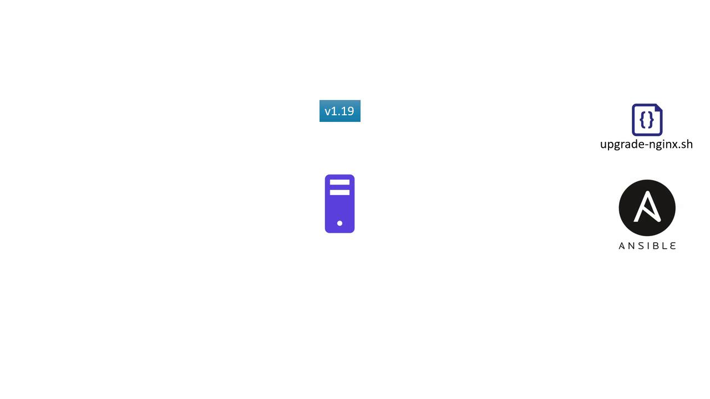
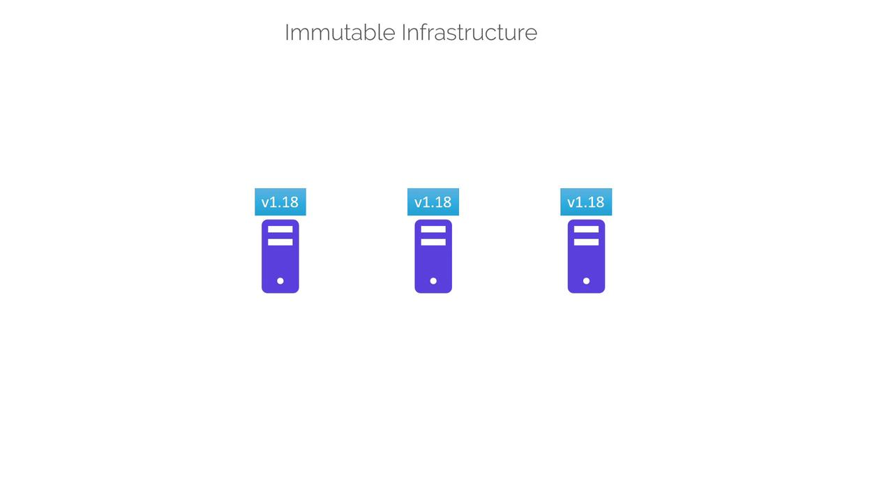

# local_file.pet must be replaced
-/+ resource "local_file" "pet" {
      content                = "We love pets!"
      directory_permission   = "0777"
  ~   file_permission        = "0777" -> "0700" # forces replacement
      filename               = "/root/pet.txt"
      ~ id                    = "5f8fb950ac60f7f23ef968097cda01fd3c11bdf" -> (known after apply)
}
Plan: 1 to add, 0 to change, 1 to destroy.
Do you want to perform these actions?
Terraform will perform the actions described above. Only 'yes' will be accepted to approve.
Enter a value: yes
local_file.pet: Destroying...
[id[AWS_SECRET_ACCESS_KEY]]
Destroy complete after 0s
```

This output clearly shows that Terraform destroys the existing resource before creating a new one with updated permissions.

## Mutable Infrastructure in Practice

Imagine you are running an application server with Nginx version 1.17. When a new version is released, you might choose to update the web server incrementally—from version 1.17 to 1.18, and later from 1.18 to 1.19. The upgrade process often involves either:

* Manually downloading and installing the new version during a maintenance window.
* Automating the process with configuration management tools like [Ansible](https://www.ansible.com/).

For high availability, you might run a pool of servers with identical software and configurations. In this case, performing in-place updates individually on each server represents mutable infrastructure. Even though the underlying hardware or virtual infrastructure remains the same, the software and configuration details change with each update.

<Frame>
  
</Frame>

<Callout icon="lightbulb">
  An in-place update may lead to configuration drift over time. If one server fails to upgrade due to dependency issues, it will remain on an older version while others move forward, complicating future maintenance.
</Callout>

### Challenges with Mutable Infrastructure

When updating software on a system:

* Dependencies must be met for a successful upgrade.
* If one or more servers (e.g., web server 3) have unmet dependencies—such as network issues, storage constraints, or compatibility differences—the upgrade might fail, leaving that server on an older version (e.g., version 1.18).
* After multiple update cycles, configuration drift can occur, where servers run different versions of software, increasing the complexity of troubleshooting and further updates.

## Embracing Immutable Infrastructure

Immutable infrastructure takes a different approach. Instead of modifying existing servers, you provision new servers with the updated version (for example, replacing Nginx 1.17 with 1.18). Once the new servers are confirmed to run correctly, the old servers are decommissioned.

In immutable infrastructure, resources are never modified post-deployment—they are always replaced. This method minimizes the risk of configuration drift because the previous version remains unchanged until a fully validated new version is deployed.

<Frame>
  
</Frame>

### Benefits of Immutable Infrastructure

* Easier to version infrastructure and roll back to previous releases.
* Consistent environments reduce the complexity of governance and maintenance.
* Reliable deployment pipelines, as each release is a fresh creation rather than an update.

## Terraform and Immutable Infrastructure

Terraform exemplifies immutable infrastructure by default. For instance, if you update a resource block—changing the permission from "0777" to "0700"—Terraform destroys the original resource and creates a new one with the updated settings.

Revisiting our earlier example:

```hcl theme={null}
resource "local_file" "pet" {
  filename        = "/root/pets.txt"
  content         = "We love pets!"
  file_permission = "0700"
}
```

The Terraform output for this update might appear as follows:

```bash theme={null}
$ terraform apply
# local_file.pet must be replaced
-/+ resource "local_file" "pet" {
    content               = "We love pets!"
    directory_permission  = "0777"
  ~ file_permission       = "0777" -> "0700" # forces replacement
    filename              = "/root/pet.txt"
    ~ id                  = "[AWS_SECRET_ACCESS_KEY]" -> (known after apply)
}
Plan: 1 to add, 0 to change, 1 to destroy.

local_file.pet: Destroying...
[id=[AWS_SECRET_ACCESS_KEY]]
local_file.pet: Destruction complete after 0s
local_file.pet: Creating...
[id=[AWS_SECRET_ACCESS_KEY]]
Apply complete! Resources: 1 added, 0 changed, 1 destroyed.
```

By default, Terraform replaces the resource. However, you may encounter scenarios where you wish to modify this behavior—for example, creating a new resource before the old one is decommissioned or retaining the old resource for a time. Such behaviors can be controlled through lifecycle rules defined within the resource block. We will cover lifecycle customizations in the upcoming section.

<Callout icon="triangle-alert">
  Altering default resource creation and deletion strategies without a thorough understanding of lifecycle rules can lead to unexpected outages. Always test changes in a staging environment before applying them in production.
</Callout>

For more insights into managing infrastructure with Terraform, refer to the official [Terraform Documentation](https://www.terraform.io/docs).

<CardGroup>
  <Card title="Watch Video" icon="video" href="https://learn.kodekloud.com/user/courses/terraform-basics-training-course/module/98de9b33-985e-4ec4-9903-b39856d309e8/lesson/fe362a30-ceb6-4246-9007-9208d2eec5b8" />
</CardGroup>


# Terraform Commands

Source: https://notes.kodekloud.com/docs/Terraform-Basics-Training-Course/Working-with-Terraform/Terraform-Commands/page

This guide explores essential Terraform commands for validating configurations, managing providers, outputting variables, refreshing state, and visualizing resource dependencies.

In this guide, we explore essential Terraform commands used to validate configurations, format files, inspect state, manage providers, output variables, refresh state, and visualize resource dependencies. Each section provides clear examples and outputs to help you master the use of Terraform in your infrastructure management tasks.

***

## Terraform Validate

After crafting your Terraform configuration files, you can verify their syntax without running a full plan or apply. The `terraform validate` command checks your configuration for errors, ensuring that your HCL (HashiCorp Configuration Language) is correct.

For example, consider the following configuration:

```hcl theme={null}
resource "local_file" "pet" {
  filename = "/root/pets.txt"
  content  = "We love pets!"
}
```

Run the command:

```bash theme={null}
$ terraform validate
Success! The configuration is valid.
```

If an error is present, such as using an unsupported argument, Terraform will indicate the issue. For instance, using `file_permissions` instead of `file_permission` may lead to an error. The corrected configuration should be:

```hcl theme={null}
resource "local_file" "pet" {
  filename        = "/root/pets.txt"
  content         = "We love pets!"
  file_permission = "0700"
}
```

If left uncorrected, you might see an error like this:

```bash theme={null}
$ terraform validate
Error: Unsupported argument

  on main.tf line 4, in resource "local_file" "pet":
   4:   file_permissions = "0777"

An argument named "file_permissions" is not expected here. Did you mean "file_permission"?
```

***

## Terraform fmt

The `terraform fmt` command scans your configuration files in the current directory and reformats them into a standard style. This canonical formatting greatly improves code readability and consistency. Running the command will list any files that were modified during the formatting process.

***

## Terraform Show

The `terraform show` command is used to display the current Terraform state, detailing all attributes of your managed resources. This output helps you verify the actual state of your infrastructure.

For example, if you have a local file resource, running:

```plaintext theme={null}
$ terraform show
