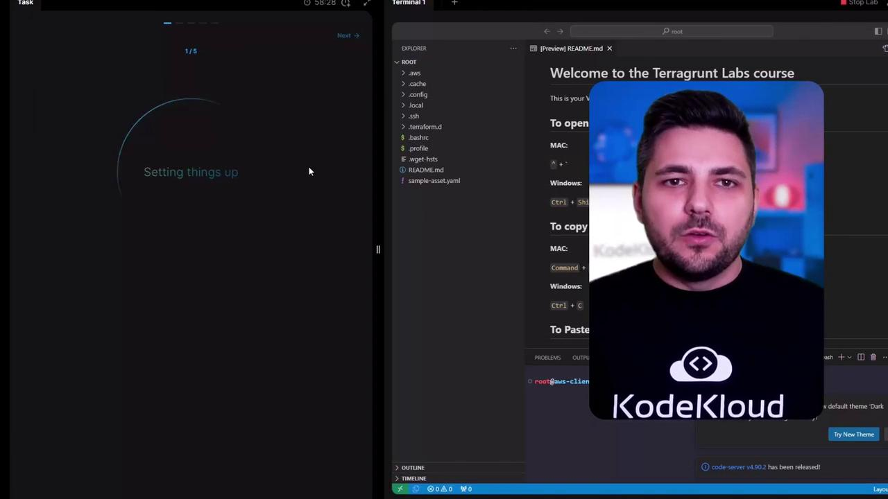

# ---- variables.tf ----
# Storage Account Name (string)
variable "storage_account_name" {
  type        = string
  description = "Name of the Azure Storage Account"
}

# HTTPS-only toggle (boolean)
variable "https_only" {
  type        = bool
  description = "Enforce HTTPS-only traffic"
  default     = true
}

# Tags (key-value pairs)
variable "tags" {
  type        = map(string)
  description = "Tags to assign to the storage account"
  default = {
    environment = "dev"
    owner       = "rithin"
  }
}

# Storage configuration as an object
variable "storage_config" {
  type = object({
    location     = string
    account_tier = string
    replication  = string
  })

  default = {
    location     = "East US"
    account_tier = "Standard"
    replication  = "LRS"
  }
}
```

```hcl theme={null}
# ---- main.tf ----
resource "azurerm_storage_account" "example" {
  name                        = var.storage_account_name
  resource_group_name         = "my-workshop-rg"
  location                    = var.storage_config.location
  account_tier                = var.storage_config.account_tier
  account_replication_type    = var.storage_config.replication
  enable_https_traffic_only   = var.https_only
  tags                        = var.tags
}
```

Example `terraform.tfvars` (override defaults or provide runtime values):

```hcl theme={null}
storage_account_name = "mystorageacct123"
https_only           = false

tags = {
  environment = "prod"
  owner       = "alice"
}

storage_config = {
  location     = "East US"
  account_tier = "Standard"
  replication  = "LRS"
}
```

Notes on the example:

* `storage_account_name` is declared as a `string`.
* `https_only` is a `bool` with a default of `true`; you can override it in `terraform.tfvars`.
* `tags` is a `map(string)` used for tagging resources.
* `storage_config` is an `object` grouping related attributes accessed via `var.storage_config.location`, `var.storage_config.account_tier`, etc.

Choosing the right data type enables Terraform to validate inputs, catch errors early, and keep your configurations clear and maintainable. Use objects to group related settings, maps for key-based lookups, lists/sets for collections (ordered or unique), and avoid `any` unless flexibility is essential.

<Callout icon="warning">
  Be cautious when using `any`. It disables type checking and can make debugging harder. Prefer explicit types for production code.
</Callout>

References

* Terraform: Input Variables — [https://www.terraform.io/language/values/variables](https://www.terraform.io/language/values/variables)
* Terraform: Types — [https://www.terraform.io/language/types](https://www.terraform.io/language/types)

<CardGroup>
  <Card title="Watch Video" icon="video" href="https://learn.kodekloud.com/user/courses/terraform-on-azure/module/6909fa70-4ccc-40c3-a918-1188673d8985/lesson/de6eb384-31bd-4749-893a-0a669895331b" />

  <Card title="Practice Lab" icon="flask-conical" href="https://learn.kodekloud.com/user/courses/terraform-on-azure/module/6909fa70-4ccc-40c3-a918-1188673d8985/lesson/bfdd5c93-7568-4082-9a61-be25457c12f2" />
</CardGroup>


# Course Introduction

Source: https://notes.kodekloud.com/docs/Terragrunt-for-Beginners/Introduction/Course-Introduction/page

This course teaches managing infrastructure as code with Terragrunt, focusing on best practices for a DRY and scalable Terraform workflow.

Welcome to **KodeKloud’s Terragrunt Course**! I’m Stefan Matić, and I’m excited to guide you through the essentials of managing infrastructure as code with Terragrunt. Whether you’re just starting or aiming to refine your skills, this course will equip you with best practices for a DRY and scalable Terraform workflow.

## What Is Terragrunt?

Terragrunt is a lightweight wrapper for Terraform that helps you:

* Keep your configurations **DRY (Don’t Repeat Yourself)**
* Manage and share remote state efficiently
* Simplify complex Terraform project structures

## Why Use Terragrunt?

* Centralize common configuration patterns
* Automate remote state locking and backend configuration
* Reuse modules across multiple environments with minimal boilerplate

<Callout icon="lightbulb">
  For a solid foundation, we recommend completing our [Terraform Basics](/courses/terraform-basics) or [OpenTofu Fundamentals](/courses/opentofu-fundamentals) courses before diving into Terragrunt.
</Callout>

## Course Overview

| Topic                                              | Learning Outcome                                                 |
| -------------------------------------------------- | ---------------------------------------------------------------- |
| Terragrunt concepts and configuration              | Understand key features and set up Terragrunt for your projects. |
| Essential Terragrunt commands                      | Learn `terragrunt init`, `apply`, `destroy`, and more.           |
| Built-in Terragrunt functions                      | Automate and customize configurations with helper functions.     |
| Terragrunt blocks and attributes                   | Structure your `.hcl` files for clarity and reusability.         |
| Remote state management                            | Configure backends and state locking for safe collaboration.     |
| Terraform modules with Terragrunt                  | Create, share, and version modules across environments.          |
| AWS demo: Build your first project with Terragrunt | Apply everything in a real-world AWS scenario.                   |

<Frame>
  
</Frame>

## Hands-on Labs

All labs run in your browser, so you can practice immediately with step-by-step guidance.

## Community and Support

Join our active KodeKloud forum to:

* Ask questions and share tips
* Collaborate on hands-on labs
* Connect with fellow learners and experts

## Enroll Now

Ready to elevate your Infrastructure as Code skills? Enroll in KodeKloud’s Terragrunt course today and start building scalable, maintainable infrastructure with confidence!

***

## Links and References

* [Terraform Documentation](https://www.terraform.io/docs)
* [Terragrunt GitHub Repository](https://github.com/gruntwork-io/terragrunt)
* [KodeKloud Community Forum](/community)

<CardGroup>
  <Card title="Watch Video" icon="video" href="https://learn.kodekloud.com/user/courses/terragrunt-for-beginners/module/80c3af1c-e730-4884-8172-1968f95c4dfa/lesson/53c5af2e-c68f-444d-a154-6fbb26f9a48e" />
</CardGroup>
