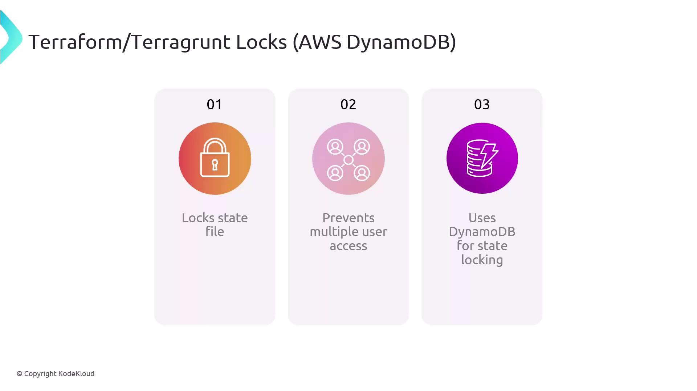

# If prompted, type "yes" to migrate your state.
terragrunt apply
# Confirm the plan with "yes".
```

You should see Terraform planning and applying an AWS VPC. Verify the VPC and related resources in the AWS Console once complete.

***

## 6. Reconfigure Remote State (Optional)

To update or reconfigure the backend at any time:

```bash theme={null}
terragrunt init --reconfigure
```

***

## Links and References

* [Terraform CLI Documentation](https://www.terraform.io/docs/cli/index.html)
* [Terragrunt Documentation](https://terragrunt.gruntwork.io/docs/)
* [AWS S3 Backend](https://www.terraform.io/docs/backends/types/s3.html)

<CardGroup>
  <Card title="Watch Video" icon="video" href="https://learn.kodekloud.com/user/courses/terragrunt-for-beginners/module/2eef056a-8494-4e5d-acf0-25b04fad55c4/lesson/7e959b9e-c5b3-4dae-b9fd-08788512f552" />

  <Card title="Practice Lab" icon="installation" href="https://learn.kodekloud.com/user/courses/terragrunt-for-beginners/module/2eef056a-8494-4e5d-acf0-25b04fad55c4/lesson/e61ba193-3780-4e0a-ae45-cc97b0afa1e0" />
</CardGroup>


# DynamoDB as a Locking Mechanism

Source: https://notes.kodekloud.com/docs/Terragrunt-for-Beginners/Managing-Remote-State-with-Terragrunt/DynamoDB-as-a-Locking-Mechanism/page

This article discusses using AWS DynamoDB for state locking in Terraform and Terragrunt to prevent deployment conflicts and ensure serialized state modifications.

Leveraging **AWS DynamoDB** for state locking is a best practice when using Terraform or Terragrunt in team environments. By coordinating locks through DynamoDB, you ensure that only one operation can modify your infrastructure state at a time, eliminating deployment conflicts and race conditions.

* Guarantees serialized state modifications
* Prevents concurrent `terraform apply` or `terragrunt apply` runs
* Provides a scalable, highly available lock backend in AWS

<Frame>
  
</Frame>

## Understanding Terraform & Terragrunt State Locks

Terraform and Terragrunt implement a locking mechanism to safeguard the `.tfstate` file during operations that write state changes. When one user or process holds the lock:

* All other operations are blocked until the lock is released
* Accidental overwrites and drift are prevented
* Collaboration becomes predictable and conflict-free

Here’s a quick overview of how the components fit together:

| Component      | Role                                     | Example Configuration                         |
| -------------- | ---------------------------------------- | --------------------------------------------- |
| S3 Backend     | Stores the Terraform state file securely | `bucket = "my-terraform-state-bucket"`        |
| DynamoDB Table | Manages concurrent locks                 | `dynamodb_table = "terraform-locks"`          |
| Key Path       | Namespaces state per environment/module  | `key = "${path_relative_to_include()}/state"` |

## Configuring Remote State in Terragrunt

Terragrunt can automatically create the required DynamoDB table when you define your remote state. Add the following block to your `terragrunt.hcl`:

```hcl theme={null}
remote_state {
  backend = "s3"
  config = {
    bucket         = "my-terraform-state-bucket"
    key            = "${path_relative_to_include()}/terraform.tfstate"
    region         = "us-west-2"
    dynamodb_table = "terraform-locks"
    encrypt        = true
  }
}
```

<Callout icon="lightbulb">
  Terragrunt checks for the existence of the DynamoDB table and creates it if missing—no manual setup required. Ensure your IAM role has permissions for `dynamodb:CreateTable`.
</Callout>

## Handling Stuck Locks

Network interruptions or process crashes can leave stale locks in DynamoDB. To resolve this, use the Terraform CLI’s `force-unlock` command:

```bash theme={null}
terraform force-unlock LOCK_ID
```

Replace `LOCK_ID` with the identifier from the error message. This removes the lock entry in DynamoDB and lets you proceed.

<Callout icon="triangle-alert">
  `force-unlock` bypasses safety checks. Only use it when you are certain no other process is applying changes.
</Callout>

***

## Further Reading and References

* [Terraform Remote State](https://www.terraform.io/language/state/remote)
* [Terragrunt Documentation](https://terragrunt.gruntwork.io/docs/)
* [AWS DynamoDB Developer Guide](https://docs.aws.amazon.[AWS_SECRET_ACCESS_KEY]/Introduction.html)
* [Managing State Locking](https://www.terraform.io/language/state/locking)

<CardGroup>
  <Card title="Watch Video" icon="video" href="https://learn.kodekloud.com/user/courses/terragrunt-for-beginners/module/2eef056a-8494-4e5d-acf0-25b04fad55c4/lesson/5ba2c408-e273-4c0a-b42c-9ce0fae2e754" />
</CardGroup>
