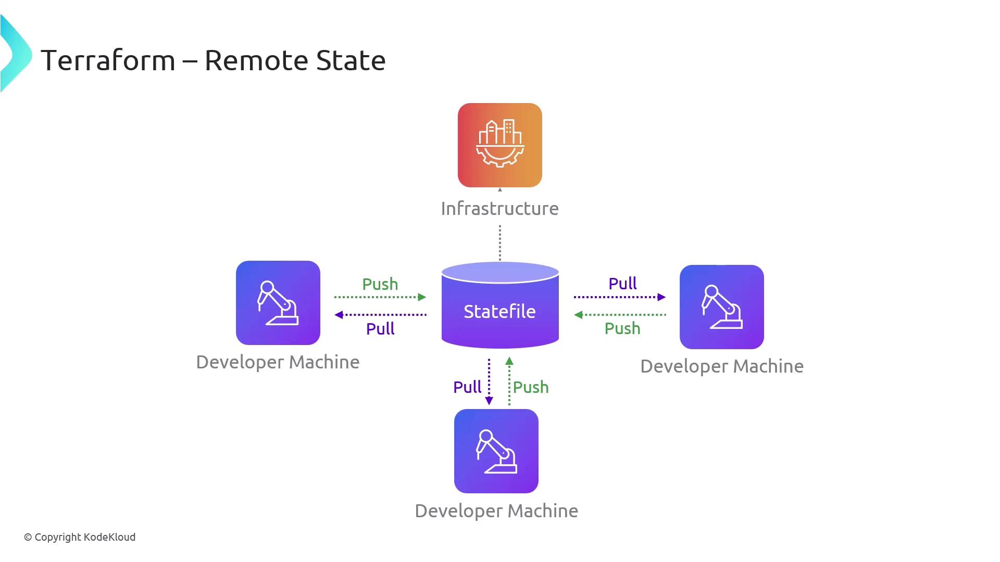
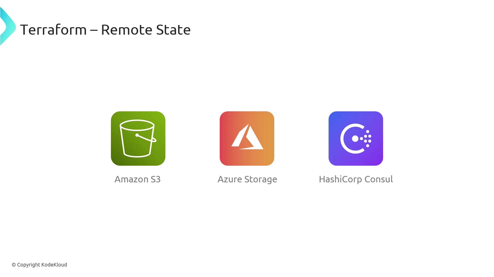
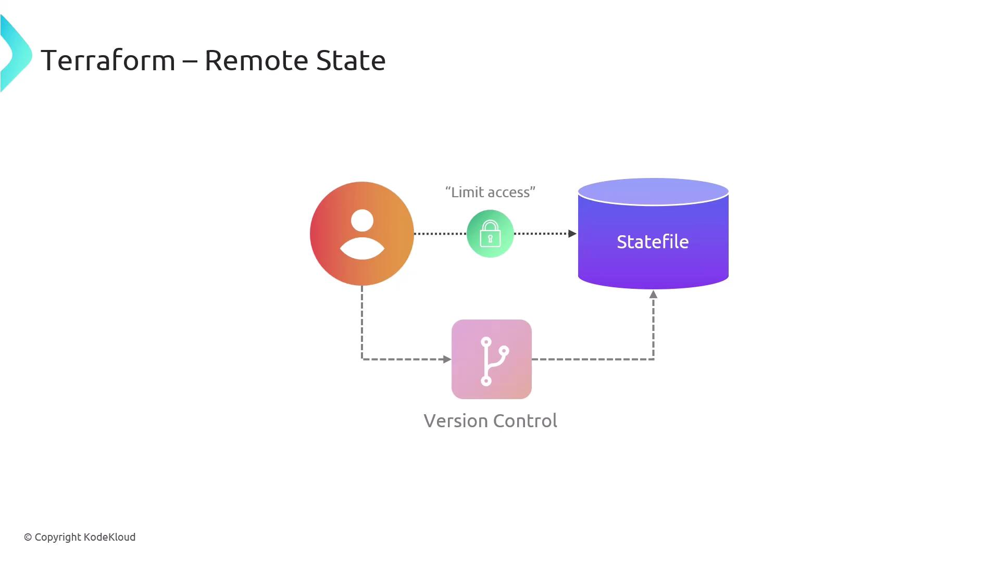

# Remote State in Terraform

Source: https://notes.kodekloud.com/docs/Terragrunt-for-Beginners/Managing-Remote-State-with-Terragrunt/Remote-State-in-Terraform/page

This article explains configuring remote state in Terraform using Terragrunt for centralized management of state files and highlights best practices and popular backends.

Mickey is ready to put his Terragrunt expertise into practice. One of his first tasks is configuring remote state to manage Terraform state files centrally. With Terragrunt’s streamlined syntax, he can declare all the necessary parameters and focus on building infrastructure—without getting bogged down in state management details.

<Callout icon="lightbulb">
  Terragrunt automatically generates the Terraform backend configuration for you. This ensures consistent remote state settings across all environments.
</Callout>

In this lesson, we’ll start with an overview of Terraform Remote State, explore popular backends, and highlight security best practices.

***

## What Is Terraform Remote State?

Terraform Remote State provides a centralized repository for storing and organizing your `.tfstate` files. Think of it as the nerve center of your infrastructure:

* Ensures a single source of truth for all team members
* Prevents conflicting edits by serializing state updates
* Simplifies collaboration and preserves deployment integrity

<Frame>
  
</Frame>

***

## Popular Remote Backends

Terraform supports multiple backends, letting you choose the storage solution that best fits your environment:

| Backend            | Use Case                                | Documentation                                                                                                                                                                                       |
| ------------------ | --------------------------------------- | --------------------------------------------------------------------------------------------------------------------------------------------------------------------------------------------------- |
| AWS S3             | Scalable, cost-effective object storage | [https://registry.terraform.io/providers/hashicorp/aws/latest/docs/resources/s3\_bucket](https://registry.terraform.io/providers/hashicorp/aws/latest/docs/resources/s3_bucket)                     |
| Azure Blob Storage | Native Azure integration with RBAC      | [https://registry.terraform.io/providers/hashicorp/azurerm/latest/docs/resources/storage\_account](https://registry.terraform.io/providers/hashicorp/azurerm/latest/docs/resources/storage_account) |
| HashiCorp Consul   | Highly-available, on-premise KV store   | [https://registry.terraform.io/providers/hashicorp/consul/latest/docs](https://registry.terraform.io/providers/hashicorp/consul/latest/docs)                                                        |

<Frame>
  
</Frame>

***

## Security, Versioning, and Access Control

Beyond simple storage, Terraform Remote State offers:

* **Access Controls:** Grant read/write permissions to specific IAM roles or users
* **State Versioning:** Enable object versioning (e.g., S3 Versioning) to track changes
* **Encryption:** Encrypt state at rest and in transit

<Frame>
  
</Frame>

<Callout icon="triangle-alert">
  Your state file may contain sensitive data (passwords, IDs, etc.). Always enable encryption and restrict access to authorized team members only.
</Callout>

***

## Further Reading

* [Terraform Remote State Documentation](https://www.terraform.io/language/state/remote)
* [Terragrunt Official Guide](https://terragrunt.gruntwork.io/docs/)

By setting up remote state correctly, you create a robust foundation for collaborative, secure, and auditable infrastructure management.

<CardGroup>
  <Card title="Watch Video" icon="video" href="https://learn.kodekloud.com/user/courses/terragrunt-for-beginners/module/2eef056a-8494-4e5d-acf0-25b04fad55c4/lesson/24ccb1b0-7a03-43a3-b778-2e02dc74e84d" />
</CardGroup>
