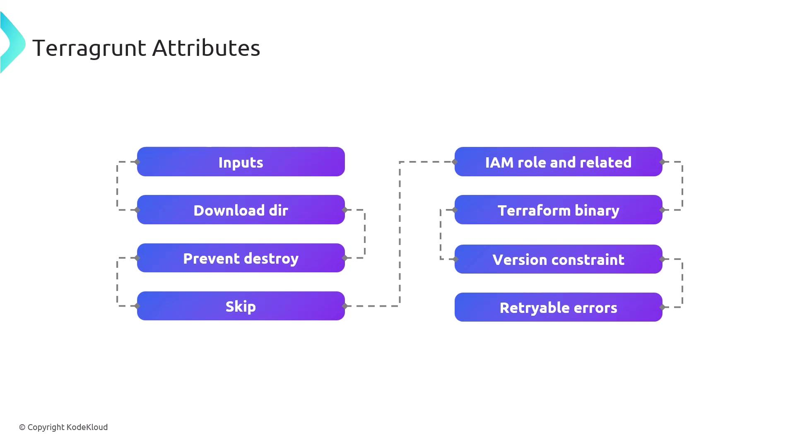

# Terragrunt Attribute Overview

Source: https://notes.kodekloud.com/docs/Terragrunt-for-Beginners/Terragrunt-Attributes/Terragrunt-Attribute-Overview/page

This guide explores key Terragrunt configuration attributes for advanced control over Infrastructure as Code workflows.

In this guide, we’ll dive into key Terragrunt configuration attributes that unlock advanced control over your Infrastructure as Code workflows. You’ll learn how to parameterize Terraform modules, optimize caching, enforce security safeguards, and handle transient errors—empowering you to build resilient, maintainable deployments.

<Frame>
  
</Frame>

## Attribute Summary

| Attribute           | Purpose                                                                          |
| ------------------- | -------------------------------------------------------------------------------- |
| inputs              | Pass variables into Terraform modules for dynamic parameterization.              |
| download\_dir       | Define a local cache directory for remote Terraform modules and providers.       |
| prevent\_destroy    | Protect critical resources from accidental deletion during `apply` or `destroy`. |
| skip                | Exclude specific Terragrunt blocks or commands from execution.                   |
| iam\_role           | Configure AWS IAM roles and permissions for Terraform operations.                |
| terraform\_binary   | Specify a custom Terraform executable or version.                                |
| version\_constraint | Enforce version rules for both Terraform and Terragrunt binaries.                |
| retryable\_errors   | List error patterns that Terragrunt retries automatically on failure.            |

***

## Detailed Attribute Guide

### inputs

Define a map of input variables to inject into your Terraform modules.

```hcl theme={null}
