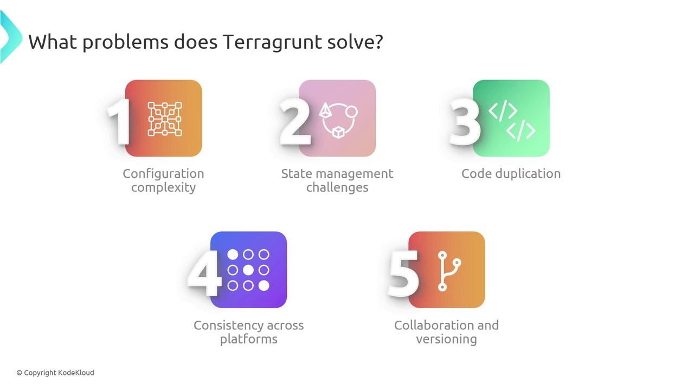
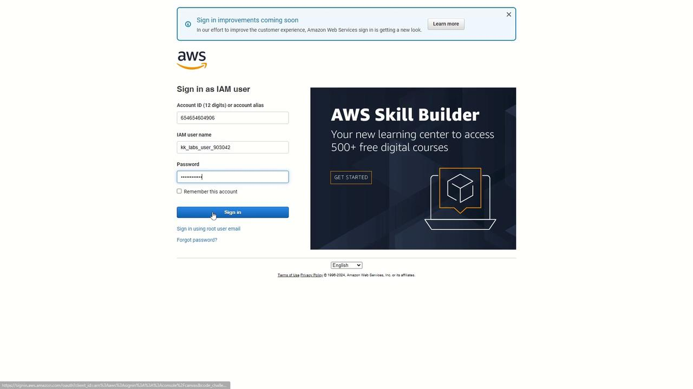
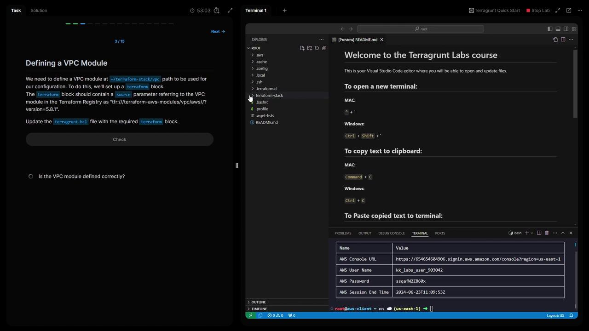
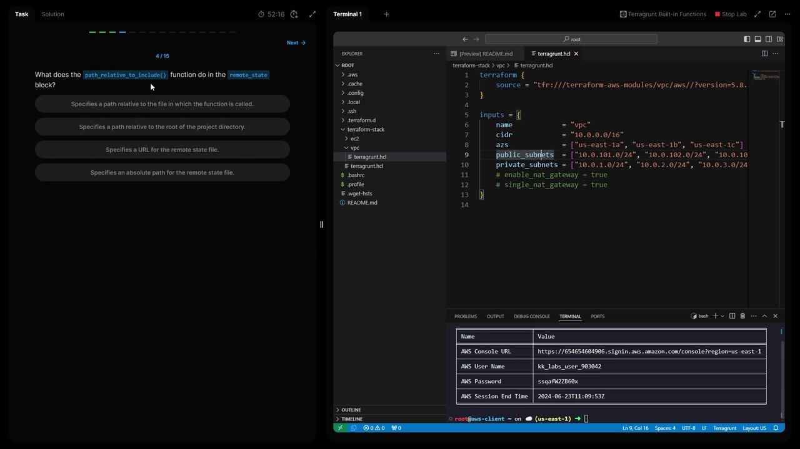
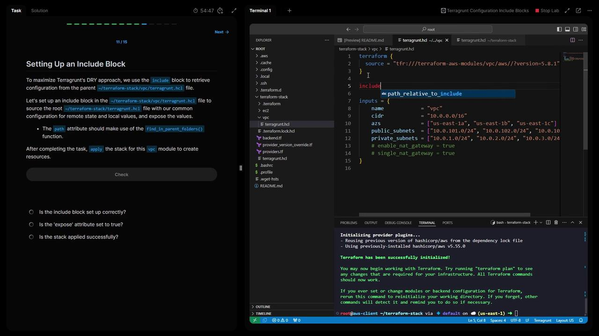

# live/common.hcl
include {
  path = find_in_parent_folders()
}

inputs = {
  project = "my-app"
}
```

Then inherit in each environment:

```hcl theme={null}
# live/dev/terragrunt.hcl
include { path = "../common.hcl" }
inputs = { environment = "dev" }
```

<Callout icon="lightbulb">
  Use `dependency` blocks to pass outputs between modules, further reducing repetition.
</Callout>

## 4. Environment Consistency

Differences between dev, staging, and prod can cause unexpected behavior. By defining environment-specific variables and settings in separate folders, Terragrunt ensures each stage uses the intended configuration:

```text theme={null}
live/
└─ prod/
   └─ terragrunt.hcl  # Overrides common inputs with production values
```

## 5. Collaboration and Versioning

Multiple engineers working on the same Terraform code can collide on merges or apply the wrong versions of modules. Terragrunt addresses this by:

* Isolated apply/plan contexts per environment
* Support for semantic versioning of modules
* Encouraging small, incremental changes

This leads to safer upgrades and clearer audit trails.

<Frame>
  
</Frame>

## References

* [Terraform](https://www.terraform.io/)
* [Infrastructure as Code](https://en.wikipedia.org/wiki/Infrastructure_as_Code)

<CardGroup>
  <Card title="Watch Video" icon="video" href="https://learn.kodekloud.com/user/courses/terragrunt-for-beginners/module/9618155f-f613-4c7b-92c7-9be9ddfa22b5/lesson/56b282c7-193d-4906-b9c9-b679b183b63f" />
</CardGroup>


# Demo of Lab 3

Source: https://notes.kodekloud.com/docs/Terragrunt-for-Beginners/Terragrunt-Blocks/Demo-of-Lab-3/page

Learn to structure Terragrunt configurations for multi-module AWS deployment, provisioning VPC, EC2 instances, and managing remote state with Terraform and Terragrunt.

Welcome to Lab Three! In this session, you'll learn how to structure Terragrunt configurations for a multi-module AWS deployment. Follow these steps to provision a VPC, EC2 instances, and manage remote state with Terraform and Terragrunt.

If you ever need to retrieve your AWS credentials during the lesson, run:

```bash theme={null}
show creds
```

You can also open the VS Code IDE in a new browser tab to copy and paste commands.

<Frame>
  
</Frame>

***

## Terraform Modules Overview

| Module       | Source                                                   | Purpose                                             |
| ------------ | -------------------------------------------------------- | --------------------------------------------------- |
| VPC          | `terraform-aws-modules/vpc/aws//?version=5.8.1`          | Create a scalable VPC with public & private subnets |
| EC2 Web      | `terraform-aws-modules/ec2-instance/aws//?version=2.0.0` | Launch a web server in the public subnet            |
| EC2 Database | (Your custom module)                                     | Deploy a database instance in a private subnet      |

***

## 1. Define the VPC Module

Create a Terragrunt configuration under `Terraform stack/vpc/terragrunt.hcl`:

<Frame>
  
</Frame>

```hcl theme={null}
terraform {
  source = "terraform-aws-modules/vpc/aws//?version=5.8.1"
}

inputs = {
  name               = "vpc"
  cidr               = "10.0.0.0/16"
  azs                = ["us-east-1a", "us-east-1b", "us-east-1c"]
  public_subnets     = ["10.0.101.0/24", "10.0.102.0/24", "10.0.103.0/24"]
  private_subnets    = ["10.0.201.0/24", "10.0.202.0/24"]
  enable_nat_gateway = true
  single_nat_gateway = true
}
```

Save the file and validate the configuration:

```bash theme={null}
terragrunt validate
```

***

## 2. Configure Remote State in the Root

### What is `path_relative_to_include()`?

<Frame>
  
</Frame>

<Callout icon="lightbulb">
  The `path_relative_to_include()` function computes the relative path from the current `terragrunt.hcl` to the included parent. This ensures each module’s state key is unique in S3.
</Callout>

In your root `Terraform stack/terragrunt.hcl`, add:

```hcl theme={null}
remote_state {
  backend = "s3"
  config = {
    encrypt = true
    bucket  = "kk-tf-state-314"
    key     = "${path_relative_to_include()}/terraform.tfstate"
    region  = "us-east-1"
  }
  generate = {
    path      = "backend.tf"
    if_exists = "overwrite_terragrunt"
  }
}
```

1. List your S3 buckets to find the Terraform state bucket:
   ```bash theme={null}
   aws s3 ls | grep "kk-tf-state-"
   ```
2. Reinitialize Terragrunt and confirm updating the backend:
   ```bash theme={null}
   terragrunt init
   # Type "yes" when prompted
   ```

***

## 3. Define Common Locals

To DRY out your configuration, define shared values at the root:

```hcl theme={null}
locals {
  project       = "kodeloud-labs"
  ami           = "ami-0f2a1bb3c24f7285"
  instance_type = "t2.micro"
}
```

Validate once more:

```bash theme={null}
terragrunt validate
```

***

## 4. Generate Provider and Terraform Version Files

Leverage Terragrunt’s `generate` blocks to auto-create `providers.tf` and a Terraform version override:

```hcl theme={null}
generate "provider" {
  path      = "providers.tf"
  if_exists = "overwrite_terragrunt"
  contents  = <<EOF
provider "aws" {
  region = "us-east-1"
}
EOF
}

generate "provider_version" {
  path      = "provider_version_override.tf"
  if_exists = "overwrite_terragrunt"
  contents  = <<EOF
terraform {
  required_providers {
    aws = {
      source  = "hashicorp/aws"
      version = "~> 5.0"
    }
  }
}
EOF
}
```

Re-run initialization:

```bash theme={null}
terragrunt init
```

***

## 5. Include Root Configuration in the VPC Module

In `Terraform stack/vpc/terragrunt.hcl`, inherit root settings:

<Frame>
  
</Frame>

```hcl theme={null}
terraform {
  source = "terraform-aws-modules/vpc/aws//?version=5.8.1"
}

include "root" {
  path   = find_in_parent_folders()
  expose = true
}

inputs = {
  name               = "vpc"
  cidr               = "10.0.0.0/16"
  azs                = ["us-east-1a", "us-east-1b", "us-east-1c"]
  public_subnets     = ["10.0.101.0/24", "10.0.102.0/24", "10.0.103.0/24"]
  private_subnets    = ["10.0.201.0/24", "10.0.202.0/24"]
  enable_nat_gateway = true
  single_nat_gateway = true
}
```

Apply the VPC module:

```bash theme={null}
cd "Terraform stack/vpc"
terragrunt init
terragrunt apply
