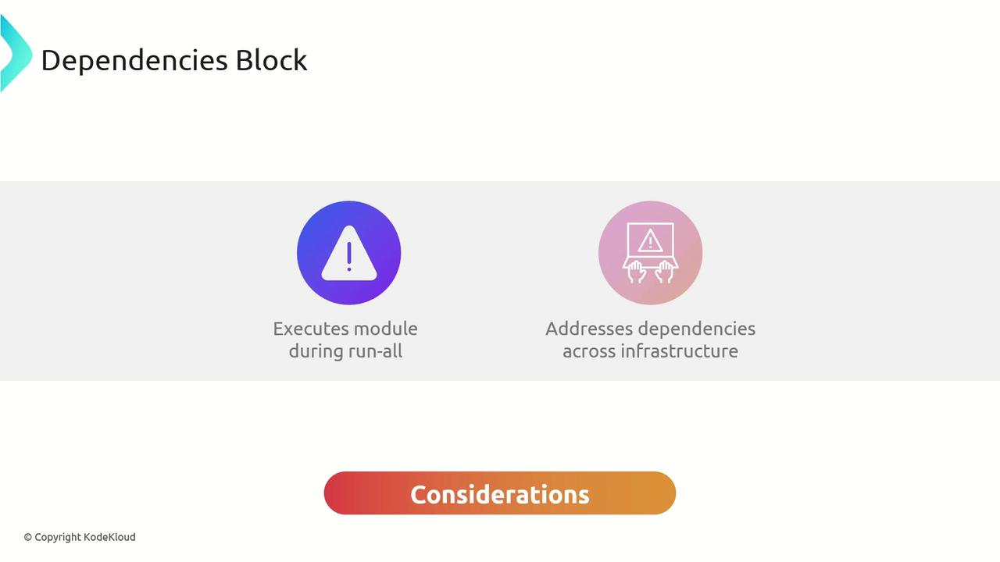
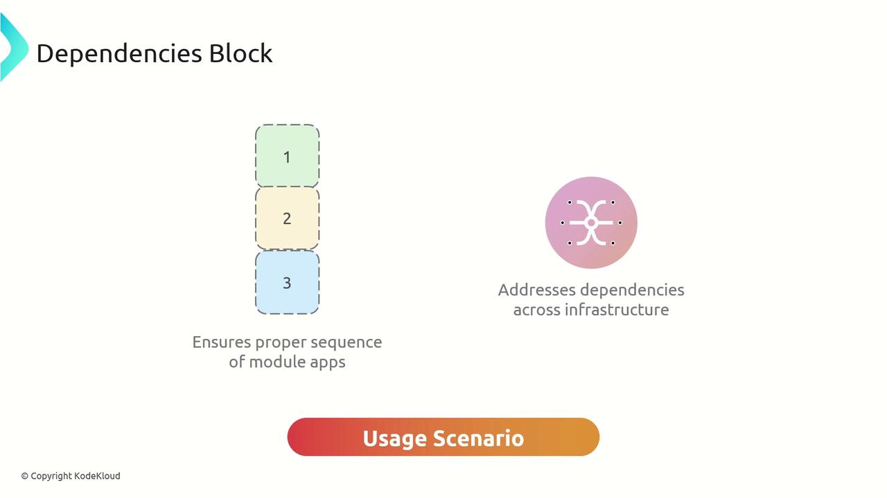

# Use the output
resource "aws_subnet" "private" {
  vpc_id = dependency.vpc.outputs.vpc_id
}
```

## 6. dependencies Block

Orchestrate multiple modules by listing them all:

```hcl theme={null}
dependencies {
  paths = ["../vpc", "../security-group", "../database"]
}
```

When you run `terragrunt apply-all`, it ensures each module runs in the correct order.

## 7. generate Block

Automatically generate additional configuration files (HCL or JSON):

```hcl theme={null}
generate "backend_tf" {
  path      = "backend.tf"
  if_exists = "overwrite"
  contents  = <<EOF
terraform {
  backend "s3" {
    bucket = "generated-backend"
    key    = "generated.tfstate"
    region = "us-east-1"
  }
}
EOF
}
```

## Next Steps

* Explore [Terragrunt Remote State](https://terragrunt.gruntwork.io/docs/reference/config-blocks/remote_state/) for advanced backend options.
* Learn how to combine `dependency` and `dependencies` in a real-world multi-module project.
* Check out [Terraform CLI Docs](https://www.terraform.io/docs/cli/index.html) for all available commands and flags.

<CardGroup>
  <Card title="Watch Video" icon="video" href="https://learn.kodekloud.com/user/courses/terragrunt-for-beginners/module/bab279d4-de1d-4e8d-8376-ea420c71c9e1/lesson/62f6d615-b3b4-49cc-9a3f-90fb375a2b36" />
</CardGroup>


# dependencies Block

Source: https://notes.kodekloud.com/docs/Terragrunt-for-Beginners/Terragrunt-Blocks/dependencies-Block/page

The dependencies block in Terragrunt ensures modules are applied in a specific order by listing prerequisite module paths.

The `dependencies` block in Terragrunt ensures that modules are applied in a specific order when running commands like `terragrunt run-all`. By listing paths to prerequisite modules, you guarantee that upstream infrastructure is provisioned before downstream modules execute.

## Key Attribute

| Attribute | Type         | Description                                                                     |
| --------- | ------------ | ------------------------------------------------------------------------------- |
| paths     | list(string) | A list of relative paths to modules that must finish before the current module. |

<Callout icon="lightbulb">
  The `dependencies` block only enforces execution order. It does **not** retrieve outputs from those modules. To reference outputs, use the `dependency` block with `config_path` and `outputs`.
</Callout>

<Frame>
  
</Frame>

## Usage Scenario

Imagine you have defined VPC and EC2 modules, and you want to add an S3 bucket that should only be provisioned after the EC2 instance. Even though the S3 bucket doesn’t consume any EC2 outputs, you can enforce this order:

<Frame>
  
</Frame>

```hcl theme={null}
terraform {
  source = "tfr://terraform-aws-modules/s3-bucket/aws//?version=4.1.2"
}

include "root" {
  path   = find_in_parent_folders()
  expose = true
}

include "common" {
  path   = find_in_parent_folders("common.hcl")
  expose = true
}

dependencies {
  paths = ["../ec2"]
}

inputs = {
  bucket = include.common.locals.project
}
```

## Applying with `terragrunt run-all`

From the root configuration directory, run:

```bash theme={null}
terragrunt run-all apply
```

This command applies the EC2 module under `../ec2` first, then provisions the S3 bucket, preserving the correct module sequence and preventing race conditions.

## Links and References

* [Terragrunt Documentation](https://terragrunt.gruntwork.io/docs/)
* [Terragrunt CLI: run-all](https://terragrunt.gruntwork.io/docs/reference/cli-options/#run-all)

<CardGroup>
  <Card title="Watch Video" icon="video" href="https://learn.kodekloud.com/user/courses/terragrunt-for-beginners/module/bab279d4-de1d-4e8d-8376-ea420c71c9e1/lesson/b1db3990-c5d3-4b16-8d37-18772e878538" />
</CardGroup>
