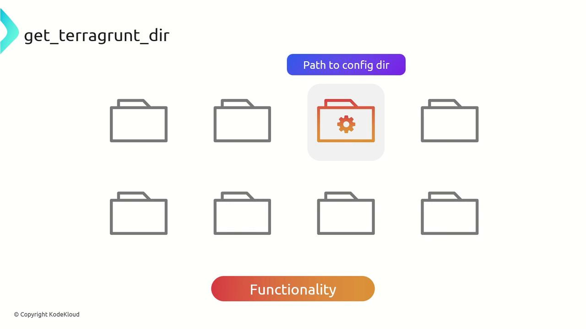
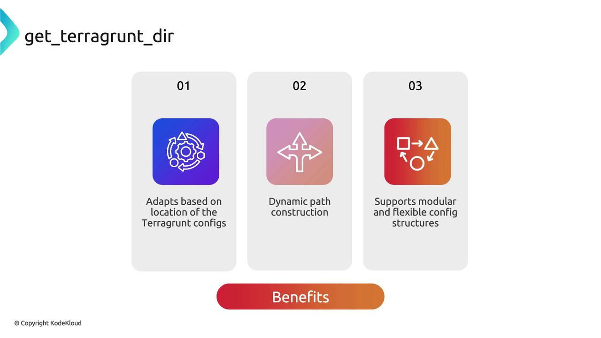
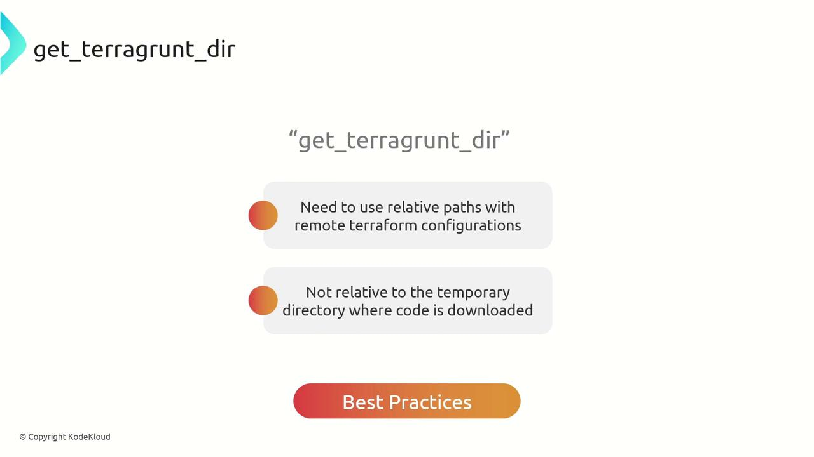

# terragrunt.hcl in /envs/dev
terraform {
  source = "${get_parent_terragrunt_dir()}/modules/network"
}

inputs = {
  vpc_cidr = "10.0.0.0/16"
}
```

This resolves to `/envs/modules/network` if the parent `terragrunt.hcl` lives in `/envs`.

<Callout icon="triangle-alert">
  Calling `get_parent_terragrunt_dir()` at the root level (where no parent exists) will result in an error. Always validate your folder structure before using this function.
</Callout>

## Best Practices

* Keep a **consistent directory layout** so returned paths remain predictable.
* Use `get_parent_terragrunt_dir()` for `source` definitions in **nested** configurations only.
* Combine with other Terragrunt functions like `find_in_parent_folders()` to import common settings.

## Links and References

* [Terragrunt Official Documentation](https://terragrunt.gruntwork.io/docs/)
* [Terraform Modules](https://www.terraform.io/language/modules)
* [Terragrunt GitHub Repository](https://github.com/gruntwork-io/terragrunt)

<CardGroup>
  <Card title="Watch Video" icon="video" href="https://learn.kodekloud.com/user/courses/terragrunt-for-beginners/module/5775621f-5504-4da8-835d-661cda37a852/lesson/2eadb951-218a-443c-bc0b-946edd9822c7" />
</CardGroup>


# get terragrunt dir

Source: https://notes.kodekloud.com/docs/Terragrunt-for-Beginners/Terragrunt-Functions/get-terragrunt-dir/page

The `get_terragrunt_dir()` function returns the absolute path of the directory containing the current `terragrunt.hcl` configuration for dynamic file references.

The `get_terragrunt_dir()` function in Terragrunt returns the absolute filesystem path of the directory containing the current `terragrunt.hcl` configuration. By using this function, you can build dynamic file references, support modular layouts, and adapt configurations based on their location.

<Frame>
  
</Frame>

## When to Use `get_terragrunt_dir()`

* Dynamically adapt resources or input files based on the configuration directory
* Construct file paths that automatically adjust when the directory hierarchy changes
* Maintain flexible, modular directory structures without hard-coding absolute paths

<Frame>
  
</Frame>

## Key Benefits

| Benefit                 | Description                                                                |
| ----------------------- | -------------------------------------------------------------------------- |
| Dynamic Path Resolution | Automatically resolves relative paths from the `terragrunt.hcl` location.  |
| Modular Configuration   | Keeps module directories self-contained and portable.                      |
| Environment Agnostic    | Works consistently across local machines, CI pipelines, and remote states. |

## Best Practices

* Always reference inputs, variable files, and modules relative to `get_terragrunt_dir()`
* Avoid using `../` in paths that Terragrunt evaluates in its cache directory
* Combine with `extra_arguments` to pass var-files into remote Terraform modules

<Callout icon="triangle-alert">
  When Terragrunt downloads Terraform code into a cache, your working directory changes. Always use `get_terragrunt_dir()` to ensure paths are resolved against your configuration, not the cache folder.
</Callout>

<Frame>
  
</Frame>

***

## Example: Fixing Relative Paths in a VPC Module

Imagine you’re calling the Terraform AWS VPC module via Terragrunt and need to supply a `common.tfvars` file stored in a sibling directory:

```hcl theme={null}
