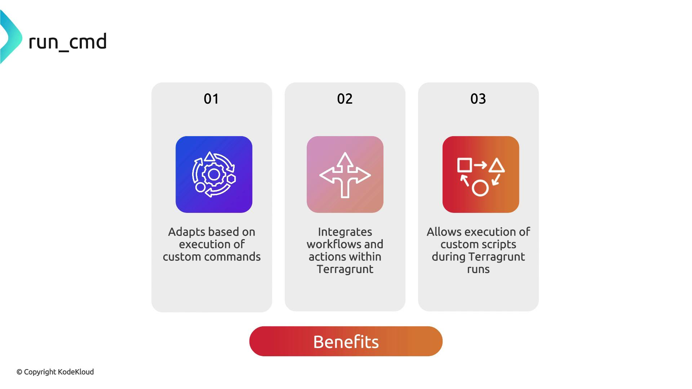

# common.hcl
inputs = {
  project     = "KodeKloud"
  environment = "dev"
}
```

In the `vpc/` directory, import these inputs using `read_terragrunt_config`:

```hcl theme={null}
# vpc/terragrunt.hcl
terraform {
  source = "tfr://terraform-aws-modules/vpc/aws//?version=5.8.1"
}

locals {
  common_vars = read_terragrunt_config("../common.hcl")
}

inputs = {
  name = "${local.common_vars.inputs.project}-${local.common_vars.inputs.environment}-VPC"
}
```

What happens under the hood:

1. Terragrunt reads `../common.hcl`.
2. `local.common_vars.inputs` contains:
   * `project`: `"KodeKloud"`
   * `environment`: `"dev"`
3. The VPC module’s `name` input resolves to:

```text theme={null}
KodeKloud-dev-VPC
```

<Callout icon="triangle-alert">
  Verify the relative path to `common.hcl`, or Terragrunt will error out with a file-not-found.
</Callout>

***

## Initializing Terragrunt

Run the following in the `vpc/` directory:

```bash theme={null}
$ terragrunt init
```

Expected output:

```text theme={null}
- Finding hashicorp/aws versions matching ">= 5.30.0"...
- Installing hashicorp/aws v5.52.0...
- Installed hashicorp/aws v5.52.0 (signed by HashiCorp)

Terraform has created a lock file .terraform.lock.hcl ...
Terraform has been successfully initialized!
```

<Callout icon="lightbulb">
  After initialization, run `terragrunt plan` to preview changes based on your dynamic inputs.
</Callout>

***

## Links and References

* [Terragrunt Function Reference](https://github.com/gruntwork-io/terragrunt#functions)
* [Terraform AWS VPC Module](https://github.com/terraform-aws-modules/terraform-aws-vpc)
* [Terragrunt Official Documentation](https://terragrunt.gruntwork.io/docs/)

<CardGroup>
  <Card title="Watch Video" icon="video" href="https://learn.kodekloud.com/user/courses/terragrunt-for-beginners/module/5775621f-5504-4da8-835d-661cda37a852/lesson/ed759e39-32c9-4e7a-952c-82af22f54cee" />
</CardGroup>


# run cmd

Source: https://notes.kodekloud.com/docs/Terragrunt-for-Beginners/Terragrunt-Functions/run-cmd/page

Terragrunt’s run_cmd is an interpolation function that executes shell commands during a run and returns their standard output.

Terragrunt’s `run_cmd` is a powerful interpolation function that lets you execute shell commands during a run and return their standard output. By integrating `run_cmd` into your configurations, you can:

* Dynamically adapt module inputs based on external context
* Incorporate existing workflows or scripts
* Feed custom data into Terraform resources at plan/apply time

<Frame>
  
</Frame>

## Best Practices for `run_cmd`

| Use Case                    | Example                         |
| --------------------------- | ------------------------------- |
| Inject current OS user      | `run_cmd("whoami")`             |
| Fetch latest Git commit SHA | `run_cmd("git rev-parse HEAD")` |
| Read environment variables  | `run_cmd("echo $MY_ENV_VAR")`   |

* Always validate and sanitize any external scripts or commands to mitigate security risks.
* Prefer native Terraform/Terragrunt functions (like `timestamp()` and `file()`) when possible.
* Reserve `run_cmd` for scenarios where built-in functions cannot produce the needed output.

<Callout icon="triangle-alert">
  Executing arbitrary shell commands can introduce security vulnerabilities. Ensure you trust and sanitize any external inputs or scripts invoked via `run_cmd`.
</Callout>

***

## Example: Tagging AWS VPC Resources with the Current User

In this example, we’ll consume the [Terraform AWS VPC module](https://registry.terraform.io/modules/terraform-aws-modules/vpc/aws/5.8.1) and automatically tag every resource with the username running Terragrunt.

```hcl theme={null}
terraform {
  source = "tfr://terraform-aws-modules/vpc/aws//?version=5.8.1"
}

inputs = {
  name = "Kodekloud-VPC"
  tags = {
    CreatedBy = run_cmd("whoami")
  }
}
```

When you run the command locally:

```bash theme={null}
$ whoami
abc
```

Terragrunt will interpolate the result into your Terraform plan:

```bash theme={null}
$ terragrunt plan
...
Plan: 4 to add, 0 to change, 0 to destroy.

Changes to Outputs:
+ tags = {
    + CreatedBy = "abc"
  }
...
```

Every resource provisioned by this Terragrunt configuration will now carry the tag `CreatedBy = "abc"`.

With `run_cmd`, you can extend this pattern to pull data from any script, API call, or toolchain, giving you a highly flexible Terragrunt workflow.

***

## Links and References

* [Terraform AWS VPC Module](https://registry.terraform.io/modules/terraform-aws-modules/vpc/aws/5.8.1)
* [Terragrunt Documentation](https://terragrunt.gruntwork.io/)
* [Terraform Interpolation Functions](https://www.terraform.io/docs/language/functions/index.html)

<CardGroup>
  <Card title="Watch Video" icon="video" href="https://learn.kodekloud.com/user/courses/terragrunt-for-beginners/module/5775621f-5504-4da8-835d-661cda37a852/lesson/bfbd7c34-4649-48ba-b195-23d3299a57a7" />
</CardGroup>
