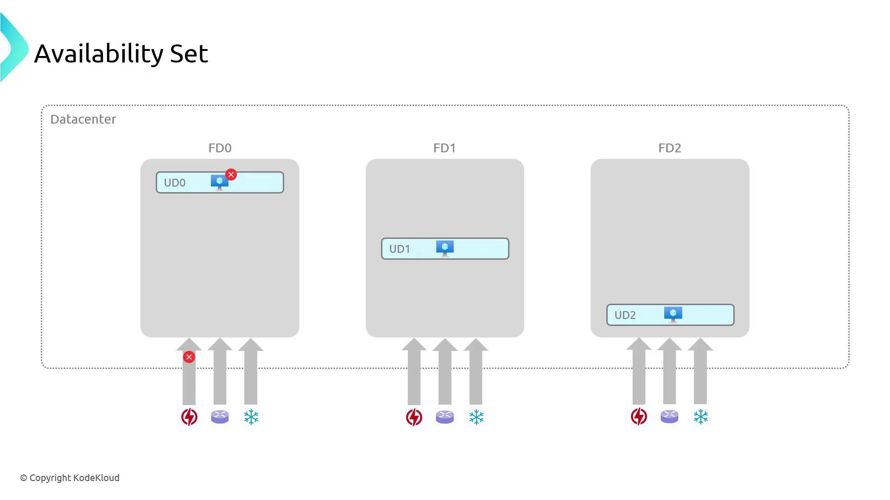
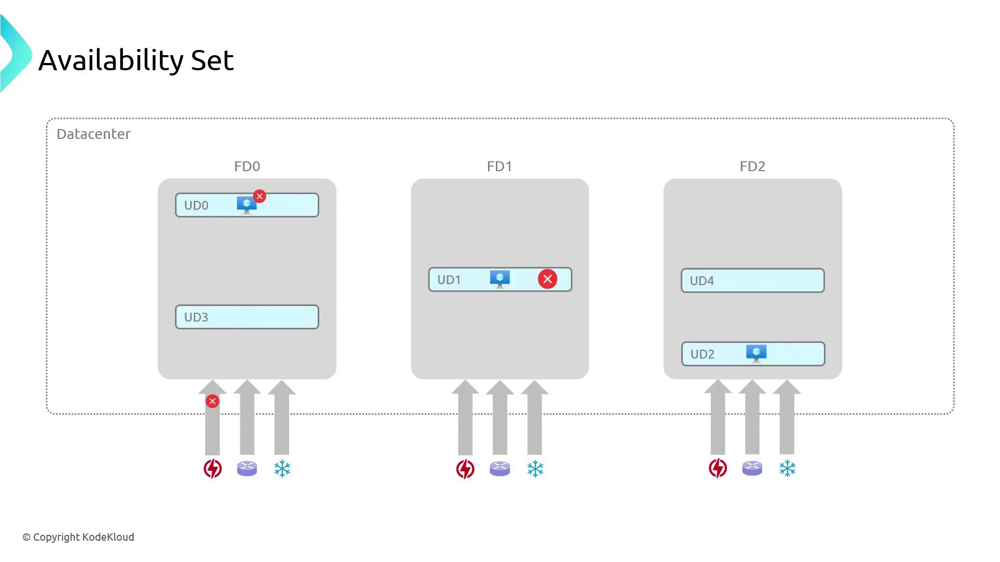
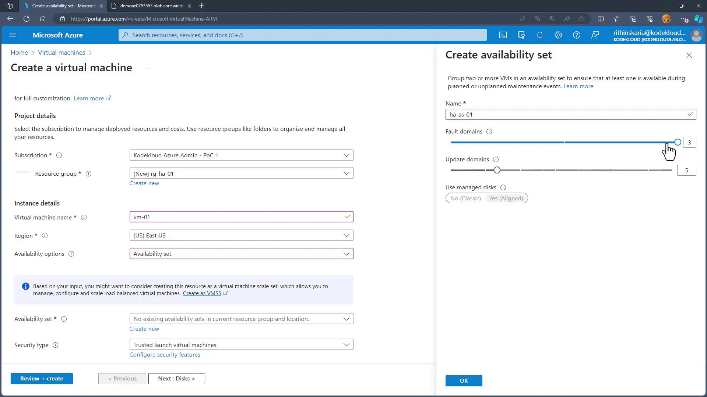
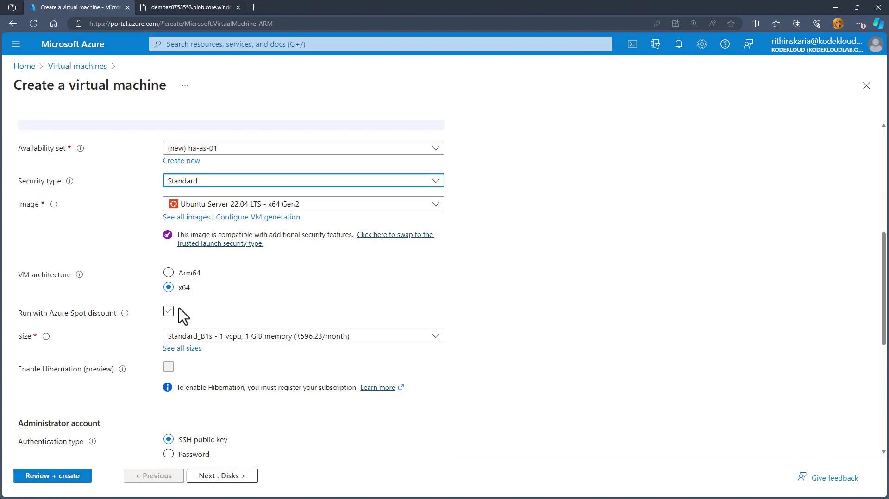
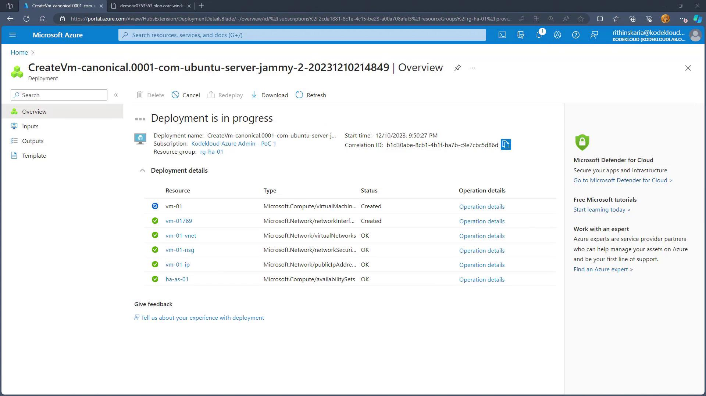
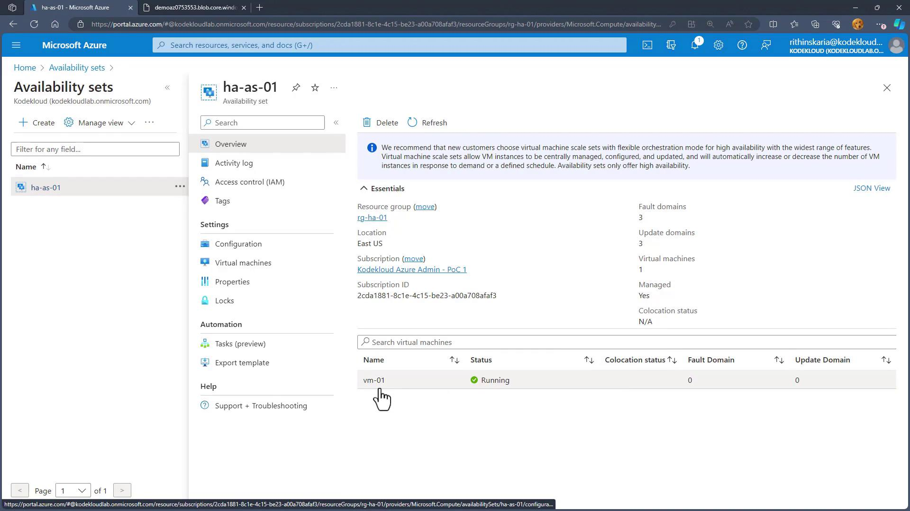
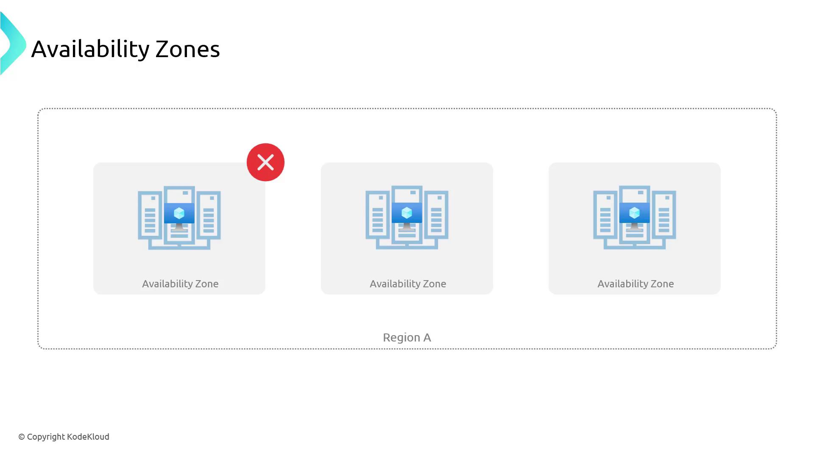

# Configuring high availability

Source: https://notes.kodekloud.com/docs/Updated-AZ-104-Microsoft-Azure-Administrator/Administer-Azure-Virtual-Machines/Configuring-high-availability/page

This article discusses configuring high availability for virtual machines in Azure to ensure continuous service during failures and maintenance.

Ensuring high availability when deploying virtual machines is critical. A single VM can become a single point of failure; if the VM or its underlying hardware encounters an issue, the hosted services may become inaccessible. High availability configurations are designed to keep systems accessible during unplanned hardware failures, software bugs, network outages, and even scheduled maintenance.

## Managing Unexpected Downtime

Unexpected downtime can result from network failures, power outages, or software bugs. Azure's architecture is designed to automatically handle these situations with redundant power sources, networking, and failover strategies. However, implementing your own high availability measures is essential to minimize the risk and impact of outages.

## Addressing Planned Maintenance

Azure routinely performs maintenance to enhance performance and security. During these events, virtual machines might need to be rebooted. Azure’s live migration technology helps move VMs to updated hosts with minimal downtime. Despite this, it is crucial to plan for redundancy and ensure proper distribution across update and fault domains to maintain service continuity.

Using availability sets and availability zones, you can configure your virtual machines to remain operational even if one component fails or is undergoing maintenance.

## Understanding Availability Sets

In Azure, high availability is often achieved by deploying your virtual machines within availability sets. An availability set is a logical grouping that enables Azure to understand the architecture of your application, providing redundancy through two main concepts:

* **Fault Domains:** These represent racks of servers within an Azure datacenter. By distributing VMs across multiple fault domains, you ensure that a hardware failure in one rack does not affect all your VMs.
* **Update Domains:** These group VMs that are updated or restarted together during planned maintenance. Azure staggers these updates so that at least one instance remains available during maintenance events.

<Callout icon="lightbulb">
  For example, if you deploy three VMs across separate fault domains, a power failure in one domain will only impact the affected machine, while the others remain operational.
</Callout>

Below is a diagram that illustrates how an availability set distributes VMs across fault and update domains:

<Frame>
  
</Frame>

For instance, if your VMs are distributed across UD0, UD1, and UD2, a planned update in UD1 will not affect VMs in UD0 or UD2. Once UD1 completes its update, its VMs come back online, ensuring continuous service availability.

<Frame>
  
</Frame>

## Deploying VMs Within an Availability Set

Follow these steps to deploy virtual machines across an availability set using the Azure portal:

1. In the Azure portal, search for "availability sets" and select Create. You can also configure an availability set during the virtual machine creation process.
2. When creating a virtual machine:
   * Fill in the required basic information.
   * Under availability options, select "availability set." If no existing set is available, create a new set (for example, "HAAS01").
   * Remember that Azure supports up to three fault domains and can accommodate up to 20 update domains.

<Frame>
  
</Frame>

3. Confirm the availability set settings by clicking OK. The selected availability set will be referenced when proceeding with the virtual machine creation.
4. Review the configuration and create the virtual machine. The first VM might be placed in FD0, UD0; subsequent VMs are automatically assigned to FD1, UD1, then FD2, UD2, and so on.

<Frame>
  
</Frame>

5. Monitor your deployment progress:

<Frame>
  
</Frame>

6. Verify the deployment by navigating to your availability set in the Azure portal. Details will confirm the VMs’ placement, for example:
   * VM01: FD0, UD0
   * VM02: FD1, UD1

<Frame>
  
</Frame>

Adding more machines is straightforward. To distribute user requests evenly, place a load balancer in front of these VMs.

## Leveraging Availability Zones for Enhanced Redundancy

While availability sets provide resilience within a single datacenter, they do not protect against complete datacenter outages. For risks such as floods, earthquakes, or large-scale failures, availability zones offer another layer of protection.

Availability zones are groups of datacenters within a region that are physically separated and interconnected with independent power, networking, and cooling. Most Azure regions now offer up to three availability zones. Deploying VMs across these zones ensures that if one zone faces an outage, the VMs in other zones remain operational.

<Frame>
  
</Frame>

### Configuring VMs Across Availability Zones

To set up deployment across availability zones:

1. In the Azure portal, navigate to Virtual Machines and begin the creation process.
2. Under availability options, choose "availability zone" instead of an availability set.
3. Enter the required details (using the same resource group, for instance) and assign a name such as "VM HA."
4. Select multiple availability zones so that Azure deploys three VMs (e.g., VMHA1, VMHA2, and VMHA3) distributed across the zones.
5. Once deployed, you can use a load balancer to efficiently manage incoming traffic.

This strategy enhances resilience, ensuring that even if an entire datacenter or zone is impacted, your services continue to run smoothly.

## Conclusion

In this guide, we explored various methods for configuring high availability for virtual machines in Azure. We covered:

* The significance of high availability to mitigate both unexpected downtime and planned maintenance risks.
* The role of availability sets, including how fault domains and update domains help maintain service continuity.
* Step-by-step instructions for deploying VMs within an availability set via the Azure portal.
* The additional benefits of using availability zones to secure your applications against complete datacenter outages.

Next, we will delve into virtual machine scale sets to further enhance the deployment and management of scalable applications.

<Callout icon="lightbulb">
  For additional details on configuring and managing high availability, visit the [Azure Documentation](https://docs.microsoft.com/azure) to stay updated with the latest best practices.
</Callout>

<CardGroup>
  <Card title="Watch Video" icon="video" href="https://learn.kodekloud.com/user/courses/az-104-microsoft-azure-administrator/module/34d9af06-fc33-4556-a3f2-2e7a5c5db484/lesson/76451d6e-adaa-4f3c-81c2-180d5b50bb8d" />
</CardGroup>
