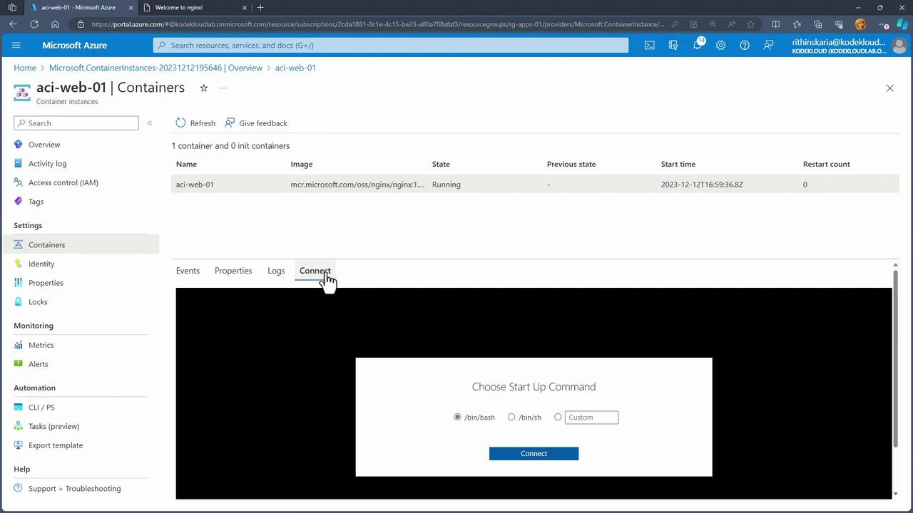
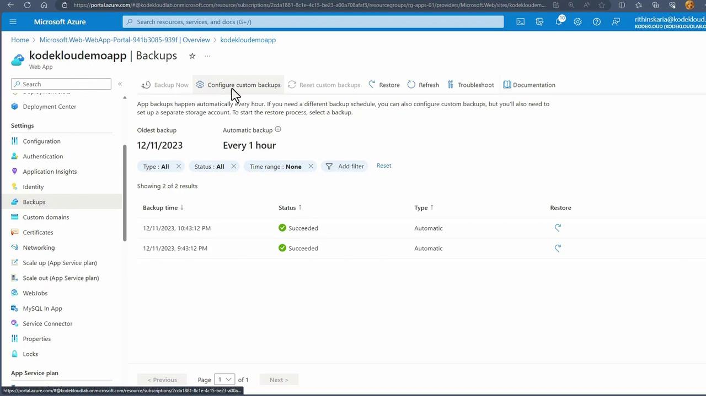

# cd /usr/
/usr # ls
bin  lib  local  sbin  share  src
/usr # cd share
/usr/share # ls
nginx  perl5  terminfo
/usr/share # cd
```

<Callout icon="lightbulb">
  While modifying files (e.g., index.html) is acceptable for demonstration purposes, container updates in production environments are typically managed through image updates and redeployments rather than direct SSH modifications.
</Callout>

<Frame>
  
</Frame>

## Conclusion

Azure Container Instances streamline the deployment of containerized applications by removing the need to manage underlying virtual machines. With benefits such as rapid startup times, scalability, secure isolation, and integrated networking and storage, ACI is a robust platform for running modern applications in the cloud.

Up next, we will delve into container groups and advanced configurations within Azure Container Instances.

<CardGroup>
  <Card title="Watch Video" icon="video" href="https://learn.kodekloud.com/user/courses/az-104-microsoft-azure-administrator/module/c1871647-c1ec-478a-beab-b21781cec58f/lesson/4dd57403-a848-419f-b23c-299e984c5f13" />
</CardGroup>


# Backup App Service

Source: https://notes.kodekloud.com/docs/Updated-AZ-104-Microsoft-Azure-Administrator/Administer-PaaS-Compute-Options/Backup-App-Service/page

The article describes the Backup App Service in Azure for safeguarding web applications through manual and scheduled backups.

The Backup App Service feature in Azure provides a reliable solution to safeguard your web applications against catastrophic failures. With this functionality, you can perform both manual and scheduled backups, ensuring that your app’s configuration settings, file contents, and connected databases are securely saved.

<Callout icon="lightbulb">
  Backup App Service supports up to 10 GB of data per backup, which includes both your app and its associated database. Note that this feature is available exclusively on Standard and Premium plans.
</Callout>

You can configure both full and partial backups based on your specific requirements. Once a backup is created, you have the flexibility to restore the app to a previous state or even create a new web app from the backup file, enabling rapid recovery with minimal downtime.

When you access the backup option in the Azure portal, you will first need to select a storage account where your backups will be securely stored. Additionally, you have the option to configure custom backup settings to tailor the retention policy and backup schedule to your needs.

<Frame>
  
</Frame>

Custom backups let you define your own retention policies and schedules for backup collection, whereas the automatic backup configuration provided by Azure runs every hour. This automated approach allows you to quickly restore your app from a previous restore point whenever needed.

Next, we will explore how to set up CI/CD pipelines and deployment slots for your web app, enhancing your development workflow and streamlining the deployment process.

<CardGroup>
  <Card title="Watch Video" icon="video" href="https://learn.kodekloud.com/user/courses/az-104-microsoft-azure-administrator/module/c1871647-c1ec-478a-beab-b21781cec58f/lesson/5c4c62e2-6aea-4d3d-a156-c21e0526ffb6" />
</CardGroup>
